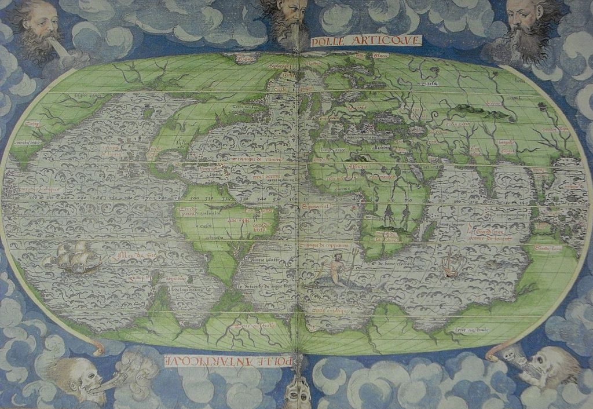

### Terra Australis

#### Cosmographie Universelle, 4ème projection (1556)

Source: [Wikimedia Commons](https://en.wikipedia.org/wiki/File:Le_Testu_1556_4th_projection.jpg)

#### More Images

##### Te Ara - The Encyclopedia of New Zealand

* [Terra australis incognita](https://teara.govt.nz/en/zoomify/1403/terra-australis-incognita)

##### Wikipedia

* [Cornelius Wytfliet South 1597](https://en.wikipedia.org/wiki/File:Cornelius_Wytfliet_South_1597.jpg)
* [Le pôle antarctique, Jacques de Vaux](https://en.wikipedia.org/wiki/File:Map-533.jpg)
* [Mercator World Map](https://en.wikipedia.org/wiki/File:Mercator_World_Map.jpg)
* [Typus Orbis Terrarum drawn by Abraham Ortelius](https://en.wikipedia.org/wiki/File:Typus_Orbis_Terrarum_drawn_by_Abraham_Ortelius.jpg)

#### References

##### Gallica

* [Cosmographie universelle, selon les navigateurs tant anciens que modernes / par Guillaume Le Testu, pillotte en la mer du Ponent, de la ville francoyse de Grâce](https://gallica.bnf.fr/ark:/12148/btv1b8447838j.r=Cosmographie%20Universelle?rk=21459;2)

##### Internet Archive

* [Cosmographie universelle, selon les navigateurs tant anciens que modernes](https://archive.org/details/LeTestu1555Bnf42467457f/page/n1)

##### Wikipedia

* [Guillaume Le Testu](https://en.wikipedia.org/wiki/Guillaume_Le_Testu)
* [Terra Australis](https://en.wikipedia.org/wiki/Terra_Australis)

