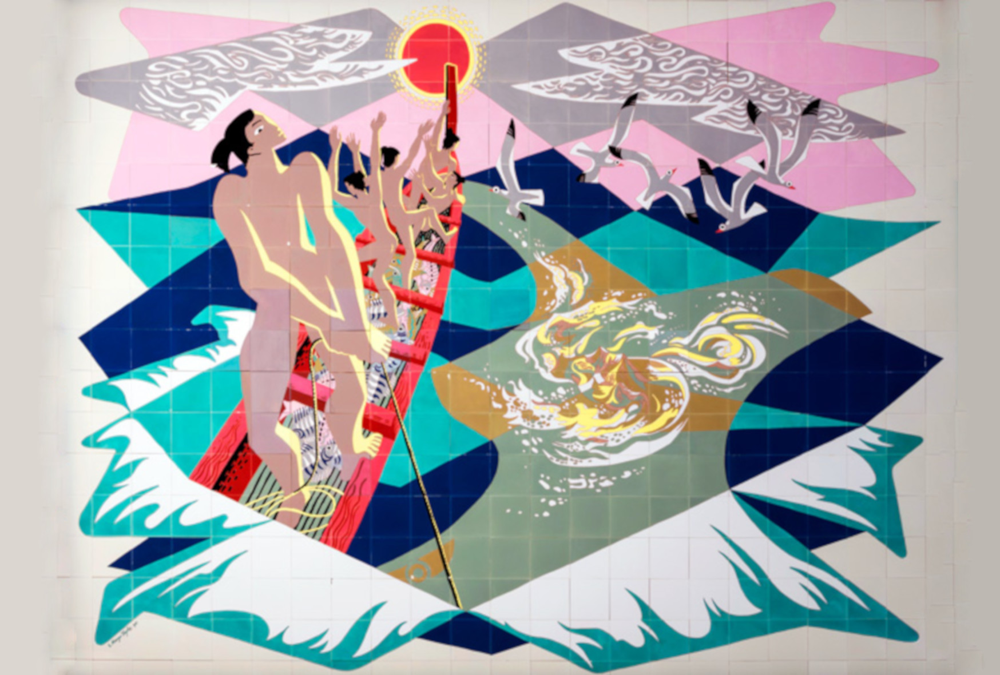
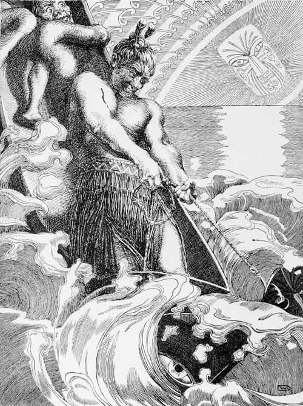

[Cook 250 Research Notebook](../) > Māui  
*[Previous](../p01-cook-250/)* | Page 02 | *[Next](../p03-terra-australis/)*
### Māui

#### Māui fishing New Zealand out of the ocean

*Te Ika-a-Māui mural by E. Mervyn Taylor (1962)*

Source: [NOTED](https://www.noted.co.nz/culture/culture-arts/e-mervyn-taylor-in-search-of-the-missing-murals-of-a-kiwi-artist)

> Many Europeans were fascinated by Māori mythology.
> One was the German artist Wilhelm Dittmer,
> who visited New Zealand to collect oral traditions.
> He also illustrated many traditions with ink drawings.
> Here Māui, with his frightened brothers clinging to the canoe,
> heaves up the fish that is the North Island.
> The sun, to whom Māui and his brothers are linked
> in another tradition, watches on.

Source: [Te Ara, The Encyclopedia of New Zealand](https://teara.govt.nz/en/artwork/2383/maui-fishing-new-zealand-out-of-the-ocean)

#### More Images

##### Bronwyn Holloway-Smith

* [Te Ika-a-Akoranga (2014-2019)](https://hollowaysmith.nz/te-ika-a-akoranga/)
* [B. Holloway-Smith on Twitter](https://twitter.com/hollowaysmith/status/1111449338100609025/photo/1)

##### City Gallery Wellington — Te Whare Toi

* [This Is New Zealand, Exhibition, 3 March–15 July 2018](https://citygallery.org.nz/exhibitions/this-is-new-zealand/)
* [E. Mervyn Taylor Te Ika-a-Maui 1961 from Bronwyn Holloway-Smith The Southern Cross Cable: A Tour 2018](https://citygallery.org.nz/wp-content/uploads/2018/04/TeIkaAMaui_forCGWPuzzle-1024x821.jpg)

##### Eric Bréchemier on Flickr

* [Te Papa Treasures](https://www.flickr.com/photos/eric_brechemier/3319884409/in/album-72157611251752316/)

##### New Zealand Post

* [Māui and the Fish - Te Ika-a-Māui](https://stamps.nzpost.co.nz/new-zealand/2018/maui-and-fish-te-ika-maui)
* [The Discoverers - Millenium Part One](https://stamps.nzpost.co.nz/new-zealand/1997/discoverers-millenium-part-one)

##### Public Art Heritage

* [E. Mervyn Taylor: COMPAC terminal, Te Ika-a-Maui](https://publicart.nz/2016/04/10/emt-compac-building-te-ika-a-maui/)

##### Project Gutenberg

* [VIII Māui - The creation of New Zealand](https://www.gutenberg.org/files/54610/54610-h/54610-h.htm#VIII)

##### Te Ara, The Encyclopedia of New Zealand

* [Māui fishes up the North Island](https://teara.govt.nz/en/artwork/5982/maui-fishes-up-the-north-island)
* [Places associated with Māui](https://teara.govt.nz/en/map/2382/places-associated-with-maui)
* [Māui](https://teara.govt.nz/en/document/3802/maui)
* [Whakairo on Hikurangi](https://teara.govt.nz/en/photograph/33352/whakairo-on-hikurangi)

#### References

##### Dr Bronwyn Holloway-Smith

* [Te Ika-a-Akoranga (2014-2019)](https://hollowaysmith.nz/te-ika-a-akoranga/)

##### E. Mervyn Taylor

* [E. Mervyn Taylor](https://emervyntaylor.co.nz/)
* [Mervyn Taylor by Sarah Taylor](https://emervyntaylor.co.nz/wp-content/uploads/2015/09/bio.pdf)

##### Heritage et AL

* [ The many lives of E. Mervyn Taylor’s mural Te Ika-a-Maui](https://heritageetal.blogspot.com/2020/09/the-many-lives-of-e-mervyn-taylors.html)

##### Land of Voyagers

* [MAUI'S MATAURANGA OF THE SUN](https://www.thevoyage.co.nz/en/video/72_MAUI-S-MATAURANGA-OF-THE-SUN)

##### Letting Space

* [Te Ika-a-Akoranga, Bronwyn Holloway Smith](http://www.lettingspace.org.nz/te-ika-a-akoranga/)

##### Massey University Press

* [Wanted, The search for the modernist murals of E. Mervyn Taylor](https://www.masseypress.ac.nz/books/wanted/)

##### New Zealand Tourism — 100% Pure New Zealand

* [The Legend of New Zealand](https://www.newzealand.com/us/feature/the-legend-of-new-zealand/)

##### NOTED

* [In search of the missing murals of E Mervyn Taylor](https://www.noted.co.nz/culture/culture-arts/e-mervyn-taylor-in-search-of-the-missing-murals-of-a-kiwi-artist)

##### Project Gutenberg

* [Te Tohunga: The ancient legends and traditions of the Maoris by W. Dittmer](https://www.gutenberg.org/ebooks/54610)
* [VIII Māui - The creation of New Zealand](https://www.gutenberg.org/files/54610/54610-h/54610-h.htm#VIII)

##### Stuff

* [New Māori name created for submerged continent Zealandia](https://www.stuff.co.nz/national/112578516/new-mori-name-created-for-submerged-continent-zealandia)

##### Te Ara, The Encyclopedia of New Zealand

* [Māui](https://teara.govt.nz/en/first-peoples-in-maori-tradition/page-3)
* [Story: First peoples in Māori tradition](https://teara.govt.nz/en/first-peoples-in-maori-tradition)

##### The Spinoff

* [The Single Object: The internet cable that connects us to the rest of the world](https://thespinoff.co.nz/partner/objectspace/01-04-2020/the-single-object-the-internet-cable-that-connects-us-to-the-rest-of-the-world/)

##### YouTube

* [Bronwyn Holloway-Smith - New cultural narratives - NDF 2014](https://www.youtube.com/watch?v=L1KET70IDAY)

##### Wikipedia

* [Māui](https://en.wikipedia.org/wiki/M%C4%81ui_(mythology))

[Cook 250 Research Notebook](../) > Māui  
*[Previous](../p01-cook-250/)* | Page 02 | *[Next](../p03-terra-australis/)*
