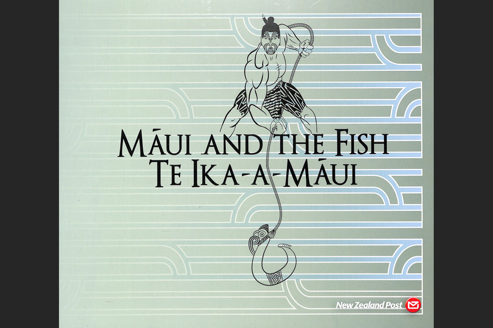

### Māui

#### Maui and the Fish - Te Ika-a-Maui

Source: [New Zealand Post Stamps](https://stamps.nzpost.co.nz/new-zealand/2018/maui-and-fish-te-ika-maui)

> Many Europeans were fascinated by Māori mythology.
> One was the German artist Wilhelm Dittmer,
> who visited New Zealand to collect oral traditions.
> He also illustrated many traditions with ink drawings.
> Here Māui, with his frightened brothers clinging to the canoe,
> heaves up the fish that is the North Island.
> The sun, to whom Māui and his brothers are linked
> in another tradition, watches on.

Source: [Te Ara, The Encyclopedia of New Zealand](https://teara.govt.nz/en/artwork/2383/maui-fishing-new-zealand-out-of-the-ocean)

#### More Images

##### New Zealand Post

* [Maui and the Fish - Te Ika-a-Maui](https://stamps.nzpost.co.nz/new-zealand/2018/maui-and-fish-te-ika-maui)

##### Project Gutenberg

* [VIII Maui - The creation of New Zealand](https://www.gutenberg.org/files/54610/54610-h/54610-h.htm#VIII)

##### Te Ara, The Encyclopedia of New Zealand

* [Māui fishes up the North Island](https://teara.govt.nz/en/artwork/5982/maui-fishes-up-the-north-island)
* [Places associated with Māui](https://teara.govt.nz/en/map/2382/places-associated-with-maui)
* [Māui](https://teara.govt.nz/en/document/3802/maui)

#### References

##### Land of Voyagers

* [MAUI'S MATAURANGA OF THE SUN](https://www.thevoyage.co.nz/en/video/72_MAUI-S-MATAURANGA-OF-THE-SUN)

##### New Zealand Tourism — 100% Pure New Zealand

* [The Legend of New Zealand](https://www.newzealand.com/us/feature/the-legend-of-new-zealand/)

##### Project Gutenberg

* [Te Tohunga: The ancient legends and traditions of the Maoris by W. Dittmer](https://www.gutenberg.org/ebooks/54610)
* [VIII Maui - The creation of New Zealand](https://www.gutenberg.org/files/54610/54610-h/54610-h.htm#VIII)

##### Stuff NZ

* [New Māori name created for submerged continent Zealandia](https://www.stuff.co.nz/national/112578516/new-mori-name-created-for-submerged-continent-zealandia)

##### Te Ara, The Encyclopedia of New Zealand

* [Māui](https://teara.govt.nz/en/first-peoples-in-maori-tradition/page-3)
* [Story: First peoples in Māori tradition](https://teara.govt.nz/en/first-peoples-in-maori-tradition)

##### Wikipedia

* [Māui](https://en.wikipedia.org/wiki/M%C4%81ui_(mythology))
