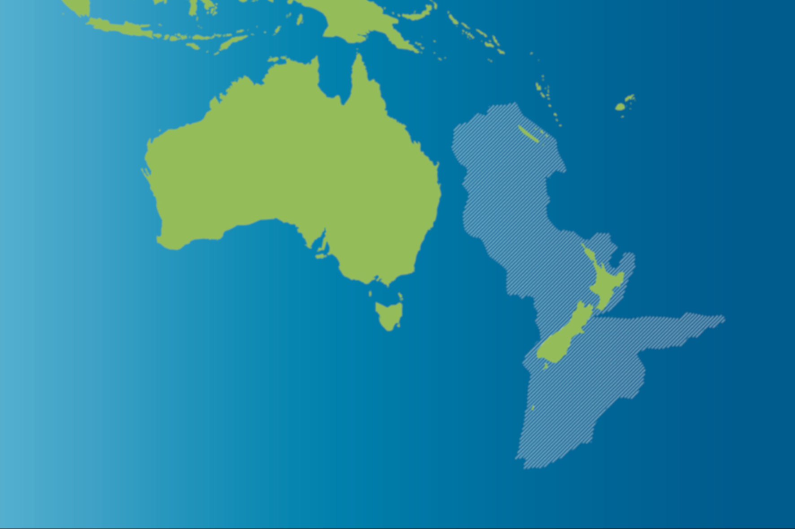

### Te Riu-a-Māui - Zealandia

Source: [University of Nebraska–Lincoln](https://news.unl.edu/newsrooms/today/article/what-makes-a-continent-husker-geologist-says-zealandia-fits/)

#### More Images

##### Shutterstock

* [Zealandia continental fragment](https://www.shutterstock.com/image-vector/zealandia-continental-fragment-known-new-zealand-583134097?src=bHUA8_LZGnOVpsrNYebf2A-1-0&zanpid=!!awc!!&utm_medium=Affiliate&utm_source=!!AWINsharedid!!&awc=5876_1578592923_dcba5ab58abab05f07b82e56e370700f)

##### The Sun

* [What is Zealandia? Landmass under New Zealand that could become earth’s eighth continent](https://www.thesun.co.uk/news/2887128/zealandia-new-eight-continent/)

##### University of Nebraska–Lincoln

* [What makes a continent? Husker geologist says 'Zealandia' fits](https://news.unl.edu/newsrooms/today/article/what-makes-a-continent-husker-geologist-says-zealandia-fits/)

##### University of Tasmania

* [Researchers explore lost ancient continent of Zealandia](http://www.utas.edu.au/news/2017/9/27/419-researchers-explore-lost-ancient-continent-of-zealandia/)

##### Wikipedia

* [Zealandia Topography](https://en.wikipedia.org/wiki/File:Zealandia_topography.jpg)

#### References

##### My Modern MET

* [Zealandia Is the Continent You Never Knew Existed](https://mymodernmet.com/zealandia-hidden-continent/)

##### Nature

* [How the submerged continent of Zealandia took shape](https://www.nature.com/articles/d41586-018-07884-y)

##### Stuff NZ

* [New Māori name created for submerged continent Zealandia](https://www.stuff.co.nz/national/112578516/new-mori-name-created-for-submerged-continent-zealandia)

##### The Sun

* [What is Zealandia? Landmass under New Zealand that could become earth’s eighth continent](https://www.thesun.co.uk/news/2887128/zealandia-new-eight-continent/)

##### ThoughtCo.

* [Zealandia: The Drowned Continent of the South](https://www.thoughtco.com/zealandia-missing-continent-4154008)

##### University of Nebraska–Lincoln

* [What makes a continent? Husker geologist says 'Zealandia' fits](https://news.unl.edu/newsrooms/today/article/what-makes-a-continent-husker-geologist-says-zealandia-fits/)

##### University of Tasmania

* [Researchers explore lost ancient continent of Zealandia](http://www.utas.edu.au/news/2017/9/27/419-researchers-explore-lost-ancient-continent-of-zealandia/)

##### Wikipedia

* [Zealandia](https://en.wikipedia.org/wiki/Zealandia)
