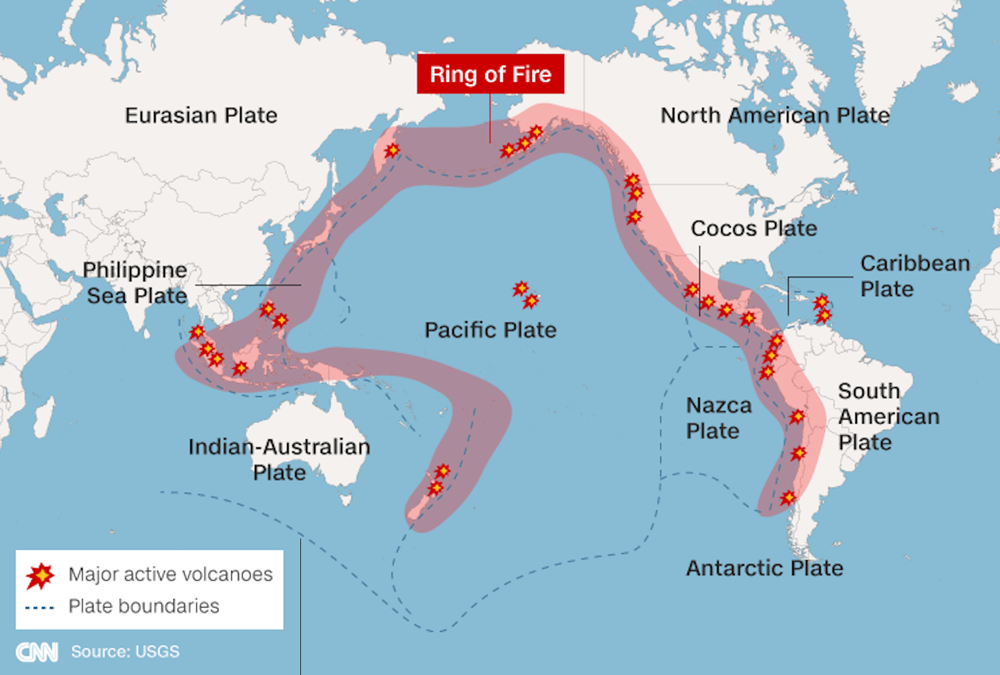

[Cook 250 Research Notebook](../) > Ring of Fire  
*[Previous](../p04-zealandia/)* | Page 05 | *[Next](../p06-hawaiki/)*
### Ring of Fire

Source: [CNN/USGS](https://edition.cnn.com/2017/09/08/world/ring-of-fire-explainer/index.html)

#### More Images

##### The Guardian

* [Java's ring of fire rumbles on: Indonesian volcanoes erupt – in pictures](https://www.theguardian.com/world/gallery/2021/jan/19/javas-ring-of-fire-rumbles-on-indonesian-volcanoes-erupt-in-pictures)

##### USGS

* [Pacific Plate boundaries and relative motion](https://www.usgs.gov/media/images/pacific-plate-boundaries-and-relative-motion)

#### References

##### CNN

* [What is the Ring of Fire?](https://edition.cnn.com/2017/09/08/world/ring-of-fire-explainer/index.html)

##### Encyclopedia Britannica

* [Ring of Fire](https://www.britannica.com/place/Ring-of-Fire)

##### Universe Today

* [What is the Pacific “Ring of Fire”?](https://www.universetoday.com/59341/pacific-ring-of-fire/)

##### Wikipedia

* [Ring of Fire](https://en.wikipedia.org/wiki/Ring_of_Fire)

[Cook 250 Research Notebook](../) > Ring of Fire  
*[Previous](../p04-zealandia/)* | Page 05 | *[Next](../p06-hawaiki/)*
