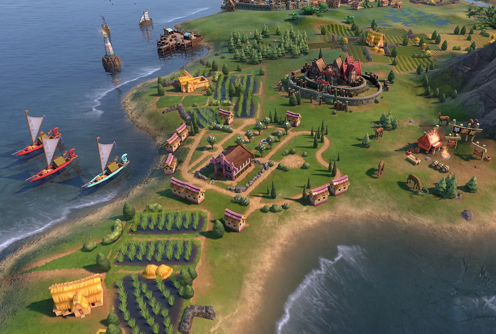

[Cook 250 Research Notebook](../) > Hawaiki  
*[Previous](../p05-ring-of-fire/)* | Page 06 | *[Next](../p07-roaring-forties/)*
### Hawaiki

> From Hawaiki to Hawaiki
>
> Hawaiki, the legendary homeland of the Maori peoples
> of Aotearoa/New Zealand, from whence we migrated to
> this land about 1000 years ago. Where is Hawaiki?
> Many have speculated that it lies somewhere in the
> Pacific, somewhere in Polynesia.
>
> Modern scholars tell us that more than 15,000 years ago
> we lived on the land now called China, and that from there
> we travelled via Taiwan and the Philippines to Indonesia.
> About 6,000 to 9,000 years ago we moved on through Melanesia
> and reached Fiji about 3,500 years ago. From there to Samoa
> and on to the Marquesas 2,500 years ago. Perhaps that was the
> limit of our eastern migration for it seems that 1,700 years
> ago we turned South West to Tahiti, thence to the Cook Islands
> and to Aotearoa/New Zealand. Where then is the legendary
> homeland of Hawaiki?
>
> Our tribal stories tell us that at the death of our bodies
> our spirits live on and journey back to Hawaiki; to the meeting
> place of the spirits at Great Hawaiki, Long Hawaiki, Hawaiki
> Far Away. Life then is a journey from Hawaiki to Hawaiki, the
> spiritual homeland of the Maori. And Hawaiki is with us always,
> carried in our hearts through thousands of generations, and
> thousands of years of migration; carried also through the lifetime
> of a single heart wherever it may journey.
>
> — https://maaori.com/people/maoriara.htm

#### More Images

##### Sid Meier's Civilization

* [Civilization VI: Gathering Storm – Kupe Leads the Maori](https://civilization.com/news/entries/civilization-vi-gathering-storm-first-look-maori-kupe-leader-pc-release-date-february-14-2019/)

##### Te Ara — The Encyclopedia of New Zealand

* [Hawaiki](https://teara.govt.nz/en/artwork/3803/hawaiki)
* [Meeting house, Te Papa Tongarewa](https://teara.govt.nz/en/photograph/2384/meeting-house-te-papa-tongarewa)

#### References

##### Encyclopedia Mythica

* [Hawaiki](https://pantheon.org/articles/h/hawaiki.html)

##### Māori - From Hawaiki to Hawaiki

* [The Journey to Aotearoa](https://maaori.com/people/maoriara.htm)

##### Māori Dictionary

* [Hawaiki](https://maoridictionary.co.nz/search?idiom=&phrase=&proverb=&loan=&histLoanWords=&keywords=Hawaiki)

##### New Zealand Tourism — 100% Pure New Zealand

* [The arrival of Māori](https://www.newzealand.com/int/feature/early-settlement/)

##### Stuff

* [The ancient origins of New Zealanders](https://www.stuff.co.nz/science/100455675/the-ancient-origins-of-new-zealanders)
* [Who were the first humans to reach New Zealand?](https://www.stuff.co.nz/science/100629585/dna-who-were-the-first-humans-to-reach-aotearoa)

##### Te Ara — The Encyclopedia of New Zealand

* [Story: Hawaiki](https://teara.govt.nz/en/hawaiki)
* [Hawaiki](https://teara.govt.nz/en/artwork/3803/hawaiki)
* [Meeting house, Te Papa Tongarewa](https://teara.govt.nz/en/photograph/2384/meeting-house-te-papa-tongarewa)

##### Victoria University of Wellington Library

* [The Coming of the Maori: Hawaiki](http://nzetc.victoria.ac.nz/tm/scholarly/tei-BucTheC-t1-g1-t1-body1-d5-d2.html)
* [Hawaiki: The Original Home of the Maori; with a Sketch of Polynesian History: Hawaiki](http://nzetc.victoria.ac.nz/tm/scholarly/tei-SmiHawa-t1-body-d3-d1.html)

##### Wikipedia

* [Hawaiki](https://en.wikipedia.org/wiki/Hawaiki)

##### Wikisource

* [Hawaiki: The Original Home of the Maori, by S. Percy Smith](https://en.wikisource.org/wiki/Hawaiki_The_Original_Home_of_the_Maori)

[Cook 250 Research Notebook](../) > Hawaiki  
*[Previous](../p05-ring-of-fire/)* | Page 06 | *[Next](../p07-roaring-forties/)*
