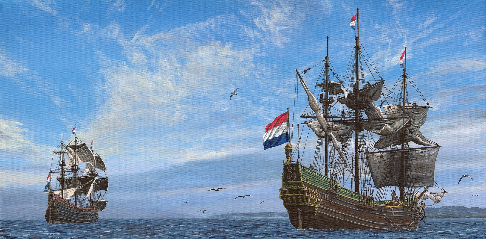

### Heemskerck and Zeehaen

#### Heemskerck and Zeehaen weigh anchor at sunrise off Nine Mile Beach, December 15th 1642

Source: [Abel Tasman 1642](http://abeltasman.org.nz/articles-research/heemskerck-zeehaen/)

> These ship paintings are based on Robert Jenkin’s 2014 reconstructions
> which appear below [in the page], and those are largely based on
> Hoving and Emke’s reconstructions in The Ships of Abel Tasman (2000).
> Two minor differences are mizzenmasts and waist storage of large open boats.

#### More Images

* [Heemskerck and Zeehaen](http://abeltasman.org.nz/articles-research/heemskerck-zeehaen/)
* [New Zealand images from Tasman’s journal](http://abeltasman.org.nz/images/)

#### References

##### Abel Tasman 1642

* [What happened in 1642](http://abeltasman.org.nz/what-happened-in-1642/)
* [Heemskerck and Zeehaen](http://abeltasman.org.nz/articles-research/heemskerck-zeehaen/)

##### Wikipedia

* [Abel Tasman](https://en.wikipedia.org/wiki/Abel_Tasman)

