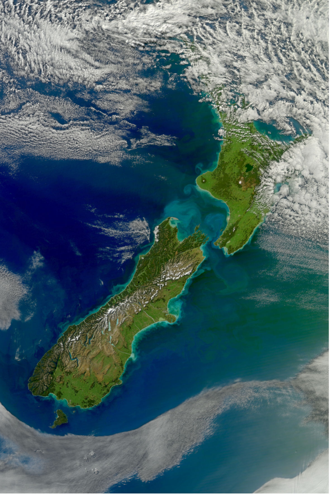

### Roaring Forties

#### Turbid Waters Surround New Zealand

> The Roaring Forties in the Cook Strait of New Zealand
> produce high waves, and they erode the shore as shown in this image.
> — https://en.wikipedia.org/wiki/Roaring_Forties

> View of sediment from New Zealand flowing in the Pacific Ocean.
> The volume of sediment in the water hints at rough seas.
> Distinctive plumes arise from pulsing rivers,
> while the halo of turquoise around both islands is likely sediment
> swept up to the ocean surface by powerful waves.
> The plumes fan out and fade from tan to green and blue
> with water depth and distance from the shore.
> The Cook Strait, the narrow strip of water separating the North
> and South Islands of New Zealand, has a reputation for being among
> the world’s roughest stretches of water.
> The islands lie within the “Roaring Forties,” a belt of winds
> that circles the globe around 40 degrees south.
> The westerlies hit the islands side on and run into the mountain ranges.
> The Cook Strait is the only opening for the winds,
> so the channel becomes something of a wind tunnel.
> Strong winds produce high waves, and they erode the shore
> as shown in the image.

Source: [Wikimedia](https://en.wikipedia.org/wiki/File:Turbid_Waters_Surround_New_Zealand.jpg)

A larger resolution of the picture is available on that page.

#### References

##### Wikipedia

* [Roaring Forties](https://en.wikipedia.org/wiki/Roaring_Forties)
