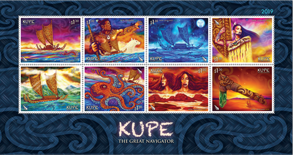
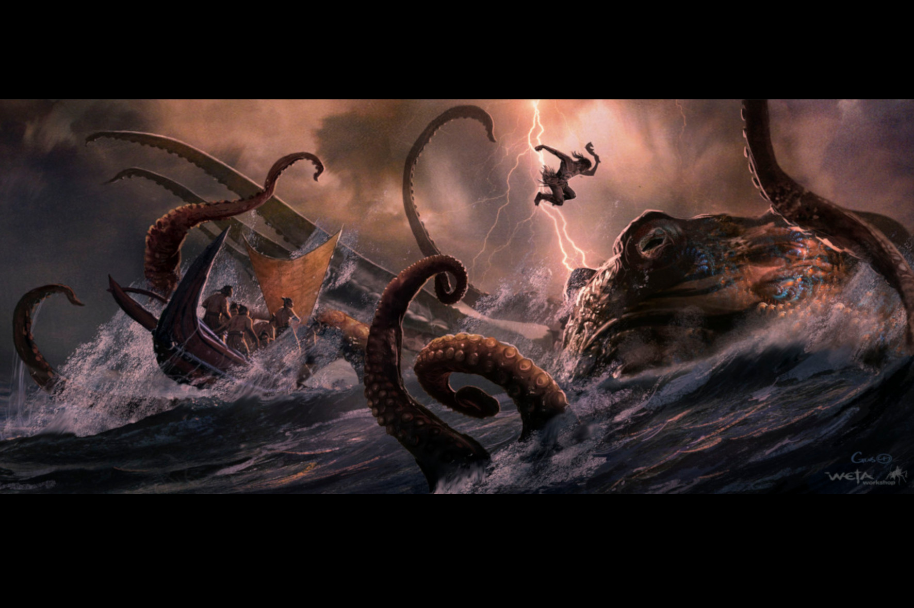

*[Previous](../p07-roaring-forties/)* | Page 08 | *[Next](../p09-abel-tasman/)*
### Kupe

#### A cloud! A white cloud! A long white cloud!

  
*Kupe's wife, Hine-te-Aparangi, was the first to spot Aotearoa.*  
*Stamps designed by Dave Burke, issued June 5, 2019 by New Zealand Post*

> Kupe - The Great Navigator Sheetlet
>
> Mint sheetlet of eight gummed stamps

Source: [New Zealand Post](https://stamps.nzpost.co.nz/new-zealand/2019/kupe-great-navigator)

#### More Images

* [House carving showing Kupe (holding a paddle), with two sea creatures at his feet](https://en.wikipedia.org/wiki/File:KupeWheke.jpg)
* [Kupe battling Te Wheke](https://historyaotearoa.com/2019/01/09/history-of-aotearoa-new-zealand-episode-3-kupe-and-te-wheke/)

##### Abel Tasman 1642

* [Kupe’s Sails](http://abeltasman.org.nz/kupes/)

##### Cryptid Wiki on Fandom

* [Te Wheke-a-Muturangi](https://cryptidz.fandom.com/wiki/Te_Wheke-a-Muturangi)

##### New Zealand Post

* [The Discoverers - Millenium Part One](https://stamps.nzpost.co.nz/new-zealand/1997/discoverers-millenium-part-one)

##### Sid Meier's Civilization

* [Civilization VI: Gathering Storm – Kupe Leads the Maori](https://civilization.com/news/entries/civilization-vi-gathering-storm-first-look-maori-kupe-leader-pc-release-date-february-14-2019/)

##### Te Ara, The Encyclopedia of New Zealand

* [Statue of Kupe on the Wellington waterfront](https://teara.govt.nz/en/photograph/14132/statue-of-kupe)
* [Battling Te Wheke](https://teara.govt.nz/en/artwork/6800/battling-te-wheke)

##### Te Papa Tongarewa — Museum of New Zealand

* [Kupe Sites: A photographic journey ](https://www.tepapa.govt.nz/discover-collections/read-watch-play/maori/kupe-sites-photographic-journey)

##### Virtual New Zealand Stamps

* [Kupe and The First Maori Settlers](http://virtualnewzealandstamps.blogspot.com/2016/07/kupe-and-first-maori-settlers.html)
* [2019 Kupe - The Great Navigator](http://virtualnewzealandstamps.blogspot.com/2019/07/2019-kupe-great-navigator.html)

##### Wikipedia

* [Kupe Wheke](https://commons.wikimedia.org/wiki/File:KupeWheke.jpg)

#### References

##### Abel Tasman 1642

* [Kupe’s Sails](http://abeltasman.org.nz/kupes/)

##### Ao Ako Global Learning

* [The Wheke – The Octopus](https://aoakogloballearning.co.nz/te-wheke/)

##### Encyclopedia Mythica

* [Kupe](https://pantheon.org/articles/k/kupe.html)

##### History of Aotearoa New Zealand Podcast

* [Kupe and Te Wheke](https://historyaotearoa.com/2019/01/09/history-of-aotearoa-new-zealand-episode-3-kupe-and-te-wheke/)

##### New Zealand Post

* [Kupe, The Great Navigator (Stamp Series, June 2019)](https://stamps.nzpost.co.nz/new-zealand/2019/kupe-great-navigator)

##### NZ History

* [Encounters](https://nzhistory.govt.nz/culture/encounters)
* [Te Haerenga o Kupe](https://linz.maps.arcgis.com/apps/Cascade/index.html?appid=be9ec5ec3dc24405bc0d2a769fae81ee)

##### NZ On Screen

* [Kupe - Voyaging by the Stars](https://www.nzonscreen.com/title/kupe-voyaging-by-the-stars-1993)

##### Te Ara, The Encyclopedia of New Zealand

* [Aotearoa](https://teara.govt.nz/en/1966/aotearoa)
* [Story: First peoples in Māori tradition](https://teara.govt.nz/en/first-peoples-in-maori-tradition)
* [Kupe](https://teara.govt.nz/en/first-peoples-in-maori-tradition/page-6)
* [Coastal Explorers](https://teara.govt.nz/en/nga-waewae-tapu-maori-exploration/page-2)
* [Kupe in the far north](https://teara.govt.nz/en/interactive/14129/kupe-in-the-far-north)
* [Places associated with Kupe (1st of 3)](https://teara.govt.nz/en/map/2388/places-associated-with-kupe)
* [Kupe’s places around Cook Strait (2nd of 3)](https://teara.govt.nz/en/map/2389/kupes-places-around-cook-strait)
* [Kupe’s places around the Marlborough Sounds (3rd of 3)](https://teara.govt.nz/en/map/2390/kupes-places-around-the-marlborough-sounds)
* [Islands in Wellington Harbour](https://teara.govt.nz/en/photograph/2394/islands-in-wellington-harbour)

##### Te Kete Ipurangi (TKI), New Zealand’s bilingual education portal

* [About Te Kete Ipurangi](https://www.tki.org.nz/About-this-site/About-Te-Kete-Ipurangi)
* [Kupe and the Giant Wheke](http://eng.mataurangamaori.tki.org.nz/Support-materials/Te-Reo-Maori/Maori-Myths-Legends-and-Contemporary-Stories/Kupe-and-the-Giant-Wheke)
* [Kupe's travels around Aotearoa](http://eng.mataurangamaori.tki.org.nz/Support-materials/Te-Reo-Maori/Maori-Myths-Legends-and-Contemporary-Stories/Kupe-s-travels-around-Aotearoa)

##### Te Papa Tongarewa — Museum of New Zealand

* [Voyage and discovery in the Pacific](https://www.tepapa.govt.nz/discover-collections/read-watch-play/history/voyage-and-discovery-pacific)

##### Victoria University of Wellington on edX/YouTube

* [Ngā Waka o Kupe - Video](https://www.youtube.com/watch?v=m4rkRpiQYdI)
* [New Zealand Landscape as Culture: Islands (Ngā Motu)](https://www.edx.org/course/new-zealand-landscape-as-culture-islands-nga-motu)
* [New Zealand Landscape as Culture: Maunga (Mountains)](https://www.edx.org/course/new-zealand-landscape-as-culture-maunga-mountains)

##### Virtual New Zealand Stamps

* [Kupe and The First Maori Settlers](http://virtualnewzealandstamps.blogspot.com/2016/07/kupe-and-first-maori-settlers.html)

##### Wikipedia

* [Kupe](https://en.wikipedia.org/wiki/Kupe)
* [Te Wheke-a-Muturangi](https://en.wikipedia.org/wiki/Te_Wheke-a-Muturangi)

*[Previous](../p07-roaring-forties/)* | Page 08 | *[Next](../p09-abel-tasman/)*
