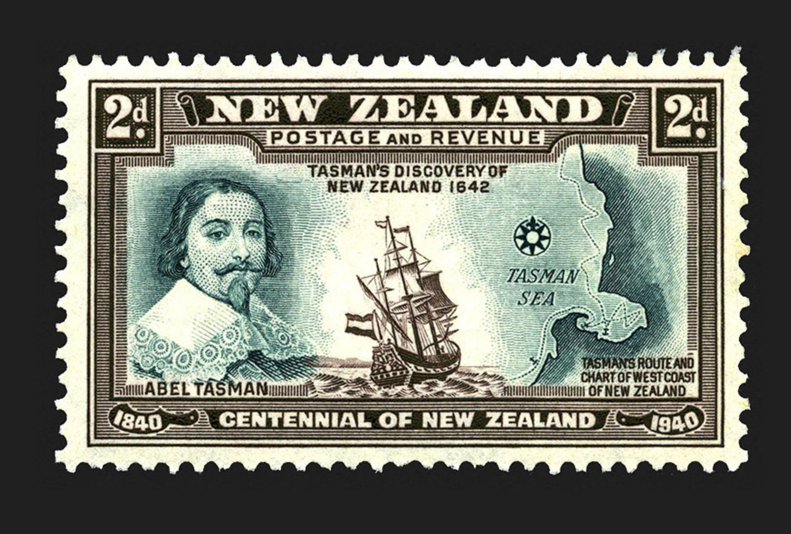
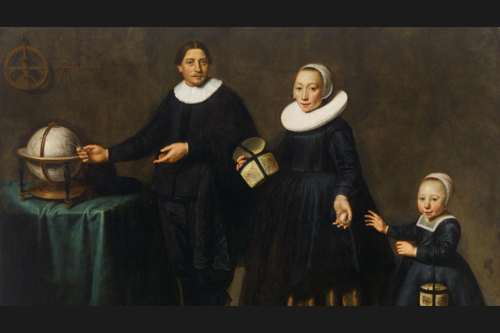
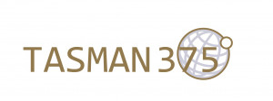

*[Previous](../p08-kupe/)* | Page 09 | *[Next](../p10-matawhaorua/)*
### Abel Tasman

[Abel Tasman][TASMAN] was a Dutch explorer employed by the
[Dutch East India Company][VOC] to find the mythical
"Southern Continent" or [Terra Australis][TERRA_AUSTRALIS],
a gigantic land mass expected to cover 1/5th of the world,
which was assumed to be required to keep the Earth in balance.

Source: [Te Ara — The Encyclopedia of New Zealand](https://teara.govt.nz/en/zoomify/43023/centennial-stamps)

> part of a series of thirteen stamps issued by the New Zealand Post Office
> for the centennial of New Zealand in 1940

#### More Images

##### Filatelia e Storia

* [Il navigatore olandese Abel Tasman scopre la Nuova Zelanda](https://filateliaestoria.weebly.com/trivial/il-navigatore-olandese-abel-tasman-scopre-la-nuova-zelanda)

##### Groninger Museum

* [Portrait of Abel Tasman in Groningen](https://www.groningermuseum.nl/en/art/exhibitions/portrait-abel-tasman-comes-home-groningen)

##### National Library New Zealand

* [Page of a book featuring an image of Abel Tasman by an unidentified artist](https://natlib.govt.nz/records/23244422?search%5Bi%5D%5Busage%5D=Unknown&search%5Bil%5D%5Bsubject%5D=Tasman%2C+Abel+Janszoon%2C+1603%3F-1659%3F&search%5Bpath%5D=photos)

##### Tasman 1642

* [Tasman](http://tasman1642.com.au/#tasman)

##### Tasman 375 Logo

Source: [Tasman 375 Project](https://tasman375.groningen.nl/en/over-tasman-375)

##### Te Ara — The Encyclopedia of New Zealand

* [Centennial stamps](https://teara.govt.nz/en/zoomify/43023/centennial-stamps)

#### References

##### Abel Tasman Museum (NL)

* [Tasman 375 Project](https://tasman375.groningen.nl/en/over-tasman-375)

##### Abel Tasman 1642

* [What happened in 1642](http://abeltasman.org.nz/what-happened-in-1642/)
* [New Zealand images from Tasman’s journal](http://abeltasman.org.nz/images/)

##### Encyclopaedia Britannica

* [Abel Tasman](https://www.britannica.com/biography/Abel-Tasman)

##### National Archives NL

* [Facsimile of Tasman Journal](https://www.nationaalarchief.nl/en/research/archive/1.11.01.01/inventory?inventarisnr=121&activeTab=gahetnascans)

##### New Zealand Post

* [1940 Centennial](https://stamps.nzpost.co.nz/new-zealand/1940/centennial)

##### Project Gutenberg Australia

* [Abel Janszoon TASMAN (c.1603-1659)](http://gutenberg.net.au/pages/tasman.html)
* [English Translation of Tasman's handwritten Journal](http://gutenberg.net.au/ebooks06/0600571h.html#journal)
* [The Journal of Abel Jansz Tasman](http://gutenberg.net.au/ebooks04/0400771.txt)

##### State Library, New South Wales

* [Facsimile of Abel Tasman's handwritten Journal](http://archival.sl.nsw.gov.au/Details/archive/110320645)

##### Tasman 1642

* [Tasman 1642](http://tasman1642.com.au/)

#### Te Ara, The Encyclopedia of New Zealand

* [Story: European discovery of New Zealand](https://teara.govt.nz/en/european-discovery-of-new-zealand)
* [Terra australis incognita](https://teara.govt.nz/en/zoomify/1403/terra-australis-incognita)

##### Wikipedia

* [Abel Tasman][TASMAN]
* [Dutch East India Company][VOC]
* [European exploration of Australia](https://en.wikipedia.org/wiki/European_exploration_of_Australia)
* [Roaring Forties][ROARING40s]
* [Terra Australis][TERRA_AUSTRALIS]

[GIANTS]: https://tasman375.groningen.nl/en/reisverslagen/wonen-hier-reuzen
[MORE_LAND]: http://sixboats.co.nz/more-land/
[ROARING40s]: https://en.wikipedia.org/wiki/Roaring_Forties
[TASMAN]: https://en.wikipedia.org/wiki/Abel_Tasman
[TASMAN_SHIPS]: http://abeltasman.org.nz/articles-research/heemskerck-zeehaen/
[TERRA_AUSTRALIS]: https://en.wikipedia.org/wiki/Terra_Australis
[VOC]: https://en.wikipedia.org/wiki/Dutch_East_India_Company

*[Previous](../p08-kupe/)* | Page 09 | *[Next](../p10-matawhaorua/)*
