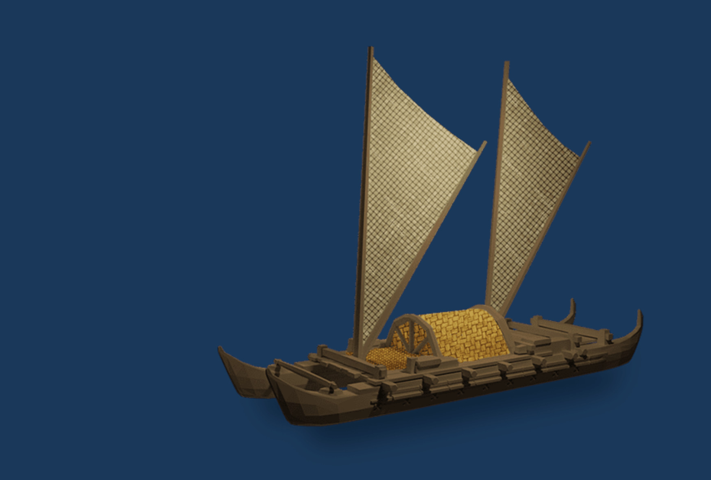

[Cook 250 Research Notebook](../) > Mātāwhaorua  
*[Previous](../p09-abel-tasman/)* | Page 10 | *[Next](../p11-heemskerck-and-zeehaen/)*
### Mātāwhaorua, Kupe's waka

  
*Polynesian double hull waka*

> According to many tribal narratives,
> Kupe was the first Pacific explorer to discover the islands of New Zealand.
> Stories about his exploration on his canoe,
> the Matawhaorua or Matahorua, differ from region to region
> but often feature a fight with a great wheke (octopus).
> Many New Zealand place names, preserved by later generations
> of Māori people, recall his journey.
>
> — https://nzhistory.govt.nz/culture/encounters/polynesian-voyaging

Source: [Tupapa](https://www.tupapa.nz/)

#### More Images

##### Hawaiian Voyaging Traditions

* [Online Visuals](http://archive.hokulea.com/hoonaauao/resources_visual.html)

##### Herb Kawainui Kāne: A Visual Collection of Hawaiian History

* [Canoes](https://www.herbkanehawaii.com/product-category/canoes/)

##### New Zealand History

* [Pacific voyaging and discovery](https://nzhistory.govt.nz/culture/encounters/polynesian-voyaging)

##### Te Ara, The Encyclopedia of New Zealand

* [Polynesian double hull](https://teara.govt.nz/en/artwork/5987/polynesian-double-hull)
* [Kupe’s anchor](https://teara.govt.nz/en/photograph/2295/kupes-anchor)
* [Replica of the Ngātokimatawhaorua canoe](https://teara.govt.nz/en/photograph/4134/replica-of-the-ngatokimatawhaorua-canoe)
* [Ngātokimatawhaorua](https://teara.govt.nz/en/photograph/6001/ngatokimatawhaorua)

##### Tuia 250

* [Tuia 250 Voyage](https://mch.govt.nz/tuia250/voyage)

##### Virtual New Zealand Stamps

* [2019 Kupe - The Great Navigator](http://virtualnewzealandstamps.blogspot.com/2019/07/2019-kupe-great-navigator.html)

#### References

##### Abel Tasman 1642

* [Atholl Anderson (2017) Changing perspectives upon Māoricolonisation voyaging, Journal of the Royal Society of New Zealand](http://abeltasman.org.nz/articles-research/changing-perspectives-upon-maori-colonisation-voyaging/)

##### Hawaiian Voyaging Traditions

* [Hawaiian Voyaging Traditions](http://archive.hokulea.com/)

##### NZ On Screen

* [Kupe - Voyaging by the Stars](https://www.nzonscreen.com/title/kupe-voyaging-by-the-stars-1993)

##### Te Ara, The Encyclopedia of New Zealand

* [Story: Waka – canoes](https://teara.govt.nz/en/waka-canoes)
* [Story: Canoe traditions](https://teara.govt.nz/en/canoe-traditions)
* [Pacific origins](https://teara.govt.nz/en/waka-canoes/page-1)
* [Waka in New Zealand](https://teara.govt.nz/en/waka-canoes/page-2)

##### Te Ao Māori News

* [Top of the South Iwi relaunch their waka traditions](https://teaomaori.news/top-south-iwi-relaunch-their-waka-traditions)

[Cook 250 Research Notebook](../) > Mātāwhaorua  
*[Previous](../p09-abel-tasman/)* | Page 10 | *[Next](../p11-heemskerck-and-zeehaen/)*
