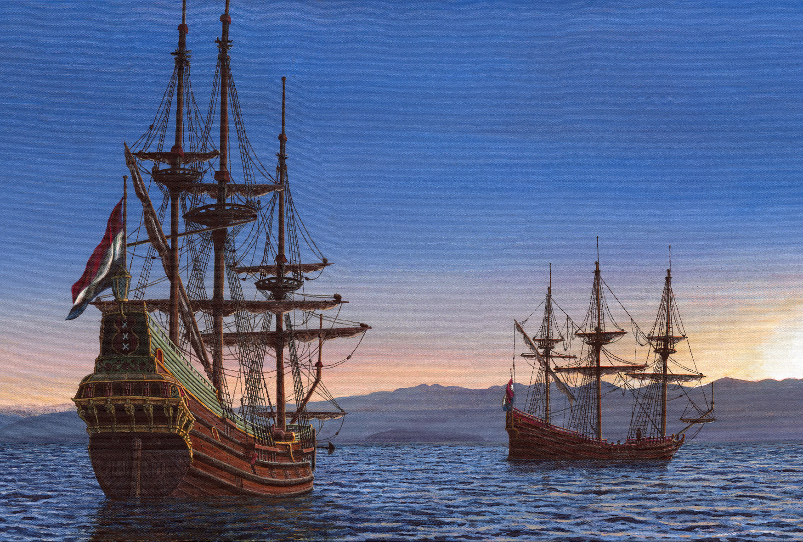

[Cook 250 Research Notebook](../) > Heemskerck and Zeehaen  
*[Previous](../p10-matawhaorua/)* | Page 11 | *[Next](../p12-aotearoa/)*
### Heemskerck and Zeehaen, Abel Tasman's ships

*Heemskerck and Zeehaen anchored in Golden Bay at sunset, December 18, 1642*  
*Painting by [Robert Jenkin](https://robertianjenkin.co.nz/my-art/heemskerck/)*

Source: [Abel Tasman 1642](http://abeltasman.org.nz/articles-research/heemskerck-zeehaen/)

> These ship paintings are based on Robert Jenkin’s 2014 reconstructions
> which appear below [in the page], and those are largely based on
> Hoving and Emke’s reconstructions in The Ships of Abel Tasman (2000).
> Two minor differences are mizzenmasts and waist storage of large open boats.

#### Start of Tasman First Voyage

Leaving Indonesia with two ships, [Heemskerck and Zeehaen][TASMAN_SHIPS],
on 14 August 1642, Abel Tasman arrived at Mauritius on 5 September 1642
then left on 8 October along the [Roaring Forties][ROARING40s].

On 24 November 1642, he sighted the coast of what he assumed to be
[Terra Australis][TERRA_AUSTRALIS]. He started to circumvent it from
a distance, keeping at sea due to the rough weather, as multiple attempts
to send men ashore failed. On 2 December 1642, men reached the shore,
trying to find fresh water and provisions: they found a lush vegetation
but only a thin stream with too little water to collect in barrels.
They [heard music and saw traces of people][GIANTS] but did not meet anyone.

> **Item the 2nd.**
>
> Early in the morning we sent our Pilot-major Francoys Jacobsz in command of
> our pinnace, manned with 4 musketeers and 6 rowers, all of them furnished
> with pikes and side-arms, together with the cock-boat of the Zeehaan with
> one of her second mates and 6 musketeers in it, to a bay situated north-west
> of us at upwards of a mile distance in order to ascertain what facilities
> (as regards fresh water, refreshments, timber and the like) may be available
> there. About three hours before nightfall the boats came back,
> bringing various samples of vegetables which they had seen growing
> there in great abundance, some of them in appearance not unlike a certain
> plant growing at the Cape of Good Hope and fit to be used as pot-herbs,
> and another species with long leaves and a brackish taste, strongly
> resembling persil de mer or samphire. The Pilot-major and the second mate
> of the Zeehaan made the following report, to wit:
>
> That they had rowed the space of upwards of a mile round the said point,
> where they had found high but level land covered with vegetation (not
> cultivated, but growing naturally by the will of God) abundance of excellent
> timber, and a gently sloping watercourse in a barren valley, the said water,
> though of good quality, being difficult to procure because the watercourse
> was so shallow that the water could be dipped with bowls only.
>
> That they had heard certain human sounds and also sounds nearly resembling
> the music of a trump or a small gong not far from them though they had seen
> no one.
>
> That they had seen two trees about 2 or 2½ fathom in thickness measuring
> from 60 to 65 feet from the ground to the lowermost branches, which trees
> bore notches made with flint implements, the bark having been removed for
> the purpose; these notches, forming a kind of steps to enable persons to get
> up the trees and rob the birds' nests in their tops, were fully 5 feet apart
> so that our men concluded that the natives here must be of very tall stature,
> or must be in possession of some sort of artifice for getting up the said
> trees; in one of the trees these notched steps were so fresh and new that
> they seemed to have been cut less than four days ago.
>
> That on the ground they had observed certain footprints of animals, not
> unlike those of a tiger's claws; they also brought on board certain specimens
> of animals excrements voided by quadrupeds, so far as they could surmise and
> observe, together with a small quantity of gum of a seemingly very fine
> quality which had exuded from trees and bore some resemblance to gum-lac.
>
> That round the eastern point of this bay they had sounded 13 or 14 feet at
> high water, there being about 3 feet at low tide.
>
> That at the extremity of the said point they had seen large numbers of gulls,
> wild ducks and geese, but had perceived none farther inward though they had
> heard their cries; and had found no fish except different kinds of mussels
> forming small clusters in several places.
>
> That the land is pretty generally covered with trees standing so far apart
> that they allow a passage everywhere and a lookout to a great distance so
> that, when landing, our men could always get sight of natives or wild beasts,
> unhindered by dense shrubbery or underwood, which would prove a great
> advantage in exploring the country.
>
> That in the interior they had in several places observed numerous trees
> which had deep holes burnt into them at the upper end of the foot, while
> the earth had here and there been dug out with the fist so as to form a
> fireplace, the surrounding soil having become as hard as flint through the
> action of the fire.
>
> A short time before we got sight of our boats returning to the ships, we now
> and then saw clouds of dense smoke rising up from the land, which was nearly
> west by north of us, and surmised this might be a signal given by our men,
> because they were so long coming back, for we had ordered them to return
> speedily, partly in order to be made acquainted with what they had seen,
> and partly that we might be able to send them to other points if they should
> find no profit there, to the end that no precious time might be wasted.
> When our men had come on board again we inquired of them whether they had
> been there and made a fire, to which they returned a negative answer,
> adding however that at various times and points in the wood they also had
> seen clouds of smoke ascending. So there can be no doubt there must be men
> here of extraordinary stature. This day we had variable winds from the
> eastward, but for the greater part of the day a stiff, steady breeze from
> the south-east.
>
> — http://gutenberg.net.au/ebooks06/0600571h.html

Tasman officially claimed possession of the land on 3 December 1642,
which would later be called Tasmania in his honor, but failed to set foot
on the land himself because of the strong waves close to the shore, he had
to send a man swimming to the shore to plant the pole with the flag.
Two days later, facing opposing winds, he decided to stop the circumnavigation
and failed to discover the strait that separates the island of Tasmania
from Australia. Instead, Tasmania would be drawn as part of Australia
on the [Tasman Map][TASMAN_MAP], drawn circa 1644 based on his charts.

#### More Images

##### Abel Tasman 1642

* [Heemskerck and Zeehaen](http://abeltasman.org.nz/articles-research/heemskerck-zeehaen/)
* [New Zealand images from Tasman’s journal](http://abeltasman.org.nz/images/)

#### References

##### Abel Tasman 1642

* [What happened in 1642](http://abeltasman.org.nz/what-happened-in-1642/)
* [Heemskerck and Zeehaen](http://abeltasman.org.nz/articles-research/heemskerck-zeehaen/)

##### Abel Tasman Museum (NL)

* [Tasman 375 Project](https://tasman375.groningen.nl/en/over-tasman-375)
* [Do giants live here?](https://tasman375.groningen.nl/en/reisverslagen/wonen-hier-reuzen)
* [In the mist](https://tasman375.groningen.nl/en/reisverslagen/in-de-mist)

##### Project Gutenberg Australia

* [English Translation of Tasman's handwritten Journal](http://gutenberg.net.au/ebooks06/0600571h.html#journal)

##### Robert Jenkin

* [Heemskerck](https://robertianjenkin.co.nz/my-art/heemskerck/)
* [The Last Unicorn](https://robertianjenkin.co.nz/my-art/the-last-unicorn/)

##### State Library, New South Wales

* [Facsimile of Abel Tasman's handwritten Journal](http://archival.sl.nsw.gov.au/Details/archive/110320645)

##### Stuff

* [Commemoration plans of first encounter between Abel Tasman, Māori 375 years ago](https://www.stuff.co.nz/travel/destinations/nz/97210590/commemoration-plans-of-first-encounter-between-abel-tasman-mori-375-years-ago)

##### Wikipedia

* [Abel Tasman][TASMAN]
* [European exploration of Australia](https://en.wikipedia.org/wiki/European_exploration_of_Australia)
* [Roaring Forties][ROARING40s]
* [Terra Australis][TERRA_AUSTRALIS]

[GIANTS]: https://tasman375.groningen.nl/en/reisverslagen/wonen-hier-reuzen
[ROARING40s]: https://en.wikipedia.org/wiki/Roaring_Forties
[TASMAN]: https://en.wikipedia.org/wiki/Abel_Tasman
[TASMAN_MAP]: https://en.wikipedia.org/wiki/Abel_Tasman#Tasman_Map
[TASMAN_SHIPS]: http://abeltasman.org.nz/articles-research/heemskerck-zeehaen/
[TERRA_AUSTRALIS]: https://en.wikipedia.org/wiki/Terra_Australis

[Cook 250 Research Notebook](../) > Heemskerck and Zeehaen  
*[Previous](../p10-matawhaorua/)* | Page 11 | *[Next](../p12-aotearoa/)*
