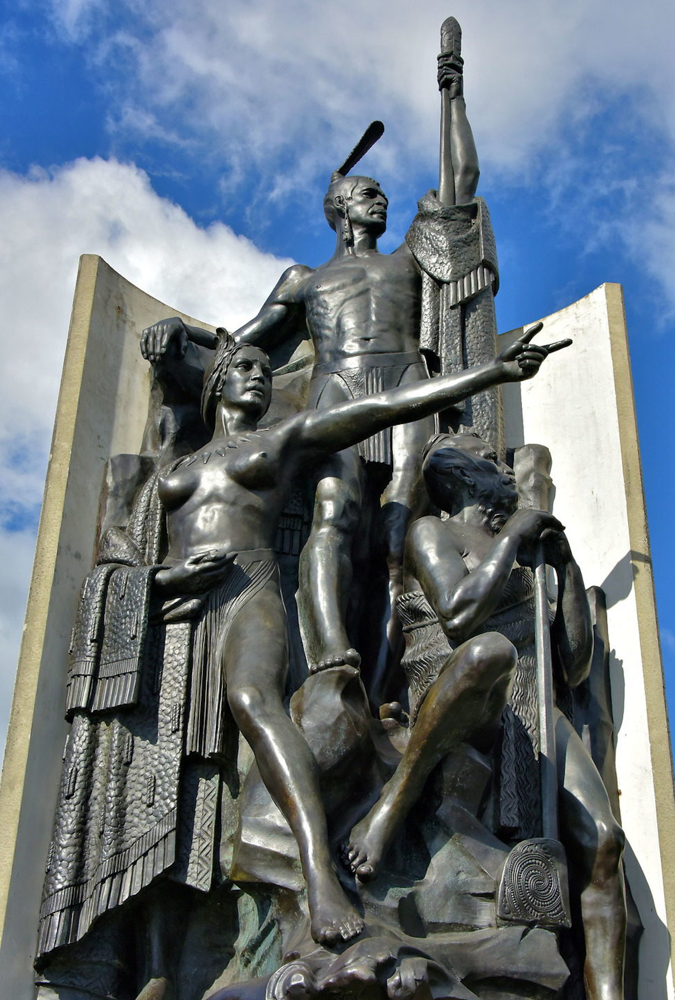

[Cook 250 Research Notebook](../) > Aotearoa  
*[Previous](../p11-heemskerck-and-zeehaen/)* | Page 12 | *[Next](../p13-new-zealand/)*
### Aotearoa

> Māori oral history names Kupe as the first explorer to discover New Zealand.
> He and his companion, Ngahue, captained two sea-going waka (canoes),
> Matahorua and Tawiri-rangi, and sailed south from Hawaiki to see
> what lay beyond the horizon.
>
> The first sign of a major land mass was a build up of white cloud
> in the distance. Kupe's wife, Hine-te-aparangi, called out
> "He ao he ao! He aotea! He aotearoa"
> ("A cloud, a cloud! A white cloud! A long white cloud!"),
> and so the land was named Aotearoa—'Land of the long white cloud'.
>
> After circumnavigating the North and South Islands of Aotearoa,
> Kupe and his crew returned to Hawaiki with treasures
> such as preserved moa flesh and pounamu (greenstone).
>
> — https://www.tourism.net.nz/new-zealand/about-new-zealand/maori-stories-and-legends.html

> It is Kupe who is credited with the discovery of Aotearoa,
> and who returned to the Pacific carrying navigational
> knowledge about the vast new land to the south.
>
> Kupe’s wife, Hine-te-Aparangi, was the first to sight
> the vast land mass that we call Aotearoa.
> “He ao - a cloud!” she called, then “He aotea - a white cloud!”
> and finally “He aotearoa - a long white cloud!”
>
> — https://stamps.nzpost.co.nz/new-zealand/2019/kupe-great-navigator

  
*Statue sculpted by William Trethewey in 1939, cast in bronze in 1999*  
*Photography by Richard F. Ebert*

Source: [Encircle Photos](https://www.encirclephotos.com/image/kupe-raiatea-sighting-of-aotearoa-in-wellington-new-zealand/)

> This statue of Kupe, on the Wellington waterfront,
> shows the legendary explorer with his wife, Hine Te Apārangi,
> and his tohunga (priest), Pekahourangi.
> The country’s Māori name, Aotearoa,
> came when his wife saw a long white cloud
> and realised that land was nearby.
> — https://teara.govt.nz/en/photograph/14132/statue-of-kupe

> In 1939, artist William Trethewey created this statuary in plaster.
> He called it “The Coming of the Māori.”
> This rendition along the waterfront was cast in bronze in 1999.
> — https://www.encirclephotos.com/image/kupe-raiatea-sighting-of-aotearoa-in-wellington-new-zealand/

#### More Images

##### Te Ara — The Encyclopedia of New Zealand

* [Statue of Kupe on the Wellington waterfront](https://teara.govt.nz/en/photograph/14132/statue-of-kupe)
* [Kupe and Kuramārōtini](https://teara.govt.nz/en/photograph/2393/kupe-and-kuramarotini)
* [William Pember Reeves's The long white cloud](https://teara.govt.nz/en/object/42338/william-pember-reevess-the-long-white-cloud)

##### Te Papa Tongarewa — Museum of New Zealand

* [William Trethewy's bronze statue on Wellington waterfront of Kupe, his wife Hine te Aparangi, and tohunga (ritual expert) Pekahourangi as they sight Aoteroa](https://collections.tepapa.govt.nz/object/583215)

##### New Zealand Post

* [Kupe - The Great Navigator](https://stamps.nzpost.co.nz/new-zealand/2019/kupe-great-navigator)

#### References

##### Internet Archive

* [The long white cloud (Ao tea roa) by William Pember Reeves (1899)](https://archive.org/details/longwhitecloudao00reevuoft/page/n8/mode/2up)

##### New Zealand Festival

* [Kupe’s Arrival](https://2018.festival.co.nz/2018/events/a-waka-odyssey/kupes-arrival/)

##### New Zealand Tourism Guide

* [Māori Stories and Legends](https://www.tourism.net.nz/new-zealand/about-new-zealand/maori-stories-and-legends.html)

##### Te Ara — The Encyclopedia of New Zealand

* [Kupe](https://teara.govt.nz/en/first-peoples-in-maori-tradition/page-6)
* [Clouds](https://teara.govt.nz/en/tawhirimatea-the-weather/page-3)

##### New Zealand Post

* [Kupe - The Great Navigator](https://stamps.nzpost.co.nz/new-zealand/2019/kupe-great-navigator)

##### Virtual New Zealand Stamps

* [2019 Kupe - The Great Navigator](http://virtualnewzealandstamps.blogspot.com/2019/07/2019-kupe-great-navigator.html)

##### Wellington City Libraries

* [The Land of Tara and they who settled it, by Elsdon Best](http://www.wcl.govt.nz/maori/wellington/landoftara1.html)

##### Wikipedia

* [Aotearoa](https://en.wikipedia.org/wiki/Aotearoa)
* [Kupe](https://en.wikipedia.org/wiki/Kupe)
* [Kuramarotini](https://en.wikipedia.org/wiki/Kuramarotini)
* [William Trethewey](https://en.wikipedia.org/wiki/William_Trethewey)

##### Wiktionary

* [Aotearoa](https://en.wiktionary.org/wiki/Aotearoa)

[Cook 250 Research Notebook](../) > Aotearoa  
*[Previous](../p11-heemskerck-and-zeehaen/)* | Page 12 | *[Next](../p13-new-zealand/)*
