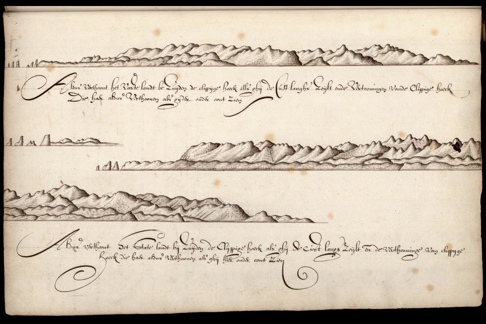

[Cook 250 Research Notebook](../) > New Zealand  
*[Previous](../p12-aotearoa/)* | Page 13 | *[Next](../p14-waka-landing/)*
### New Zealand

#### The earliest picture of New Zealand

*Cape Foulwind, folio 62 of Abel Tasman’s journal.*

Source: [Abel Tasman 1642](http://abeltasman.org.nz/images/) / National Archief, The Hague, Netherlands

> New Zealand was first seen by European eyes when Abel Tasman came upon
> the west coast of the South Island. One of Tasman’s associates,
> Isaac Gilsemans, sketched the coast from just north of Punakaiki
> up to Rocky Point (today’s Cape Foulwind).
>
> These sketches are the first European representation of New Zealand.
> The script on the map refers to Staten Landt, the name Tasman gave to
> the country.
>
> — https://teara.govt.nz/en/artwork/1406/tasmans-first-view-of-new-zealand

#### Travel from Tasmania to New Zealand

On 5 December 1642, Tasman sailed away from Tasmania, to pursue his search
for the [missing continent][TERRA_AUSTRALIS]. Pushed east by the
[Roaring Forties][ROARING40s], on 13 December 1642 he spotted the coast
of what he assumed, once again, to be [Terra Australis][TERRA_AUSTRALIS].

> **Item the 13th.**
>
> Latitude observed 42° 10', Longitude 188° 28'; course kept east by north,
> sailed 36 miles in a south-south-westerly wind with a top-gallant gale.
> Towards noon we saw a large, high-lying land, bearing south-east of us
> at about 15 miles distance; we turned our course to the south-east,
> making straight for this land, fired a gun and in the afternoon
> hoisted the white flag, upon which the officers of the Zeehaan
> came on board of us, with whom we resolved to touch at the said land
> as quickly as at all possible, for such reasons as are more amply
> set forth in this day's resolution.

Failing to find a suitable spot to get ashore, Abel Tasman continued to
navigate north and east for several days:

> In the evening we deemed it best
> and gave orders accordingly to our steersmen to stick to the south-east
> course while the weather keeps quiet but, should the breeze freshen,
> to steer due east in order to avoid running on shore, and to preclude
> accidents as much as in us lies; since we opine that the land should not
> be touched at from this side on account of the high open sea running there
> in huge hollow waves and heavy swells, unless there should happen to be
> safe land-locked bays on this side. At the expiration of four glasses of
> the first watch we shaped our course due east. Variation 7° 30' North-East.
>
> **Item the 14th.**
>
> At noon Latitude observed 42° 10', Longitude 189° 3'; course kept east,
> sailed 12 miles. We were about 2 miles off the coast, which showed as a
> very high double land, but we could not see the summits of the mountains
> owing to thick clouds. We shaped our course to northward along the coast,
> so near to it that we could constantly see the surf break on the shore.
> In the afternoon we took soundings at about 2 miles distance from the coast
> in 55 fathom, a sticky sandy soil, after which it fell a calm. Towards
> evening we saw a low-lying point north-east by north of us, at about 3 miles
> distance; the greater part of the time we were drifting in a calm towards
> the said point; in the middle of the afternoon we took soundings in
> 45 fathom, a sticky sandy bottom. The whole night we drifted in a calm,
> the sea running from the west-north-west, so that we got near the land
> in 28 fathom, good anchoring-ground, where, on account of the calm, and
> for fear of drifting nearer to the shore, we ran out our kedge-anchor
> during the day-watch, and we are now waiting for the land-wind.
>
> **Item the 15th.**
>
> In the morning with a light breeze blowing from the land
> we weighed anchor and did our best to run out to sea a little,
> our course being north-west by north; we then had the northernmost
> low-lying point of the day before, north-north-east and north-east
> by north of us. This land consists of a high double mountain-range,
> not lower than Ilha Formoza. At noon Latitude observed 41° 40',
> Longitude 189° 49'; course kept north-north-east, sailed 8 miles;
> the point we had seen the day before now lay south-east of us, at 2½
> miles distance; northward from this point extends a large rocky reef;
> on this reef, projecting from the sea, there are a number of high steep
> cliffs resembling steeples or sails; one mile west of this point we could
> sound no bottom. As we still saw this high land extend to north-north-east
> of us we from here held our course due north with good, dry weather and
> smooth water. From the said low point with the cliffs, the land makes a
> large curve to the north-east, trending first due east, and afterwards due
> north again. The point aforesaid is in Latitude 41° 50' south. The wind was
> blowing from the west. It was easy to see here that in these parts the land
> must be very desolate; we saw no human beings nor any smoke rising; nor can
> the people here have any boats, since we did not see any signs of them; in
> the evening we found 8° North-East variation of the compass.
>
> **Item the 16th.**
>
> At six glasses before the day we took soundings in 60 fathom
> anchoring-ground. The northernmost point we had in sight then
> bore from us north-east by east, at three miles distance, and the
> nearest land lay south-east of us at 1½ miles distance. We drifted
> in a calm, with good weather and smooth water; at noon Latitude
> observed 40° 58', average Longitude 189° 54'; course kept north-north-east,
> sailed 11 miles; we drifted in a calm the whole afternoon; in the evening
> at sunset we had 9° 23' increasing North-East variation; the wind then went
> round to south-west with a freshening breeze; we found the furthest point
> of the land that we could see to bear from us east by north, the land
> falling off so abruptly there that we did not doubt that this was the
> farthest extremity. We now convened our council with the second mates,
> with whom we resolved to run north-east and east-north-east till the end
> of the first watch, and then to sail near the wind, wind and weather not
> changing, as may in extenso be seen from this day's resolution. During the
> night in the sixth glass it fell calm again so that we stuck to the
> east-north-east course; although in the fifth glass of the dog-watch,
> we had the point we had seen in the evening, south-east of us, we could
> not sail higher than east-north-east slightly easterly owing to the
> sharpness of the wind; in the first watch we took soundings once, and
> a second time in the dog-watch, in 60 fathom, clean, grey sand. In the
> second glass of the day-watch we got a breeze from the south-east, upon
> which we tacked for the shore again.
>
> — http://gutenberg.net.au/ebooks06/0600571h.html

#### More Images

##### Abel Tasman 1642

* [New Zealand images from Tasman’s journal](http://abeltasman.org.nz/images/)

##### Eric Bréchemier on Flickr

* [Teddy in New Zealand](https://www.flickr.com/photos/eric_brechemier/3319885337/in/album-72157611251752316/)

#### References

##### Project Gutenberg Australia

* [English Translation of Tasman's handwritten Journal](http://gutenberg.net.au/ebooks06/0600571h.html#journal)

##### State Library, New South Wales

* [Facsimile of Abel Tasman's handwritten Journal](http://archival.sl.nsw.gov.au/Details/archive/110320645)

#### Te Ara, The Encyclopedia of New Zealand

* [Tasman’s first view of New Zealand](https://teara.govt.nz/en/artwork/1406/tasmans-first-view-of-new-zealand)
* [Story: European discovery of New Zealand](https://teara.govt.nz/en/european-discovery-of-new-zealand)
* [Terra australis incognita](https://teara.govt.nz/en/zoomify/1403/terra-australis-incognita)

##### Wikipedia

* [New Zealand](https://en.wikipedia.org/wiki/New_Zealand#Etymology)

[Cook 250 Research Notebook](../) > New Zealand  
*[Previous](../p12-aotearoa/)* | Page 13 | *[Next](../p14-waka-landing/)*
