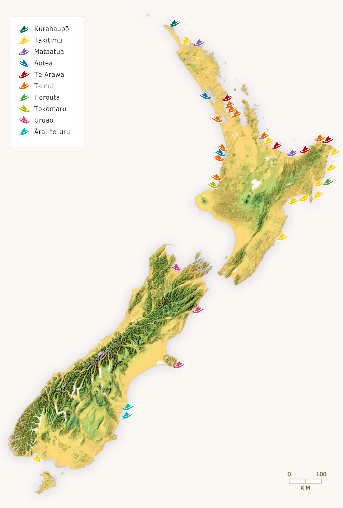

[Cook 250 Research Notebook](../) > Waka Landing  
*[Previous](../p13-new-zealand/)* | Page 14 | *[Next](../p15-first-encounters/)*
### Waka Landing

#### Waka landing places

> This map shows the landing places of a number of waka (canoes)
> important to different iwi (tribes) throughout New Zealand.
> They are Kurahaupō, Tākitimu, Mataatua, Tainui, Te Arawa,
> Aotea, Tokomaru, Horouta, Uruaokapuarangi and Ārai-te-uru.

Source: [Te Ara, The Encyclopedia of New Zealand](https://teara.govt.nz/en/interactive/14130/waka-landing-places)  

#### References

##### Mahaki.com

* [Our History](https://www.mahaki.com/our-history.html)

##### Te Ara, The Encyclopedia of New Zealand

* [Story: Ngā waewae tapu – Māori exploration](https://teara.govt.nz/en/nga-waewae-tapu-maori-exploration)
* [Page 1. Exploration traditions](https://teara.govt.nz/en/nga-waewae-tapu-maori-exploration/page-1)
* [Page 2. Coastal explorers](https://teara.govt.nz/en/nga-waewae-tapu-maori-exploration/page-2)

* [Story: Tūranganui-a-Kiwa tribes](https://teara.govt.nz/en/turanganui-a-kiwa-tribes)
* [Page 1. Lands and ancestors](https://teara.govt.nz/en/turanganui-a-kiwa-tribes/page-1)
* [Page 2. Arrivals and alliances](https://teara.govt.nz/en/turanganui-a-kiwa-tribes/page-2)

##### Wikipedia

* [List of Māori waka](https://en.wikipedia.org/wiki/List_of_M%C4%81ori_waka)
* [Waka](https://en.wikipedia.org/wiki/Waka_(canoe))

[Cook 250 Research Notebook](../) > Waka Landing  
*[Previous](../p13-new-zealand/)* | Page 14 | *[Next](../p15-first-encounters/)*
