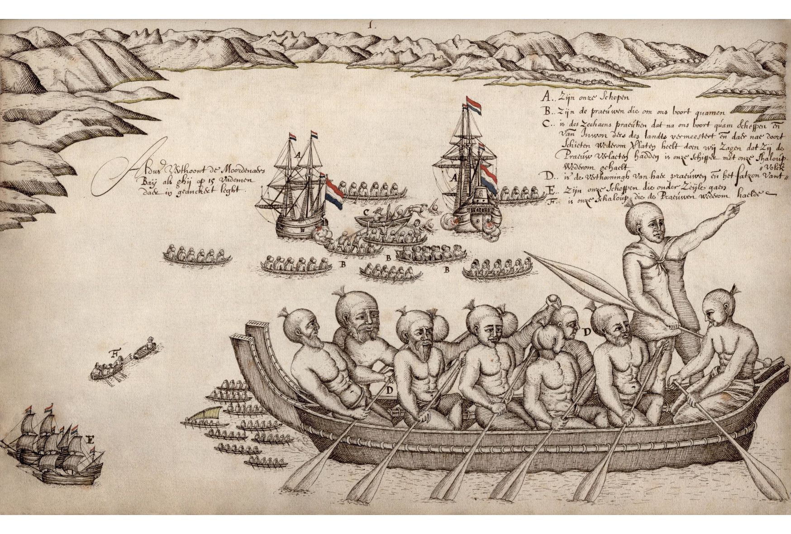

[Cook 250 Research Notebook](../) > First Encounters  
*[Previous](../p14-waka-landing/)* | Page 15 | *[Next](../p16-pacific-migration/)*
### First Encounters between Māori and Europeans, 18–19 December 1642

*Murderers Bay, folio 65 of Abel Tasman's journal*  
*Drawing attributed to Isaack Gilsemans*

Source: [Abel Tasman 1642](http://abeltasman.org.nz/images/) / Nationaal Archief, Netherlands

> **Conflict at Murderers Bay**
>
> The first encounter between Māori and Europeans took place
> in December 1642 at what is now called Golden Bay.
> Tasman named it Murderers Bay after a violent encounter with Māori.
> As Māori approached the Dutch ships in canoes,
> one canoe rammed a ship’s boat that was passing between
> Tasman’s two vessels, killing four Dutchmen.
> One Māori was hit by a shot from Tasman's men in response to the attack.
> The event was sketched by Isaac Gilsemans, who sailed with Tasman.
>
> — https://teara.govt.nz/en/artwork/1407/conflict-at-murderers-bay

#### First Sightings

On 17 December 1642, they spotted the first signs of life on the island:
"smoke ascending from fires made by the natives".

> **Item the 17th.**
>
> In the morning at sunrise we were about one mile from the shore;
> in various places we saw smoke ascending from fires made by the natives;
> the wind then being south and blowing from the land we again tacked
> to eastward. At noon Latitude estimated 40° 31', Longitude 190° 47';
> course kept north-east by east, sailed 12 miles; in the afternoon the
> wind being west we held our course east by south along a low-lying shore
> with dunes in good dry weather; we sounded in 30 fathom, black sand,
> so that by night one had better approach this land aforesaid, sounding;
> we then made for this sandy point until we got in 17 fathom, where we cast
> anchor at sunset owing to a calm, when we had the northern extremity of
> this dry sandspit west by north of us; also high land extending to east
> by south; the point of the reef south-east of us; here inside this point
> or narrow sandspit we saw a large open bay upward of 3 or 4 miles wide;
> to eastward of this narrow sandspit there is a sandbank upwards of a mile
> in length with 6, 7, 8 and 9 feet of water above it, and projecting
> east-south-east from the said point. In the evening we had 9° North-East
> variation.

On 18 December 1642, they anchored and decided to send a party to the shore.

> **Item the 18th.**
>
> In the morning we weighed anchor in calm weather; at noon Latitude
> estimated 40° 49', Longitude 191° 41'; course kept east-south-east,
> sailed 11 miles. In the morning before weighing anchor, we had resolved
> with the Officers of the Zeehaan that we should try to get ashore here and
> find a good harbour; and that as we neared it we should send out the pinnace
> to reconnoitre; all which may in extenso be seen from this day's resolution.
>
> In the afternoon our skipper Ide Tiercxz and our pilot-major Francoys
> Jacobsz, in the pinnace, and Supercargo Gilsemans, with one of the second
> mates of the Zeehaan in the latter's cock-boat, went on before to seek a
> fitting anchorage and a good watering-place.
>
> At sunset when it fell a calm we dropped anchor in 15 fathom,
> good anchoring-ground in the evening, about an hour after sunset,
> we saw a number of lights on shore and four boats close inshore,
> two of which came towards us, upon which our own two boats returned on board;
> they reported that they had found no less than 13 fathom water and that,
> when the sun sank behind the high land, they were still about half a mile
> from shore.
>
> When our men had been on board for the space of about one glass the men
> in the two prows began to call out to us in the rough, hollow voice,
> but we could not understand a word of what they said. We however called out
> to them in answer, upon which they repeated their cries several times, but
> came no nearer than a stone shot; they also blew several times on an
> instrument of which the sound was like that of a Moorish trumpet; we then
> ordered one of our sailors (who had some knowledge of trumpet-blowing)
> to play them some tunes in answer. Those on board the Zeehaan ordered their
> second mate (who had come out to India as a trumpeter and had in the
> Mauritius been appointed second mate by the council of that fortress and
> the ships) to do the same; after this had been repeated several times on
> both sides, and as it was getting more and more dark, those in the native
> prows at last ceased and paddled off.
>
> For more security and to be on guard against all accidents we ordered our
> men to keep double watches as we are wont to do when out at sea, and to keep
> in readiness all necessaries of war, such as muskets, pikes and cutlasses.
> We cleaned the guns on the upper-orlop, and placed them again, in order to
> prevent surprises, and be able to defend ourselves if these people should
> happen to attempt anything against us.
>
> Variation 9° North-East.

#### First Murders

> **Item the 19th.**
>
> Early in the morning a boat manned with 13 natives approached to about a
> stone's cast from our ships; they called out several times but we did not
> understand them, their speech not bearing any resemblance to the vocabulary
> given us by the Honourable Governor-General and Councillors of India, which
> is hardly to be wondered at, seeing that it contains the language of the
> Salomonis islands, etc.
>
> As far as we could observe these people were of ordinary height;
> they had rough voices and strong bones, the colour of their skin being
> brown and yellow; they wore tufts of black hair right upon the
> top of their heads, tied fast in the manner of the Japanese at the back of
> their heads, but somewhat longer and thicker, and surmounted by a large,
> thick white feather.
>
> Their boats consisted of two long narrow prows side by side, over which a
> number of planks or other seats were placed in such a way that those above
> can look through the water underneath the vessel: their paddles are upwards
> of a fathom in length, narrow and pointed at the end; with these vessels
> they could make considerable speed.
>
> For clothing, as it seemed to us, some of them wore mats, others cotton
> stuffs; almost all of them were naked from the shoulders to the waist.
>
> We repeatedly made signs for them to come on board of us, showing them
> white linen and some knives that formed part of our cargo. They did not
> come nearer, however, but at last paddled back to shore.
>
> In the meanwhile, at our summons sent the previous evening, the officers of
> the Zeehaan came on board of us, upon which we convened a council and
> resolved to go as near the shore as we could, since there was good
> anchoring-ground here, and these people apparently sought our friendship.
>
> Shortly after we had drawn up this resolution we saw 7 more boats put off
> from the shore, one of which (high and pointed in front, manned with 17
> natives) paddled round behind the Zeehaan while another, with 13 able-bodied
> men in her, approached to within half a stone's throw of our ship; the men
> in these two boats now and then called out to each other; we held up and
> showed them as before white linens, etc., but they remained where they were.

> The skipper of the Zeehaan now sent out to them his quartermaster with her
> cock-boat with six paddlers in it, with orders for the second mates that,
> if these people should offer to come alongside the Zeehaan, they should not
> allow too many of them on board of her, but use great caution and be well on
> their guard.
>
> While the cock-boat of the Zeehaan was paddling on its way to her those in
> the prow nearest to us called out to those who were lying behind the Zeehaan
> and waved their paddles to them, but we could not make out what they meant.
>
> Just as the cock-boat of the Zeehaan had put off from board again those in
> the prow before us, between the two ships, began to paddle so furiously
> towards it that, when they were about halfway slightly nearer to our ship,
> they struck the Zeehaan's cock-boat so violently alongside with the stem of
> their prow that it got a violent lurch, upon which the foremost man in this
> prow of villains with a long, blunt pike thrust the quartermaster Cornelis
> Joppen in the neck several times with so much force that the poor man fell
> overboard. Upon this the other natives, with short thick clubs which we at
> first mistook for heavy blunt parangs, and with their paddles, fell upon
> the men in the cock-boat and overcame them by main force, in which fray
> three of our men were killed and a fourth got mortally wounded through the
> heavy blows.
>
> The quartermaster and two sailors swam to our ship, whence we had sent our
> pinnace to pick them up, which they got into alive. After this outrageous
> and detestable crime the murderers sent the cock-boat adrift, having taken
> one of the dead bodies into their prow and thrown another into the sea.
>
> Ourselves and those on board the Zeehaan seeing this, diligently
> fired our muskets and guns and, although we did not hit any of them, the
> two prows made haste to the shore, where they were out of the reach of shot.
> With our fore upper-deck and bow guns we now fired several shots in the
> direction of their prows, but none of them took effect.
>
> There upon our skipper Ide Tercxsen Holman, in command of our pinnace
> well manned and armed, rowed towards the cock-boat of the Zeehaan
> (which fortunately for us these accursed villains had let adrift) and
> forthwith returned with it to our ships, having found in it one of the men
> killed and one mortally wounded.
>
> We now weighed anchor and set sail, since we could not hope to enter into
> any friendly relations with these people, or to be able to get water or
> refreshments here.
>
> Having weighed anchor and being under sail, we saw 22 prows near the shore,
> of which eleven, swarming with people, were making for our ships.
> We kept quiet until some of the foremost were within reach of our guns,
> and then fired 1 or 2 shots from the gun-room with our pieces, without
> however doing them any harm; those on board the Zeehaan also fired,
> and in the largest prow hit a man who held a small white flag in his hand,
> and who fell down. We also heard the canister-shot strike the prows inside
> and outside, but could not make out what other damage it had done. As soon
> as they had got this volley they paddled back to shore with great speed,
> two of them hoisting a sort of tingang sails. They remained lying near the
> shore without visiting us any further.
>
> About noon skipper Gerrit Jansz and Mr. Gilsemans again came on board of us;
> we also sent for their first mate and convened the council, with whom we
> drew up the resolution following, to wit:
>
> Seeing that the detestable deed of these natives against four men of
> the Zeehaan's crew, perpetrated this morning, must teach us to consider the
> inhabitants of this country as enemies;
>
> that therefore it will be best to sail eastward along the coast, following
> the trend of the land in order to ascertain whether there are any fitting
> places where refreshments and water would be obtainable;
>
> all of which will be found set forth in extenso in this day's resolution.
>
> In this murderous spot (to which we have accordingly given the name of
> Moordenaersbay) we lay at anchor on 40° 50' South Latitude, 191° 30'
> Longitude. From here we shaped our course east-north-east.
>
> At noon Latitude estimated 40° 57', Longitude 191° 41'; course kept south,
> sailed 2 miles.
>
> In the afternoon we got the wind from the west-north-west when, on the
> advice of our steersmen and with our own approval, we turned our course
> north-east by north.
>
> During the night we kept sailing as the weather was favourable, but about
> an hour after midnight we sounded in 25 or 26 fathom, a hard, sandy bottom.
> Soon after the wind went round to north-west, and we sounded in 15 fathom;
> we forthwith tacked to await the day, turning our course to westward,
> exactly contrary to the direction by which we had entered.
>
> Variation 9° 30' North-East.
>
> This is the second land which we have sailed along and discovered.
> In honour of their High Mightinesses the States-General we gave
> Staten Landt, since we deemed it quite possible that this land is part
> of the great Staten Land, though this is not certain. This land seems to
> be a very fine country and we trust that this is the mainland coast of the
> unknown South land. To this course we have given the name of Abel Tasman
> passagie, because he has been the first to navigate it.

Then they spent several days at anchor in a nearby bay, now called Tasman Bay,
waiting with double anchors for a strong storm to pass, then navigating
for days to find [land on all sides][TRAPPED], and no passage in view.

They escaped on the 26th with favorable wind, then navigated away
[along the west coast of the North Island of New Zealand][MORE_LAND]
until they reached the northernmost tip of the North Island on January 4th.

#### More Sightings

> **Item the 5th.**
>
> In the morning we still drifted in a calm, but about 9 o'clock we got a
> slight breeze from the south-east, whereupon with our friends of the
> Zeehaan we deemed it expedient to steer our course for the island before
> mentioned.
>
> About noon we sent to the said island our pinnace with the pilot-major,
> together with the cock-boat of the Zeehaan with Supercargo Gilsemans in it,
> in order to find out whether there was any fresh water to be obtained there.
>
> Towards the evening they returned on board and reported that, having come
> near the land, they had paid close attention to everything and had taken due
> precautions against sudden surprises or assaults on the part of the natives;
>
> that they had entered a safe but small bay, where they had found good fresh
> water, coming in great plenty from a steep mountain, but that, owing to the
> heavy surf on the shore, it was highly dangerous, nay well-nigh impossible
> for us to get water there, that therefore they pulled farther round the
> said island, trying to find some other more convenient water-place elsewhere,
> that on the said land they saw in several places on the highest hills from
> 30 to 35 persons, men of tall stature, so far as they could see from a
> distance, armed with sticks or clubs, who called out to them in a very loud,
> rough voice, certain words which our men could not understand;
>

(...) TBC

<> that these persons, in walking on, took enormous steps or strides.
>
> As our men were rowing about some few in number now and then showed
> themselves on the hill-tops, from which our men very credibly concluded
> that these natives in this way generally keep in readiness their assegais,
> boats and small arms, after their wonted fashions;
>
> so that it may fairly be inferred that few, if any, more persons inhabit
> the said island than those who showed themselves;
>
> for in rowing round the island our men nowhere saw any dwellings or
> cultivated land except just by the fresh water above referred to, where
> higher up on both sides the running water they saw everywhere square beds
> looking green and pleasant, but owing to the great distance they could not
> discern what kind of vegetables they were.
> It is quite possible that all these persons had their dwellings near the
> said fresh water.
>
> In the bay aforesaid they also saw two prows hauled on shore, one of them
> seaworthy, the other broken, but they nowhere saw any other craft.
>
> Our men having returned on board with the pinnace, we forthwith did our best
> to get near the shore, and in the evening we anchored in 40 fathom,
> good bottom, at a small swivel-gun-shot distance from the coast. We
> forthwith made preparations for taking in water the next day.
>
> The said island is in 34° 25' South Latitude and 190° 40' average Longitude.
>
> **Item the 6th.**
>
> Early in the morning we sent to the watering-place the two boats, to wit
> ours and the cock-boat of the Zeehaan, each furnished with two pederaroes,
> 6 musketeers, and the rowers with pikes and side-arms, together with our
> pinnace with the pilot-major Francoys Jacobsz and skipper Gerrit Jansz,
> with casks for getting fresh water.
>
> While rowing towards the shore they saw, in various places on the heights,
> a tall man standing with a long stick like a pike, apparently watching our
> men. As they were rowing past he had called out to them in a very loud voice;
>
> when they had got about halfway to the watering-place, between a certain
> point and another large high rock or small island, they found the current
> to run so strongly against the wind that, with the empty boats, they had to
> do their utmost to hold their own;
>
> for which reason the pilot-major and Gerrit Jansz, skipper of the Zeehaan,
> agreed together to abstain from exposing the small craft and the men to such
> great peril, seeing that there was still a long voyage before them and the
> men and the small craft were greatly wanted by the ships. They therefore
> pulled back to the ships, the rather as a heavy surf was rolling on the
> shore near the watering-place.
>
> The breeze freshening, we could easily surmise that they had not been able
> to land, and now made a sign to them from our ship with the furled flag, and
> fired a gun to let them know that they were at liberty to return, but they
> were already on their way back before we signalled to them.
>
> The pilot-major, having come alongside our ship again with the boats,
> reported that owing to the wind the attempt to land there was too dangerous,
> seeing that the sea was everywhere near the shore full of hard rocks without
> any sandy ground, so that they would have greatly imperilled the men and run
> the risk of having the water-casks injured or stove in;
>
> we forthwith summoned the officers of the Zeehaan and the second mates on
> board of us, and convened a council in which it was resolved to weigh anchor
> directly and to run on an easterly course as far as 220° Longitude, in
> accordance with the preceding resolution; then to shape our course to
> northward, or eventually due north, as far as Latitude 17° South, after
> which we shall hold our course due west in order to run straight of
> the Cocos and Hoorense islands, where we shall take in fresh water and
> refreshments;
>
> or if we should meet with any other island before these we
> shall endeavour to touch at them, in order to ascertain what can be obtained
> there; all this being duly specified and set forth at length in this day's
> resolution, to which for briefness sake we beg leave to refer.
>
> About noon we set sail; at noon we had the island due south of us at about
> 3 miles distance;
>
> in the evening at sunset it was south-south-west of us at 6 or 7 miles
> distance, the island and the rocks lying south-west and north-east of
> each other.
>
> During the night it was pretty calm with an east-south-east wind, our course
> being north-north-east, very close to the wind, while the tide was running
> in from the north-east.
>
> — http://gutenberg.net.au/ebooks06/0600571h.html

Tasman then set hist course further north, leaving New Zealand where neither
he nor any of his men had set foot.

#### More Images

##### Abel Tasman 1642

* [New Zealand images from Tasman’s journal](http://abeltasman.org.nz/images/)

#### Te Ara, The Encyclopedia of New Zealand

* [Conflict at Murderers Bay](https://teara.govt.nz/en/artwork/1407/conflict-at-murderers-bay)

#### References

##### Abel Tasman Museum (NL)

* [Tasman 375 Project](https://tasman375.groningen.nl/en/over-tasman-375)
* [A Deadly Misunderstanding](https://tasman375.groningen.nl/en/reisverslagen/misverstand-loopt-uit-de-hand)
* [Trapped][TRAPPED]

[TRAPPED]: https://tasman375.groningen.nl/en/reisverslagen/trapped

##### Nationaal Archief, Netherlands

* [Facsimile of Abel Tasman's journal, including drawings](https://www.nationaalarchief.nl/onderzoeken/archief/1.11.01.01/invnr/121/file/NL-HaNA_1.11.01.01_121_0001)
* [Folio 65](https://www.nationaalarchief.nl/onderzoeken/archief/1.11.01.01/invnr/121/file/NL-HaNA_1.11.01.01_121_0065)

##### Six Boats

* [Trapped](http://sixboats.co.nz/trapped/)
* [More land](http://sixboats.co.nz/more-land/)

#### Te Ara, The Encyclopedia of New Zealand

* [Story: European discovery of New Zealand](https://teara.govt.nz/en/european-discovery-of-new-zealand)

#### Wikipedia

* [Golden Bay / Mohua](https://en.wikipedia.org/wiki/Golden_Bay)
* [Isaack Gilsemans](https://en.wikipedia.org/wiki/Isaack_Gilsemans)

[Cook 250 Research Notebook](../) > First Encounters  
*[Previous](../p14-waka-landing/)* | Page 15 | *[Next](../p16-pacific-migration/)*
