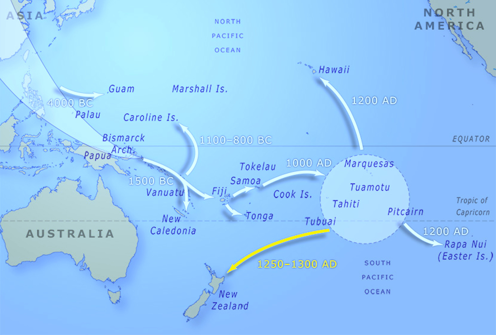

[Cook 250 Research Notebook](../) > Pacific Migration  
*[Previous](../p15-first-encounters/)* | Page 16 | *[Next](../p17-tasman-map/)*
### Pacific Migration

*Māori settlers left East Polynesia for Aotearoa from 1250 onward*

> The vast expanse of the Pacific Ocean was explored and settled
> by sailing large double-hulled canoes from island to island.
> The ancestors of Māori are likely to have sailed from East Polynesia
> in these craft.

Source: [Te Ara, The Encyclopedia of New Zealand](https://teara.govt.nz/en/map/5994/pacific-migration)

> Since the late 20th century there have been several intriguing areas
> of research into both the origins of Māori and their date and mode
> of arrival. Radiocarbon dating of archaeological settlement sites,
> analysis of volcanic ash, DNA analysis of Māori females and of the
> Pacific rat, and reconstruction of ancient Polynesian canoes, have
> all contributed to recent understanding.
>
> It is now believed that New Zealand was settled by people from
> East Polynesia – the Southern Cook and Society islands region;
> that they migrated deliberately, setting off in different canoes, at
> different times; and that they first arrived in the late 13th century.
>
> — https://teara.govt.nz/en/ideas-of-maori-origins/page-5

#### More Pictures

##### New Zealand History

* [Sketch of double-hulled waka](https://nzhistory.govt.nz/media/photo/sketch-double-hulled-waka)

##### Stuff

* [Who were the first humans to reach New Zealand?](https://www.stuff.co.nz/science/100629585/dna-who-were-the-first-humans-to-reach-aotearoa)

##### Wikimedia

* [First human migration to New Zealand](https://commons.wikimedia.org/wiki/File:First_human_migration_to_New_Zealand.svg)

#### References

##### Abel Tasman 1642

* [Moana Nui, Mass Migration and Triangular Men](http://abeltasman.org.nz/moana-nui-mass-migration-and-triangular-men/)
* [Changing perspectives upon Māori colonisation voyaging](http://abeltasman.org.nz/wp-content/uploads/2017/12/Changing-perspectives-upon-Maori-colonisation-voyaging.pdf)

##### Land of Voyagers

* [Migration: The Untold Story](https://www.thevoyage.co.nz/en/video/33_Migration-The-Untold-Story)
* [Waka Hourua: High Tech Travel](https://www.thevoyage.co.nz/en/video/37_Waka-Hourua-High-Tech-Travel)
* [Mythbusting "The arrival of the Maoris in New Zealand"](https://www.thevoyage.co.nz/en/video/45_Mythbusting-The-arrival-of-the-Maoris-in-New-Zealand-)
* [The Navigator Prepares](https://www.thevoyage.co.nz/en/video/39_The-Navigator-Prepares)
* [The waka is my island](https://www.thevoyage.co.nz/en/video/41_The-waka-is-my-island)
* [Mauri Stones: Hard Drives of the Waka](https://www.thevoyage.co.nz/en/video/63_MAURI-STONES-HARD-DRIVES-OF-THE-WAKA)
* [Nau mai ki te Land of Voyagers](https://www.thevoyage.co.nz/en/video/14_Nau-mai-ki-te-Land-of-Voyagers)

##### Science

* [‘Game-changing’ study suggests first Polynesians voyaged all the way from East Asia](https://www.sciencemag.org/news/2016/10/game-changing-study-suggests-first-polynesians-voyaged-all-way-east-asia)

##### Stuff

* [The ancient origins of New Zealanders](https://www.stuff.co.nz/science/100455675/the-ancient-origins-of-new-zealanders)
* [Who were the first humans to reach New Zealand?](https://www.stuff.co.nz/science/100629585/dna-who-were-the-first-humans-to-reach-aotearoa)

##### Te Ara, The Encyclopedia of New Zealand

* [Waka landing places](https://teara.govt.nz/en/interactive/14130/waka-landing-places)
* [Story: Pacific migrations](https://teara.govt.nz/en/pacific-migrations)
* [Pacific migration](https://teara.govt.nz/en/map/5994/pacific-migration)
* [Janet Davidson, archaeologist](https://teara.govt.nz/en/video/2301/janet-davidson-archaeologist)
* [Pacific origins](https://teara.govt.nz/en/waka-canoes/page-1)
* [Story: Hawaiki](https://teara.govt.nz/en/hawaiki)
* [Mau Piailug, navigator](https://teara.govt.nz/en/video/5995/mau-piailug-navigator)
* [Story: Ideas of Māori origins](https://teara.govt.nz/en/ideas-of-maori-origins)

##### Tupapa

* [An Ocean Voyaging Culture](https://www.tupapa.nz/stories/ocean-voyaging-culture)
* [Journey from Polynesia](https://www.tupapa.nz/stories/journey-from-polynesia)
* [Arrival in Aotearoa](https://www.tupapa.nz/stories/arrival-in-aotearoa)
* [Stories](https://www.tupapa.nz/stories-intro.html)

##### YouTube

* [Polynesian seafaring - history and Hawaiian re-creation](https://www.youtube.com/watch?v=ghojMWv5AZA)

[Cook 250 Research Notebook](../) > Pacific Migration  
*[Previous](../p15-first-encounters/)* | Page 16 | *[Next](../p17-tasman-map/)*
