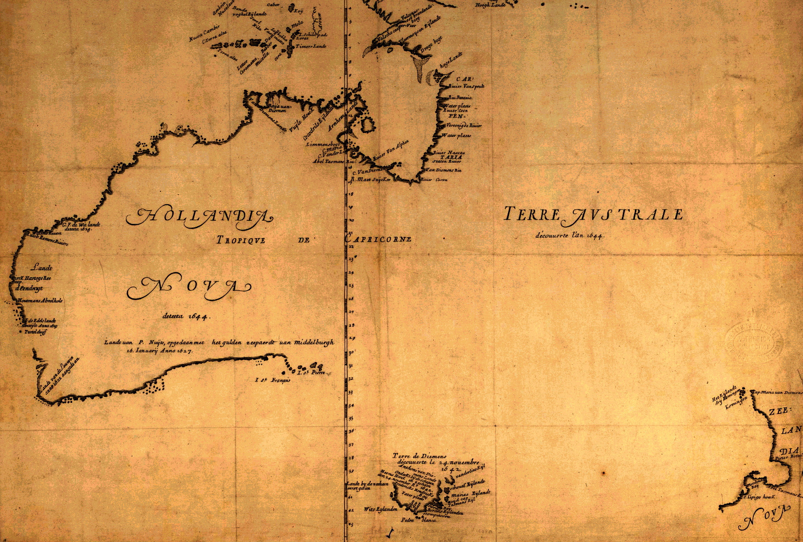

[Cook 250 Research Notebook](../) > Tasman Map  
*[Previous](../p16-pacific-migration/)* | Page 17 | *[Next](../p18-tupaia/)*
### First printed map to mention Zealandia Nova (1663)

*Map drawn by Joan Blau, adapted in print by Melchisédech Thévenot*

> Melchisedech Thevenot (1620?-1692): Hollandia Nova detecta 1644;
> Terre Australe decouuerte l'an 1644, Paris:
> De l'imprimerie de Iaqves Langlois, 1663
> Based on a map by the dutch cartographer Joan Blaeu. Langlois, 1663.
>
> — https://commons.wikimedia.org/wiki/File:Thevenot_-_Hollandia_Nova_detecta_1644.png

Source: [Wikimedia](https://commons.wikimedia.org/wiki/File:Thevenot_-_Hollandia_Nova_detecta_1644.png) / [National Library of Australia](https://catalogue.nla.gov.au/Record/6264405)

> This map was published in Melchisedech Thévenot's
> Relations de divers voyages curieux...
> [Tales of various strange voyages...].
> Paris, 1663.
>
> This was the first appearance in print of Abel Tasman's discoveries
> and revealed to the world the extent of the Dutch charting of
> the fifth continent.
>
> — https://www2.sl.nsw.gov.au/archive/events/exhibitions/2006/firstsight/images/s11.html

> The map by Thévenot, Hollandia Nova—Terre Australe
> in Relation de divers voyages et curieux,
> is a French version of the chart of Abel Tasman's discoveries
> using information from Dutch sources,
> notably Joan Blaeu's world map published in 1659.
> Although Thévenot said that he had taken his chart from the one inlaid
> into the floor of the Amsterdam Town Hall,
> in fact it appears to be an almost exact copy of that of Joan Blaeu
> in his Archipelagus Orientalis sive Asiaticus published in 1659
> in the Kurfürsten Atlas (Atlas of the Great Elector).
>
> — https://en.wikipedia.org/wiki/Melchis%C3%A9dech_Th%C3%A9venot#Other_works

> Large scale wall-map of Tasman's voyages of 1642-43 and 1644,
> on which subsequent mapping of Australia was based
> until James Cook successfully mapped the eastern coast.
> As well as the more established mapping of south east Asia.
> The map includes the first sighting of Tasmania by Europeans,
> specifically the crew of the Zeehaen, and first mapping of New Zealand.
> The map itself is surrounded on three sides by panels of explanatory text
> in French, Latin and Dutch, including detail of Dutch names for Australia
> and New Zealand (Nieuw Hollant and Nieuw Zelandt). The Blaeu wall-map is
> thought to have been the model for the popular map
> 'Hollandia Nova detecta 1644', by travel writer Melchisedech Thevenot.
>
> — https://catalogue.nla.gov.au/Record/6264405

#### End of Tasman First Voyage

The stretch of the Pacific between Australia and New Zealand,
that Tasman had crossed pushed by the Roaring Forties, locally
dubbed "the Ditch", is officially called the [Tasman Sea][TASMAN_SEA]
in recognition of his first expedition.

On January 19th, he spotted one of the Tonga islands, and had friendly
exchanges with the locals on the 21st:

> **Item the 21st.**
>
> In the morning we had a calm; we had the southernmost island east by south
> of us at about five miles distance; we shaped our course for the northernmost
> island which is in 21° 50' South Latitude, Longitude 205° 29', and sailed to
> the north-west of the island where we dropped anchor in 25 fathom, coral
> bottom.
>
> The place where we came to anchor is in 21° 20' South Latitude and
> Longitude 205° 29'. These two islands are nearly south-east and north-west
> of each other; we could see through between them, where there was a passage
> about 1½ mile in width. The one to the south-east was the highest, the
> northernmost one being a low-lying island, much like Holland. To the
> northernmost we gave the name of Amsterdam because of the abundance of
> refreshments we got there, and the southernmost we christened Middleburch.
>
> At noon a small prow with three men in it put off from land and came near
> our ship; these men were naked, of a brown colour and slightly above the
> ordinary stature; two of them had long, thick hair on their heads, the third
> wore his close cut; they had only their privities covered with a curious
> small bit of cloth; their prow was a very narrow one, covered in to a good
> distance in front and abaft; their paddles were of ordinary length, with
> blades broad in the middle; they called out to us several times, to which
> we responded in the same way, but we could not understand each other.
>
> We showed them white linen, throwing overboard a piece upwards of 1½ fathom
> in length, which they seeing paddled towards it, but as it had sunk to a
> considerable depth under the water the foremost man in the prow jumped out
> and dived for it. He remained under water for a very long time, but at last
> reappeared with the linen and got into the prow again, where he put it
> several times atop of his head, in sign of gratitude.
>
> They then gradually approached us with their prow, upon which we threw out
> to them a piece of wood to which we had fastened two large nails; we then
> handed out to them a small Chinese looking-glass with a string of Chinese
> beads, which they drew up into their prow by means of a long stick, to which
> they tied one of their fish-hooks with a small fishing-line, which they
> handed up to us to show their gratitude. This fish-hook was made of
> mother-of-pearl and shaped like a small anchovy. They repeatedly put the
> string of beads and the looking-glass on their heads; the middlemost man in
> the prow tied the nails round his neck, but as the looking-glass was closed
> with a slide they could not see themselves in it. We therefore handed down
> another to them which they looked into, and laid on their heads.
>
> We now showed them an old coconut and a fowl, and with aid of our vocabulary
> inquired after water, hogs, etc.; they did not understand us nor we them,
> but they constantly kept pointing to the shore.
>
> When we had made them a present of the objects aforementioned, and had shown
> them the coconut and the fowl, they at last paddled back to shore again and
> made signs to us, as if they were going to fetch the like from shore.
>
> At noon and in the afternoon we saw numbers of people walking along the
> shore, some of them with small white flags which we surmised to be signs
> of peace and amity. We therefore also hoisted our white flag astern,
> upon which there came alongside our ship a small prow with four persons in
> it; they were able-bodied men, having their bodies painted black from the
> waist to the thighs, their necks hung round with leaves; they carried a
> small white flag and a cloth made of the bark of trees. They fastened the
> said flag to the stem of our boat. The outriggers of their prow were trimmed
> with shells and conches.
>
> From these presents and from the embellishments of their prow, which seemed
> to be distinguished above the others, we concluded that this prow had been
> sent off by the king or chief of the country. We therefore presented these
> men with a small Chinese looking-glass, a knife, a piece of dungaree, and
> one or two nails.
>
> We filled a rummer of wine for them, from which we first drank ourselves
> lest they should think we were going to poison them or do them other harm;
> having taken the rummer they poured out the wine and took the rummer on
> shore with them.
>
> Shortly afterwards a great number of prows came alongside, some of them with
> 5 or 6, others with 10 or 12 coconuts, all of which we bartered against old
> nails; three or four coconuts against a double middle-sized nail.
> Some of them came swimming from the land with coconuts, all of which we
> bartered with them.
>
> After some time an aged man came on board of us to whom all the others
> paid honour, so that we concluded him to be one of their chiefs. We
> conducted him to the cabin; he did us reverence by inclining his head down
> to our feet; we paid our respects to him in return after our own fashion,
> and showed him a cup with fresh water which he showed us by signs to be
> obtainable on shore; we then presented him with a knife, a small
> looking-glass, and a piece of dungaree.
>
> As they were leaving the cabin one of the natives was caught in the act of
> stealing the skipper's pistol and a pair of slippers. We took these articles
> from him again without showing the least dissatisfaction.
>
> Many of these people had the lower part of the body painted black down to
> the knees, some had a mother-of-pearl shell hanging on the breast.
>
> Towards evening about 20 prows came close to our ships, which all stationed
> themselves side by side in regular order. Before coming alongside they made
> a good deal of noise, crying out repeatedly "Woo, woo, woo," etc., upon
> which those in our ship sat down.
>
> The said prows then came alongside, bringing a present from the king,
> consisting of a fine large hog, a number of coconuts, and some yams; the
> bearer of these presents being the same person who brought us the small
> white flag and the cloth of bark. We presented them in return with a common
> dish such as we use at meals, and a piece of copper-wire; we also bartered
> a few coconuts, baccovos, yams and a hog, etc., against nails and beads;
> about nightfall they all left our ship except one who remained to sleep on
> board of the Heemskerk.
>
> **Item the 22nd.**
>
> Early in the morning again a number of boats came alongside with coconuts,
> yams, baccovos, bananas, hogs and fowls, all of which we bartered with them;
> to wit, a young hog against a small fathom of dungaree, a fowl against a
> nail or a string of beads; coconuts, yams, bananas, etc., against old nails.
> Several women, both young and old, also came on board of us, the oldest of
> them having the little finger of both hands cut off, but not so the young
> women; what this meant we could not ascertain.
>
> About 8 o'clock the old man of the day before again came on board,
> bringing us 2 hogs in return for which we presented him with a
> silver-mounted knife and 8 or 9 nails. We conducted him below and went all
> over the ship with him, and caused one of our great guns to be fired, at
> which they were greatly frightened and ran away in amazement, but when they
> saw that no one was the worse for it they were soon set at ease again.
> We presented this old man with a piece of figured satin, a hat and a shirt,
> which we put on him.
>
> About noon 32 small and one large ditto, furnished with sails, and like
> those delineated in Jacob la Maire's journal No. came alongside. From these
> prows 18 strong men and a few females stepped on board of our ship,
> bringing with them as a present a few bark-mats and fruits such as coconuts,
> yams and other roots which we had no knowledge of.
>
> We presented the leader of these persons with a shirt, a pair of drawers,
> a small looking-glass and a few beads; we put the shirt and the drawers
> on him, in which he thought himself very gallantly attired.
>
> Among these 18 persons there was a bony, corpulent man with a St. Thomas arm,
> and a woman who had a small natural beard growing about the mouth.
>
> We made the second mate of the Zeehaan come on board of us with his trumpet,
> and one of her sailors with a violin, and from time to time had them blow
> and play tunes together with our own trumpeter and one of our sailors who
> could play the German flute, at which music they were greatly astonished.
>
> Meanwhile we had a number of water-casks lowered into our boat and the
> Zeehaan's cock-boat that our men might together with these people go and
> see whether there was any fresh water to be obtained here, as had been
> determined in our resolution; we placed a first mate in command of each
> of the boats while our skipper Ide Tjercxz and Supercargo Gilsemans
> accompanied them in our pinnace, into which we also put the old man and
> the leader of the natives who had last come on board, these two undertaking
> to show the watering-place to our men. We also put a number of musketeers
> into our pinnace, for though these natives seem to be good-natured enough
> it is impossible to know what they hide in their hearts, for which reason
> we armed our people to be prepared for all accidents.
>
> When our boats had rowed a considerable distance along the north-east side
> of this land they were finally conducted to three small wells, from which
> water had to be dipped up by means of a coconut-shell. This water was quite
> unfit to be drunk, of a dirty greenish colour, and there was so little of it
> that it would have been of little use even if it had been good to drink.
>
> The people who had pointed out these wells to our men now led them inland
> to a kind of pleasance and to an elegant baleye or raised and roofed
> platform, where our men were invited to sit down on handsome mats; but the
> natives brought them nothing but two coconut-shells filled with water, one
> for their chieftain and the other for our skipper.
>
> Towards the evening our men returned on board with a live hog and reported
> that there was no chance of getting water there.
>
> In the course of this day we obtained by barter upwards of 40 hogs, giving
> in exchange for each of them a double middle-sized nail and half a fathom of
> old canvas; and besides about 70 fowls, for each of which we gave a double
> middle-sized nail, etc., and a quantity of yams, coconuts and other fruit in
> exchange for beads. In the evening one of the chiefs had a roasted pig,
> some yams and other roots brought on board of us.
>
> The natives here have no knowledge of tobacco or of smoking of any kind;
> their women have the body covered from the waist to the knees with mats
> made of the leaves of trees, the rest of the body being naked;
> they wear their hair shorter than the men; the beards of the latter are
> as a rule the length of three or four finger's breadths, the hair on the
> upper lip being cut pretty short so that their mustachios are no longer
> than about two straw's breadths. We saw no arms worn by these people so
> that it was all peace and amity here.
>
> The current is not strong here, the flood runs south-west and the ebb
> north-east, which in our estimation makes it high-water with a
> south-westerly moon; the rise and fall of the tide is about 7 or 8 feet.
>
> **Item the 23rd.**
>
> In the morning we went to the shore with Skipper Gerrit Jansz and our two
> boats together with the pinnace for the purpose of digging wells to obtain
> fresh water; when coming ashore we forthwith went to the wells and made
> signs to the chief that the wells would have to be made larger, upon which
> he directly ordered his men to do this work for us.
>
> He then went with us to the baleye or platform, and caused a mat to be
> spread on which we seated ourselves. When we were seated he had refreshments
> brought in, such as fresh milk and cream, fresh fish and various kinds of
> fruit, of which there is great abundance here, and in every way showed us
> respect and friendship.
>
> They then asked us where we had come from and where were going, upon which
> we told them that we had been at sea for a hundred days and upwards, at
> which they were greatly astonished; we also told them that we had come there
> in search of fresh water, hogs, fowls, etc., to which they answered that
> they had plenty of them, as many as we wished.
>
> We then got 8 casks filled with water, and they presented us with four
> live hogs and a number of fowls, coconuts, bananas, etc.
> In return we offered them one fathom of linen, 6 nails and six strings
> of beads, for which they cordially thanked us.
>
> We then went up to the white flag with the three chiefs, signifying to them
> that we wished to leave the said flag near the platform in sign of peace and
> amity, at which they expressed great satisfaction and put the flag on their
> heads one after the other, thereby giving to understand that they desired
> nothing but our friendship. They next fastened the flag to the baleye as a
> sign that they had made a covenant with us.
>
> As the bottom here is steep and abruptly falling off our anchor lost its
> hold by the trade-wind in the afternoon, so that we drifted out to sea
> without our being able to prevent it; we did our best to haul our anchor
> on the bow but, as we had but few men on board, we could not secure it
> before midnight.
>
> In the course of this day we still got by barter a number of pigs and fowls,
> so that in all we have got for the two ships a hundred head of hogs,
> 150 fowls and a reasonable quantity of coconuts, yams and other fruit;
>
> we were compelled to stay on board the Zeehaan for the night since we
> could not get on board our own ship.
>
> — http://gutenberg.net.au/ebooks06/0600571h.html

After leaving Tonga, Tasman spotted the Fiji Islands on 6 February 1643,
but did not anchor there and left for New Guinea without any attempt
of exploration.

Back to Indonesia, his expedition concluded on 15 June 1643. His exploration
of the discovered lands was found lacking, and he was sent on a second voyage
in 1644 along a different route, and never returned to New Zealand.

#### More Pictures

##### Gord Webster on Flickr

* [Floor of Library entrance](https://www.flickr.com/photos/37996577538@N01/6875070893)

##### Internet Archive

* [Relations de divers voyages curieux, Première partie (1663), page 409](https://archive.org/details/relationsdediver00thve/page/n408/mode/1up)
* [Relations de divers voyages curieux, Première partie (1664), page 407](https://archive.org/details/relationsdediver00thve_0/page/n406/mode/1up)

##### National Library of Australia

* [Archipelagus Orientalis, sive Asiaticus / Apud Ioannem Blaeu](https://nla.gov.au/nla.obj-232510007/view)

##### State Library of New South Wales

* [Bonaparte Tasman map (1644)](http://digital.sl.nsw.gov.au/delivery/DeliveryManagerServlet?embedded=true&toolbar=false&dps_pid=IE3535846)
* [Hollandia Nova Terre Australe \[New Holland South Land\], 1663](https://www2.sl.nsw.gov.au/archive/events/exhibitions/2006/firstsight/images/s11.html)

##### Wikimedia

* [Nova et Accuratissima Terrarum Orbis Tabula (Joan Blaeu, 1664)](https://en.wikipedia.org/wiki/File:Nova_et_Accuratissima_Terrarum_Orbis_Tabula_(J.Blaeu,_1664).jpg)

#### References

##### Ian Burnet

* [The Tasman Map, The Biography of a Map](http://www.ianburnetbooks.com/#yui_3_17_2_1_1606663085682_261)

##### National Library of Australia

* [Archipelagus Orientalis, sive Asiaticus / Apud Ioannem Blaeu](https://catalogue.nla.gov.au/Record/6264405)

##### State Library of New South Wales

* [Bonaparte Tasman map (1644)](https://search.sl.nsw.gov.au/primo-explore/fulldisplay?docid=SLNSW_ALMA21113889380002626&context=L&vid=SLNSW&lang=en_US&search_scope=E&adaptor=Local%20Search%20Engine&tab=default_tab&query=any,contains,b2058092*)
* [First Sight: the Dutch mapping of Australia 1606-1697](https://www2.sl.nsw.gov.au/archive/events/exhibitions/2006/firstsight/images/s11.html)

##### The Free Library

* [New light on the origin of the Tasman-Bonaparte map](https://www.thefreelibrary.com/New+light+on+the+origin+of+the+Tasman-Bonaparte+map.-a0434793371)

##### Wikipedia

* [Tasman Map][TASMAN_MAP]
* [Tasman Sea][TASMAN_SEA]
* [Joan Blaeu](https://en.wikipedia.org/wiki/Joan_Blaeu)
* [Atlas Maior](https://en.wikipedia.org/wiki/Atlas_Maior)
* [Melchisédech Thévenot](https://en.wikipedia.org/wiki/Melchis%C3%A9dech_Th%C3%A9venot#Other_works)

[TASMAN_SEA]: https://en.wikipedia.org/wiki/Tasman_Sea
[TASMAN_MAP]: https://en.wikipedia.org/wiki/Abel_Tasman#Tasman_Map

[Cook 250 Research Notebook](../) > Tasman Map  
*[Previous](../p16-pacific-migration/)* | Page 17 | *[Next](../p18-tupaia/)*
