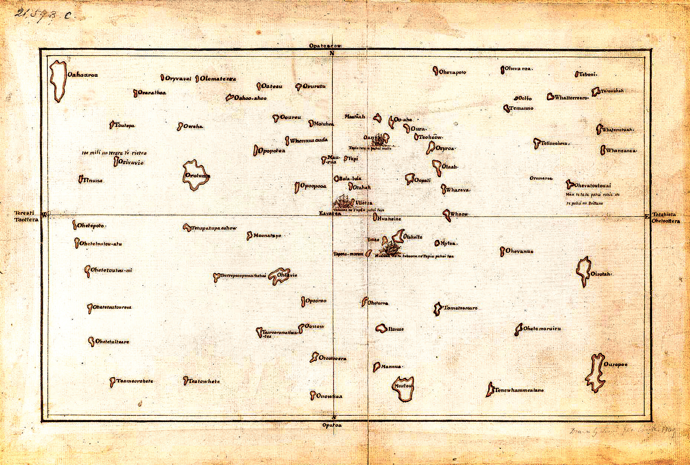

[Cook 250 Research Notebook](../) > Tupaia  
*[Previous](../p17-tasman-map/)* | Page 18 | *[Next](../p19-james-cook/)*
### Tupaia

#### Tupaia guided James Cook from Otaheite towards Aotearoa (1769)

*The navigator drew this chart to explain the relative positions of islands to Joseph Banks and James Cook.*

> Tupaia’s chart from 1769 is evidence of the intricacy and detail
> of Polynesian knowledge of the South Pacific, and a striking contrast
> to the emptiness of the same space in European maps of the time.
>
> — https://teara.govt.nz/en/map/46867/tupaias-chart

Source: [British Library](https://www.bl.uk/collection-items/the-society-islands)  
Downloaded from: [British Library Media](https://www.bl.uk/britishlibrary/~/media/bl/global/picturing%20places/add%20ms%2021593%20c%20copy%20chart%20of%20the%20society%20islands%20by%20cook%20after%20tupaia.jpg)

> **15 August 1769** (...)
>
> Tupia says that their are several Islands laying at different directions
> from this, that is from the south to the west and N.W and that 3 days sail
> to the NE is an Island called Mannua that is Bird Island and that it lies
> four days sail from Ulietea which is one day less then from Ulietea to
> Ohetiroa from this account I shall be able to find the situation of Mannua
> pretty well. Sence we have left Ulietea Tobia Tupia hath been very disireous
> for us to steer to the westward and tells us if we will but go that way we
> shall meet with plenty of Islands the most of them he himself hath been at
> and from the description he gives of two of them they must be those
> discover'd by Captain Wallice and by him call'd Boscawen and Kepple Islands,
> and these do not lay less than 400 Leagues to the westward of Ulietea;
> he says that they are 10 or 12 days in going thither and 30 or more in
> coming back and that their Paheas, that is their large Proes sails much
> faster than this Ship; All this I beleive to be true and therefore they may
> with ease sail 40 Leagues a day or more —
>
> The farthest Island to the southward that Tupia hath been at or knows
> anything of lies but two days sail from Ohetiroa and is called Moutou but
> he says that his Father once told him that their were Islands to the
> southward of it, but we can not find that he either knows or ever heard of
> a Continent or large track of land. I have no reason to doubt Tupia['s]
> information of these Islands, for when we left Ulietea and steer'd to the
> southward, he told us that if we would keep a little more to the East
> / which the wind would not permit us to do / we should see Mannua, but as
> we then steer'd we should see Ohetiroa which happend accordingly. If we
> meet with the Islands to the southward he speaks off it well if not I shall
> spend no more time searching for them. being now fully resolved to Stand
> directly to the Southward in search of the Continent.
>
> — James Cook's Journal of Remarkable Occurrences aboard His Majesty's Bark Endeavour, 1768-1771  
> Transcription of National Library of Australia, Manuscript 1 page 106, 2004  
> Published by South Seas, using the Web Academic Resource Publisher  
> http://nla.gov.au/nla.cs-ss-jrnl-cook-17690815

#### More Images

##### Stuff

* ['Legendary' map of Pacific by James Cook's Tahitian navigator Tupaia finally unlocked](https://www.stuff.co.nz/national/101871481/legendary-map-of-pacific-by-james-cooks-tahitian-navigator-tupaia-finally-unlocked)

##### Taylor & Francis Online

* [A chart representing the Isles of the South Sea (...) from the accounts of Tupaya](https://www.tandfonline.com/doi/full/10.1080/00223344.2018.1512369)

##### Te Hā 1769 - 2019 Sestercentennial

* [Te Hā 2016](http://www.teha2019.co.nz/assets/Uploads/TE-HA-2016-LOW-RES.pdf)

##### The Journal of the Polynesian Society

* [A New Reading of Tupaia's Chart](http://www.jps.auckland.ac.nz/docs/Volume116/jps_v116_no3_2007/3%20A%20new%20reading%20of%20Tupaias%20chart.pdf)

##### University of Auckland

* [A New Reading of Tupaia’s Chart](http://www.jps.auckland.ac.nz/docs/Volume116/jps_v116_no3_2007/3%20A%20new%20reading%20of%20Tupaias%20chart.pdf)

##### Wikimedia

* [File:Tupaia's map, c. 1769.jpg](https://commons.wikimedia.org/wiki/File:Tupaia%27s_map,_c._1769.jpg)

#### References

##### British Library

* [Tupaia the navigator, priest and artist](https://www.bl.uk/the-voyages-of-captain-james-cook/articles/tupaia-the-navigator-priest-and-artist)
* [Tupaia](https://www.bl.uk/people/tupaia)
* [The Society Islands](https://www.bl.uk/collection-items/the-society-islands)
* [Add MS 21593 C : 1769](http://searcharchives.bl.uk/primo_library/libweb/action/dlDisplay.do?vid=IAMS_VU2&docId=IAMS040-002033977&fn=permalink)
* [Add MS 15508, f 18 : Jul 1769-Aug 1769](http://searcharchives.bl.uk/primo_library/libweb/action/display.do?tabs=detailsTab&ct=display&fn=search&doc=IAMS040-003395036&indx=1&recIds=IAMS040-003395036&recIdxs=0&elementId=0&renderMode=poppedOut&displayMode=full&frbrVersion=&dscnt=0&frbg=&scp.scps=scope%3A%28BL%29&tab=local&dstmp=1606830933138&srt=rank&mode=Basic&&dum=true&vl(freeText0)=Tupaia%20chart&vid=IAMS_VU2)

##### Captain Cook Society

* [History of an Idea about Tupaia’s Chart](https://www.captaincooksociety.com/home/detail/history-of-an-idea-about-tupaia-s-chart)

##### Land of Voyagers

* [Tupaia: Master Navigator](https://www.thevoyage.co.nz/en/video/18_Tupaia-Master-Navigator)
* [Voyage to Aotearoa: Tupaia and the Endeavour](https://www.thevoyage.co.nz/en/video/70_VOYAGE-TO-AOTEAROA-TUPAIA-AND-THE-ENDEAVOUR)

##### New Zealand Geographic

* [Tupaia](https://www.nzgeo.com/stories/tupaia/)

#### The Observer

##### February 8th, 2025

* [Groundbreaking botanical discoveries on Captain Cook voyage were thanks to Indigenous people](https://www.theguardian.com/world/2025/feb/08/groundbreaking-botanical-discoveries-on-captain-cook-voyage-were-thanks-to-indigenous-people)

##### Royal Geographical Society, UK

* [The Indigenous map, by Joy Slappnig](https://www.rgs.org/about/our-collections/collaborative-research-on-the-collections/%E2%80%8Bthe-indigenous-map-native-information,-ethnograp/)

##### Stuff New Zealand

* ['Legendary' map of Pacific by James Cook's Tahitian navigator Tupaia finally unlocked](https://www.stuff.co.nz/national/101871481/legendary-map-of-pacific-by-james-cooks-tahitian-navigator-tupaia-finally-unlocked)

##### Tahiti Infos

* [Cook, Banks et Tupaia, une histoire du voyage autour du monde de l’Endeavour](https://www.tahiti-infos.com/Cook-Banks-et-Tupaia-une-histoire-du-voyage-autour-du-monde-de-l-Endeavour_a180498.html)

##### Taylor & Francis Online

* [The Making of Tupaia’s Map: A Story of the Extent and Mastery of Polynesian Navigation, Competing Systems of Wayfinding on James Cook’s Endeavour, and the Invention of an Ingenious Cartographic System](https://www.tandfonline.com/doi/full/10.1080/00223344.2018.1512369)

##### Te Ara, The Encyclopedia of New Zealand

* [Tupaia](https://teara.govt.nz/en/biographies/6t2/tupaia)
* [Tupaia's chart](https://teara.govt.nz/en/map/46867/tupaias-chart)

##### University of Auckland

* [A New Reading of Tupaia’s Chart](http://www.jps.auckland.ac.nz/docs/Volume116/jps_v116_no3_2007/3%20A%20new%20reading%20of%20Tupaias%20chart.pdf)

##### Wikipedia

* [Tupaia (navigator)](https://en.wikipedia.org/wiki/Tupaia_(navigator))
* [Raiatea](https://en.wikipedia.org/wiki/Raiatea)
* [Tahiti](https://en.wikipedia.org/wiki/Tahiti)

[Cook 250 Research Notebook](../) > Tupaia  
*[Previous](../p17-tasman-map/)* | Page 18 | *[Next](../p19-james-cook/)*
