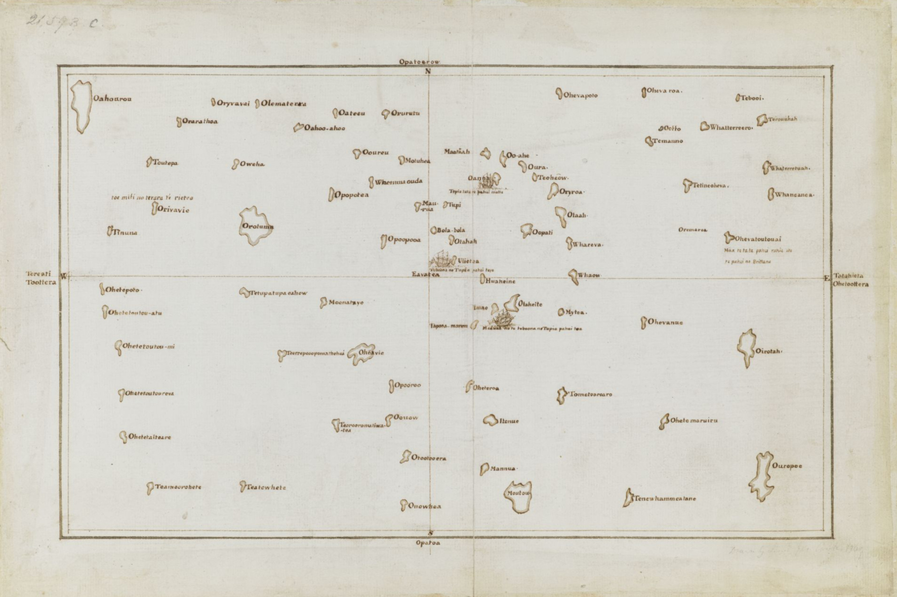

[Cook 250 Research Notebook](../) > Tupaia  
*[Previous](../p17-tasman-map/)* | Page 18 | *[Next](../p19-james-cook/)*
### Tupaia

#### Tupaia's chart

Copy chart of the society islands by James Cook after Tupaia.

> Tupaia’s chart from 1769 is evidence of the intricacy and detail
> of Polynesian knowledge of the South Pacific, and a striking contrast
> to the emptiness of the same space in European maps of the time.
>
> — https://teara.govt.nz/en/map/46867/tupaias-chart

Source: [British Library](https://www.bl.uk/collection-items/the-society-islands)  
Downloaded from: [British Library Media](https://www.bl.uk/britishlibrary/~/media/bl/global/picturing%20places/add%20ms%2021593%20c%20copy%20chart%20of%20the%20society%20islands%20by%20cook%20after%20tupaia.jpg)

#### More Images

##### Stuff

* ['Legendary' map of Pacific by James Cook's Tahitian navigator Tupaia finally unlocked](https://www.stuff.co.nz/national/101871481/legendary-map-of-pacific-by-james-cooks-tahitian-navigator-tupaia-finally-unlocked)

##### Taylor & Francis Online

* [A chart representing the Isles of the South Sea (...) from the accounts of Tupaya](https://www.tandfonline.com/doi/full/10.1080/00223344.2018.1512369)

##### Te Hā 1769 - 2019 Sestercentennial

* [Te Hā 2016](http://www.teha2019.co.nz/assets/Uploads/TE-HA-2016-LOW-RES.pdf)

##### The Journal of the Polynesian Society

* [A New Reading of Tupaia's Chart](http://www.jps.auckland.ac.nz/docs/Volume116/jps_v116_no3_2007/3%20A%20new%20reading%20of%20Tupaias%20chart.pdf)

##### Wikimedia

* [File:Tupaia's map, c. 1769.jpg](https://commons.wikimedia.org/wiki/File:Tupaia%27s_map,_c._1769.jpg)

#### References

##### British Library

* [Tupaia the navigator, priest and artist](https://www.bl.uk/the-voyages-of-captain-james-cook/articles/tupaia-the-navigator-priest-and-artist)
* [Tupaia](https://www.bl.uk/people/tupaia)
* [The Society Islands](https://www.bl.uk/collection-items/the-society-islands)

##### Captain Cook Society

* [History of an Idea about Tupaia’s Chart](https://www.captaincooksociety.com/home/detail/history-of-an-idea-about-tupaia-s-chart)

##### Land of Voyagers

* [Tupaia: Master Navigator](https://www.thevoyage.co.nz/en/video/18_Tupaia-Master-Navigator)
* [Voyage to Aotearoa: Tupaia and the Endeavour](https://www.thevoyage.co.nz/en/video/70_VOYAGE-TO-AOTEAROA-TUPAIA-AND-THE-ENDEAVOUR)

##### New Zealand Geographic

* [Tupaia](https://www.nzgeo.com/stories/tupaia/)

##### Stuff New Zealand

* ['Legendary' map of Pacific by James Cook's Tahitian navigator Tupaia finally unlocked](https://www.stuff.co.nz/national/101871481/legendary-map-of-pacific-by-james-cooks-tahitian-navigator-tupaia-finally-unlocked)

##### Tahiti Infos

* [Cook, Banks et Tupaia, une histoire du voyage autour du monde de l’Endeavour](https://www.tahiti-infos.com/Cook-Banks-et-Tupaia-une-histoire-du-voyage-autour-du-monde-de-l-Endeavour_a180498.html)

##### Taylor & Francis Online

* [The Making of Tupaia’s Map: A Story of the Extent and Mastery of Polynesian Navigation, Competing Systems of Wayfinding on James Cook’s Endeavour, and the Invention of an Ingenious Cartographic System](https://www.tandfonline.com/doi/full/10.1080/00223344.2018.1512369)

##### Te Ara, The Encyclopedia of New Zealand

* [Tupaia](https://teara.govt.nz/en/biographies/6t2/tupaia)
* [Tupaia's chart](https://teara.govt.nz/en/map/46867/tupaias-chart)

##### University of Auckland

* [A New Reading of Tupaia’s Chart](http://www.jps.auckland.ac.nz/docs/Volume116/jps_v116_no3_2007/3%20A%20new%20reading%20of%20Tupaias%20chart.pdf)

##### Wikipedia

* [Tupaia (navigator)](https://en.wikipedia.org/wiki/Tupaia_(navigator))
* [Raiatea](https://en.wikipedia.org/wiki/Raiatea)

[Cook 250 Research Notebook](../) > Tupaia  
*[Previous](../p17-tasman-map/)* | Page 18 | *[Next](../p19-james-cook/)*
