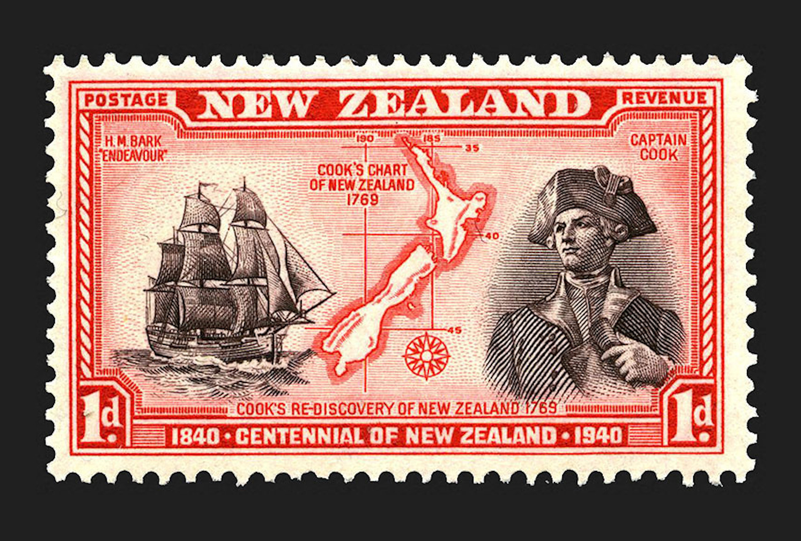

[Cook 250 Research Notebook](../) > James Cook  
*[Previous](../p18-tupaia/)* | Page 19 | *[Next](../p20-star-navigation/)*
### James Cook rediscovered New Zealand in 1769

[James Cook][COOK] was a British explorer and cartographer.
In the first of three voyages in the Pacific, he rediscovered New Zealand
in 1769 and completed an accurate map of its coast with a full circumnavigation
of the two main islands.

Source: [Te Ara — The Encyclopedia of New Zealand](https://teara.govt.nz/en/zoomify/43023/centennial-stamps)

> part of a series of thirteen stamps issued by the New Zealand Post Office
> for the centennial of New Zealand in 1940

#### More Images

##### Daily Mail Online

* [Captain Cook's Endeavour is finally found 230 years after it disappeared](https://www.dailymail.co.uk/news/article-3568740/Captain-Cook-s-HMS-Endeavour-United-States.html)

##### Lego Ideas

* [James Cook and the HMS Endeavour](https://ideas.lego.com/projects/73681484-d113-419a-9dfb-571bf49246a4)

##### Michel Tuffery

* [Cookie in Te Wai Pounamu meets Cook Strait](https://micheltuffery.co.nz/product/cookie-in-te-wai-pounamu-meets-cook-strait/)

##### New Zealand Post

* [Tuia 250: Michel Tuffery's Artistic Journey of Discovery](https://stamps.nzpost.co.nz/new-zealand/2019/tuia-250-michel-tufferys-artistic-journey-discovery)

##### Norvic Philatelics Blog

* [Stamps from Royal Mail Commemorating 250th Anniversary of James Cook's Voyages](https://blog.norphil.co.uk/2018/08/250th-anniversary-of-captain-james.html)

##### Princeton University Library

* [Act I: The First Voyage](https://lib-dbserver.princeton.edu/visual_materials/maps/websites/pacific/cook1/cook1.html)

##### Project Gutenberg Australia

* [CAPTAIN COOK'S JOURNAL. FIRST VOYAGE.](http://gutenberg.net.au/ebooks/e00043.html)

##### Royal Museums Greenwich

* [James Cook portrait by Nathaniel Dance (1776)](https://collections.rmg.co.uk/collections/objects/14102.html)
* [James Cook portrait by William Hodges (1775-1776)](https://collections.rmg.co.uk/collections/objects/15640.html)

##### Te Ara, The Encyclopedia of New Zealand

* [Centennial stamps](https://teara.govt.nz/en/zoomify/43023/centennial-stamps)

#### References

##### British Library

* [The first voyage of James Cook](https://www.bl.uk/the-voyages-of-captain-james-cook/articles/the-first-voyage-of-james-cook)

##### Hordern House

* [An Account of the Discoveries Made in the South Pacifick Ocean previous to 1764.](https://www.hordern.com/pages/books/4504907/alexander-dalrymple/an-account-of-the-discoveries-made-in-the-south-pacifick-ocean-previous-to-1764)

##### National Library of Australia

* [Journal of H.M.S. Endeavour, 1768-1771](https://nla.gov.au/nla.obj-228958440/view)
* [James Cook : his early life and the Endeavour voyage](https://trove.nla.gov.au/goto?i=book&w=8675242&d=https%3A%2F%2Fnla.gov.au%2Fnla.obj-5069509&s=8VW60GCrHy0bp626%2Fo%2FlyYkp6wwl4wYKvC0VwF9jMww%3D)
* [An Account of the Discoveries Made in the South Pacifick Ocean previous to 1764.](https://nla.gov.au/nla.obj-18696055/view?partId=nla.obj-18697220)

##### Princeton University Library

* [James Cook, 1728–1779](https://lib-dbserver.princeton.edu/visual_materials/maps/websites/pacific/cook0/cook0.html)
* [Act I: The First Voyage](https://lib-dbserver.princeton.edu/visual_materials/maps/websites/pacific/cook1/cook1.html)
* [Act II: The Second Voyage](https://lib-dbserver.princeton.edu/visual_materials/maps/websites/pacific/cook2/cook2.html)
* [Act II: The Third Voyage](https://lib-dbserver.princeton.edu/visual_materials/maps/websites/pacific/cook3/cook3.html)

##### Project Gutenberg Australia

* [James COOK (1728-1779)](http://gutenberg.net.au/pages/cook.html)
* [CAPTAIN COOK'S JOURNAL. FIRST VOYAGE.](http://gutenberg.net.au/ebooks/e00043.html)
* [Journals of Australian Land and Sea Explorers and Discoverers](http://gutenberg.net.au/explorers-journals.html)

##### South Seas

* [The Journals of James Cook's First Pacific Voyage, 1768-1771](http://southseas.nla.gov.au/index_voyaging.html)

##### Te Ara, The Encyclopedia of New Zealand

* [James Cook](https://teara.govt.nz/en/biographies/1c25/cook-james)
* [Story: European discovery of New Zealand](https://teara.govt.nz/en/european-discovery-of-new-zealand)

##### Wikipedia

* [James Cook][COOK]
* [First voyage of James Cook](https://en.wikipedia.org/wiki/First_voyage_of_James_Cook)

[COOK]: https://en.wikipedia.org/wiki/James_Cook

[Cook 250 Research Notebook](../) > James Cook  
*[Previous](../p18-tupaia/)* | Page 19 | *[Next](../p20-star-navigation/)*
