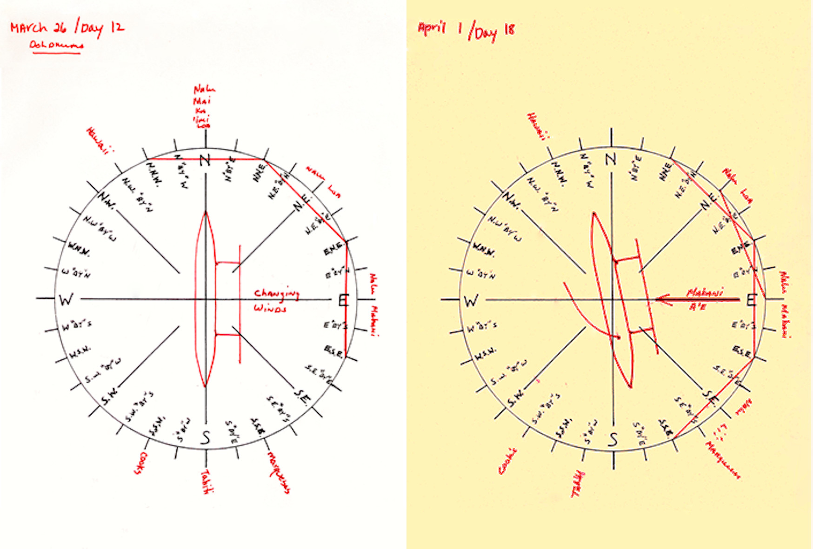
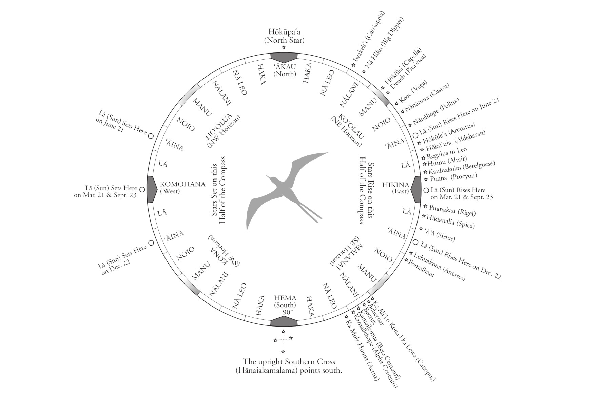
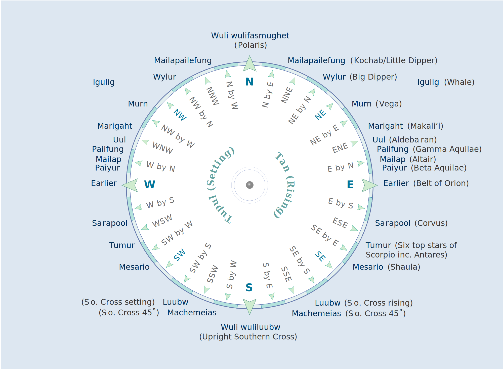
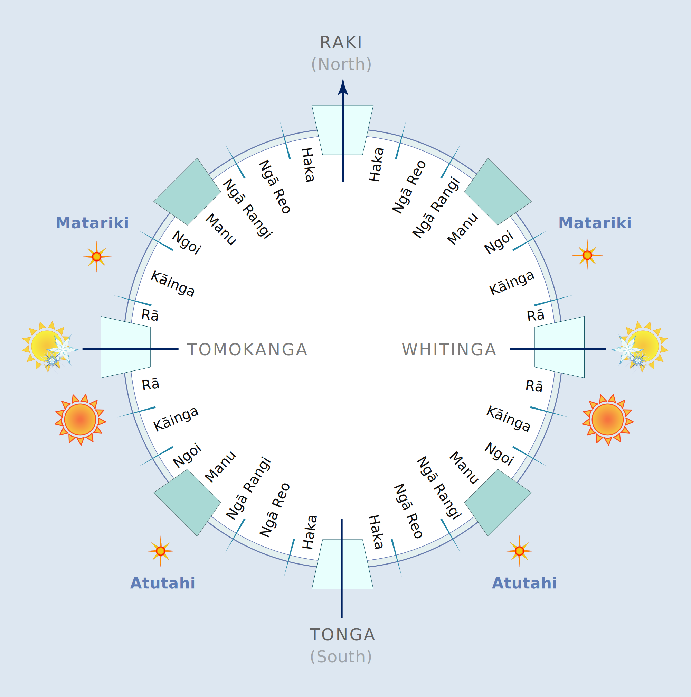
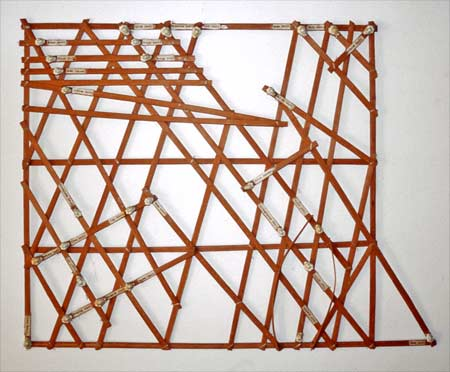

[Cook 250 Research Notebook](../) > Polynesian Navigation  
*[Previous](../p19-james-cook/)* | Page 20 | *[Next](../p21-endeavour/)*
### Polynesian Navigation

Traditional Polynesian navigation requires a deep knowledge of ocean currents,
waves and swells, algae, winds, clouds, bird flights and fish migrations, as
well as the movements of celestial bodies as seen from different locations.

#### Star compasses used in Nainoa Thompson's voyage from Hawai‘i to Tahiti (1980)

  
*Early Star Compasses, from the Nainoa's Notebooks for the 1980 Voyage to Tahiti*

Source: [Hawaiian Voyaging Traditions](http://archive.hokulea.com/ike/hookele/star_compasses.html) / Kamehameha Schools Online Archives

#### More Images

##### Hawaiian Voyaging Traditions

* [Star Compasses](http://archive.hokulea.com/ike/hookele/star_compasses.html)

*Nainoa’s Hawaiian Star Compass with the Brightest Stars*

##### Te Ara, The Encyclopedia of New Zealand

> In the early 1970s members of the Polynesian Voyaging Society in Hawaii
> searched for Polynesians who remembered traditional navigation techniques.
> At first they thought there was no one, but they eventually tracked down
> Mau Piailug from the island of Satawal in Micronesia, who could navigate
> the open ocean without instruments. He guided the Hōkūle‘a from Hawaii to
> Tahiti and back using a star compass, shown here. Mau Piailug shared his
> knowledge with Nainoa Thompson, who became the first Polynesian in centuries
> to use celestial navigation on long distance ocean voyaging when he repeated
> the journey in the same vessel in 1980.

* [Navigating by the stars](https://teara.govt.nz/en/diagram/2220/navigating-by-the-stars)

> Te kapehu whetū – the Māori star compass – divides the 360 degrees
> around a canoe in the open ocean into different whare (houses).
> The location of these houses depends on where the sun, moon and stars
> set and rise. The navigator then attempts to keep the canoe on a course
> relative to these observations.

* [Māori star compass](https://teara.govt.nz/en/diagram/2222/maori-star-compass)

> Marshall Islands navigation charts were made of sticks tied together.
> Cowrie shells represented the relative positions of islands,
> while curved and diagonal sticks showed swell and wave patterns.
> Today, they are mainly sold as tourist souvenirs,
> but these ancient navigation aids were once vital for island hopping
> between the 1,000 and more islands that make up the Marshalls group.
> The charts were not carried on board, but were memorised.
> They were also used to record collective knowledge
> and to train young navigators.

* [Replica navigation chart](https://teara.govt.nz/en/object/2231/replica-navigation-chart)

#### References

##### Hawaiian Voyaging Traditions

* [Star Compasses](http://archive.hokulea.com/ike/hookele/star_compasses.html)
* [Documentaries: Films and Videos about PVS Voyages](http://archive.hokulea.com/hoonaauao/resources_film_video.html)
* [Key Elements of Education](http://archive.hokulea.com/hoonaauao/education_elements.html)
* [Nainoa Thompson](http://archive.hokulea.com/index/founder_and_teachers/nainoa_thompson.html)
* [Recollections of the 1980 Voyage to Tahiti](http://archive.hokulea.com/holokai/1980/nainoa_to_tahiti.html)
* [Voyaging and the Revival of Culture and Heritage](http://archive.hokulea.com/ike/intro_ike.html)

##### Land of Voyagers

* [Star Compass](https://www.thevoyage.co.nz/en/video/10_Star-Compass)
* [Birds and navigation](https://www.thevoyage.co.nz/en/video/15_Birds-and-navigation)
* [Navigation](https://www.thevoyage.co.nz/en/video/17_Navigation)
* [Brains vs Gizmos](https://www.thevoyage.co.nz/en/video/19_Brains-vs-Gizmos)
* [MAUI'S MATAURANGA OF THE SUN](https://www.thevoyage.co.nz/en/video/72_MAUI-S-MATAURANGA-OF-THE-SUN)
* [Nau mai ki te Land of Voyagers](https://www.thevoyage.co.nz/en/video/14_Nau-mai-ki-te-Land-of-Voyagers)

##### Persée

* [Les Polynésiens et la navigation astronomique](https://www.persee.fr/doc/jso_0300-953x_1972_num_28_36_2384)

##### Popular Mechanics

* [How Ancient Micronesian Sailors Navigated the Ocean](https://www.popularmechanics.com/science/a22061/polynesian-stick-chart/)

##### Science Learning Hub

* [Wayfinding revival](https://www.sciencelearn.org.nz/resources/631-wayfinding-revival)
* [The star compass – kāpehu whetū](https://www.sciencelearn.org.nz/resources/622-the-star-compass-kapehu-whetu)

##### Te Ara, The Encyclopedia of New Zealand

* [Navigating by the stars](https://teara.govt.nz/en/diagram/2220/navigating-by-the-stars)
* [Story: Canoe navigation](https://teara.govt.nz/en/canoe-navigation)
* [Ocean voyaging](https://teara.govt.nz/en/canoe-navigation/page-2)
* [Locating land](https://teara.govt.nz/en/canoe-navigation/page-3)
* [Mau Piailug, navigator](https:/jteara.govt.nz/en/video/5995/mau-piailug-navigator)

##### Ulukau, the Hawaiian Electronic Library

* [The Ocean Is My Classroom](https://ulukau.org/elib/collect/kamjoe/index/assoc/D0.dir/doc13.pdf)

##### Wikipedia

* [Polynesian navigation](https://en.wikipedia.org/wiki/Polynesian_navigation)
* [Swell (ocean)](https://en.wikipedia.org/wiki/Swell_(ocean))
* [Fish migration](https://en.wikipedia.org/wiki/Fish_migration)
* [Marshall Islands stick chart](https://en.wikipedia.org/wiki/Marshall_Islands_stick_chart)
* [Nainoa Thompson](https://en.wikipedia.org/wiki/Nainoa_Thompson)
* [Hōkūleʻa](https://en.wikipedia.org/wiki/H%C5%8Dk%C5%ABle%CA%BBa)
* [Mau Piailug](https://en.wikipedia.org/wiki/Mau_Piailug)
* [Polynesian Voyaging Society](https://en.wikipedia.org/wiki/Polynesian_Voyaging_Society)
* [Hawaii](https://en.wikipedia.org/wiki/Hawaii)
* [Tahiti](https://en.wikipedia.org/wiki/Tahiti)

[Cook 250 Research Notebook](../) > Polynesian Navigation  
*[Previous](../p19-james-cook/)* | Page 20 | *[Next](../p21-endeavour/)*
