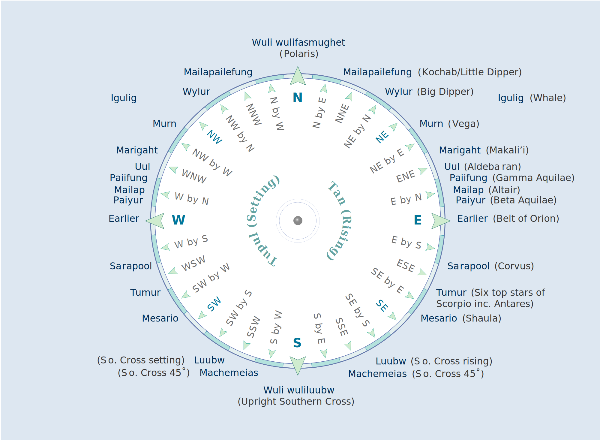

### Star Navigation

Source: [Te Ara, The Encyclopedia of New Zealand](https://teara.govt.nz/en/diagram/2220/navigating-by-the-stars)

#### More Images

##### Hawaiian Voyaging Traditions

* [Star Compasses](http://archive.hokulea.com/ike/hookele/star_compasses.html)

##### Te Ara, The Encyclopedia of New Zealand

* [Māori star compass](https://teara.govt.nz/en/diagram/2222/maori-star-compass)

#### References

##### Hawaiian Voyaging Traditions

* [Star Compasses](http://archive.hokulea.com/ike/hookele/star_compasses.html)
* [Documentaries: Films and Videos about PVS Voyages](http://archive.hokulea.com/hoonaauao/resources_film_video.html)
* [Key Elements of Education](http://archive.hokulea.com/hoonaauao/education_elements.html)

##### Land of Voyagers

* [Star Compass](https://www.thevoyage.co.nz/en/video/10_Star-Compass)
* [Birds and navigation](https://www.thevoyage.co.nz/en/video/15_Birds-and-navigation)
* [Navigation](https://www.thevoyage.co.nz/en/video/17_Navigation)
* [Brains vs Gizmos](https://www.thevoyage.co.nz/en/video/19_Brains-vs-Gizmos)
* [MAUI'S MATAURANGA OF THE SUN](https://www.thevoyage.co.nz/en/video/72_MAUI-S-MATAURANGA-OF-THE-SUN)
* [Nau mai ki te Land of Voyagers](https://www.thevoyage.co.nz/en/video/14_Nau-mai-ki-te-Land-of-Voyagers)

##### Science Learning Hub

* [Wayfinding revival](https://www.sciencelearn.org.nz/resources/631-wayfinding-revival)
* [The star compass – kāpehu whetū](https://www.sciencelearn.org.nz/resources/622-the-star-compass-kapehu-whetu)

##### Te Ara, The Encyclopedia of New Zealand

* [Navigating by the stars](https://teara.govt.nz/en/diagram/2220/navigating-by-the-stars)
* [Ocean voyaging](https://teara.govt.nz/en/canoe-navigation/page-2)
* [Mau Piailug, navigator](https:/jteara.govt.nz/en/video/5995/mau-piailug-navigator)

##### Wikipedia

* [Polynesian navigation](https://en.wikipedia.org/wiki/Polynesian_navigation)

