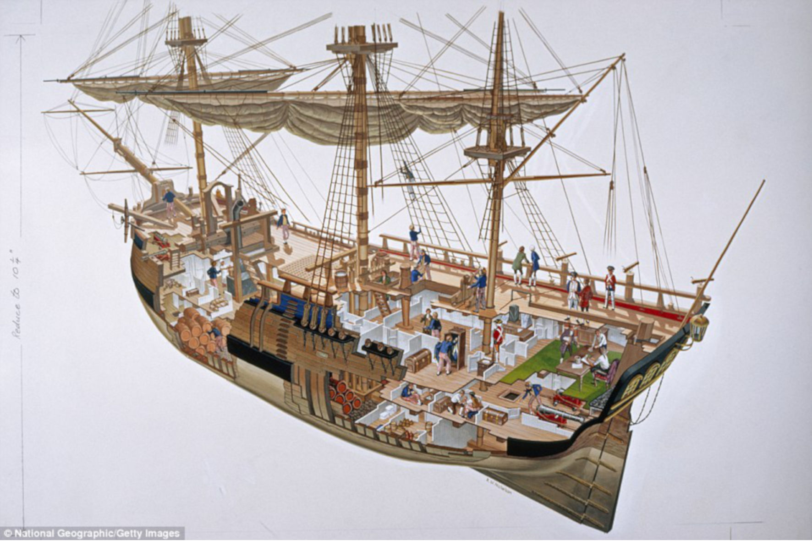

### Endeavour

Source: [National Geographic/Getty Images via Daily Mail Online](https://www.dailymail.co.uk/news/article-3568740/Captain-Cook-s-HMS-Endeavour-United-States.html)

#### More Images

##### Archives New Zealand on Flickr

* [HMS Endeavour](https://www.flickr.com/photos/archivesnz/20340350738/)

##### Daily Mail Online

* [Captain Cook's Endeavour is finally found 230 years after it disappeared](https://www.dailymail.co.uk/news/article-3568740/Captain-Cook-s-HMS-Endeavour-United-States.html)

##### Lego Ideas

* [James Cook and the HMS Endeavour](https://ideas.lego.com/projects/73681484-d113-419a-9dfb-571bf49246a4)

##### Mighty Ape

* [Billing Boats 1:50 HMS Endeavour (Experienced)](https://www.mightyape.co.nz/product/billing-boats-150-hms-endeavour-experienced/23018708)

##### New Zealand Post

* [1940 Centennial](https://stamps.nzpost.co.nz/new-zealand/1940/centennial)

##### Stuff

* [Boat-building Picton family's ancestors built and housed the Endeavour](https://www.stuff.co.nz/national/116246105/boatbuilding-picton-familys-ancestors-built-and-housed-the-endeavour)

##### Te Ara — The Encyclopedia of New Zealand

* [Centennial stamps](https://teara.govt.nz/en/zoomify/43023/centennial-stamps)

##### Travel to Eat

* [HM Bark Endeavour. Australian National Maritime Museum, Sydney](https://traveltoeat.com/hm-bark-endeavour-australian-national-maritime-museum-sydney)

##### Wikimedia

* [HM Bark Endeavour 1764 and Captain Cook setting out on his voyage Wellcome M0011198](https://commons.wikimedia.org/wiki/File:HM_Bark_Endeavour_1764_and_Captain_Cook_setting_out_on_his_voyage_Wellcome_M0011198.jpg)

#### References

##### Australian National Maritime Museum

* [HMB Endeavour](https://www.sea.museum/whats-on/vessels/hmb-endeavour)

##### Captain Cook Society

* [Endeavour](https://www.captaincooksociety.com/home/detail/endeavour)

##### Land of Voyages

* [HMB Endeavour Replica](https://www.thevoyage.co.nz/en/vessels/hmb-endeavour-replica)
* [HMB Endeavour: Sydney to Tauranga](https://www.thevoyage.co.nz/en/video/47_HMB-Endeavour-Sydney-to-Tauranga)

##### RNZ Radio New Zealand

###### September 20th, 2018

* [Archaeologists may have found Captain Cook's Endeavour](https://www.rnz.co.nz/news/world/366930/archaeologists-may-have-found-captain-cook-s-endeavour)

##### Stuff

* [Boat-building Picton family's ancestors built and housed the Endeavour](https://www.stuff.co.nz/national/116246105/boatbuilding-picton-familys-ancestors-built-and-housed-the-endeavour)

##### Wikipedia

* [HMS Endeavour](https://en.wikipedia.org/wiki/HMS_Endeavour)

