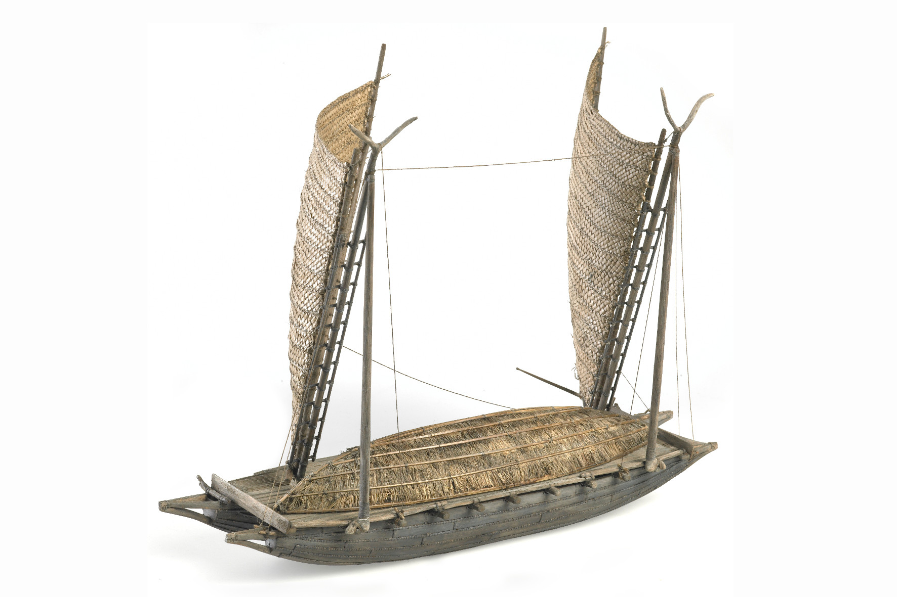

### Horouta

[Model pahi (sailing canoe from Tuamotu)](https://collections.tepapa.govt.nz/object/747347), 2007, New Zealand,
by Izzat Design Limited. Commissioned 2007. © Te Papa.
[CC BY-NC-ND 4.0.](https://creativecommons.org/licenses/by-nc-nd/4.0/) Te Papa (FE011986)

#### More Images

##### Beattie's Book Blog

* [HOROUTA The History of the Horouta Canoe, Gisborne and East Coast](http://beattiesbookblog.blogspot.com/2012/11/horouta-history-of-horouta-canoe.html)

##### Gisborne Herald

* [Hine Hakirirangi](http://www.gisborneherald.co.nz/entertainment/2909432-135/hine-hakirirangi/)

##### Michael Mallett on Flickr

* [Waka Pahi reconstruction, Gisborne museum](https://flic.kr/p/22P1xjR)
* [Waka Pahi](https://flic.kr/p/22P1yrR)

##### Oratia

* [Horouta, The History of the Horouta Canoe, Gisborne and East Coast, by Rongowhakaata Halbert](https://www.oratia.co.nz/product/horouta/)

> Horouta is the definitive history of the descendants of the voyaging canoes
> that brought the first settlers from Polynesia to the lands that stretch
> from East Cape to northern Hawke’s Bay. Assembled through painstaking
> historical and genealogical research over more than 70 years by
> Rongowhakaata Halbert and his family, this outstanding work of scholarship
> is destined to serve the needs of all New Zealanders, and especially the
> peoples of Gisborne and the East Coast, for generations to come.
>
> — https://www.oratia.co.nz/product/horouta/

##### Te Ara — The Encyclopedia of New Zealand

* [Story: East Coast region: Waka landings, places of significance and tribes](https://teara.govt.nz/en/map/33350/waka-landings-places-of-significance-and-tribes)
* [Hine Hakirirangi](https://teara.govt.nz/en/artwork/33354/hine-hakirirangi)
* [Double-hulled voyaging canoes, Gisborne, 2000](https://teara.govt.nz/en/object/1814/double-hulled-voyaging-canoes-gisborne-2000)

##### Te Papa Tongarewa — Museum of New Zealand

* [Pacific canoes](https://collections.tepapa.govt.nz/topic/2354)

##### Tupapa

* [Horouta](https://www.tupapa.nz/stories/arrival-in-aotearoa/horouta)

#### References

##### Beattie's Book Blog

* [HOROUTA The History of the Horouta Canoe, Gisborne and East Coast](http://beattiesbookblog.blogspot.com/2012/11/horouta-history-of-horouta-canoe.html)

##### Department of Conservation, New Zealand

* [The Turanganui River, A Brief History, October 2006](https://www.doc.govt.nz/Documents/conservation/historic/by-region/echb/turanganui-river-history.pdf)

##### LEARNZ on Vimeo

* [Waka Horouta](https://vimeo.com/97880061)

##### Hōkūleʻa

###### November 13th, 2014

* [Uncovering an Ancient Waka](http://www.hokulea.com/uncovering-ancient-waka/)

##### Te Papa Tongarewa — Museum of New Zealand

* [Pacific canoes](https://collections.tepapa.govt.nz/topic/2354)
* [Royal transport](https://collections.tepapa.govt.nz/topic/3190)
* [Model Tipaerua (model canoe)](https://collections.tepapa.govt.nz/object/648721)
* [Model pahi (sailing canoe from Tuamotu)](https://collections.tepapa.govt.nz/object/747347)

##### The Informer

* [Of waka hourua, pahī, barques and barks](https://www.theinformer.co.nz/feature/of-waka-hourua-pahi-barques-and-barks)

##### Oratia

* [Horouta, The History of the Horouta Canoe, Gisborne and East Coast, by Rongowhakaata Halbert](https://www.oratia.co.nz/product/horouta/)

##### PNAS, Proceedings of the National Academy of Sciences of the United States of America

###### October 14th, 2014

* [An early sophisticated East Polynesian voyaging canoe discovered on New Zealand's coast](https://www.pnas.org/content/111/41/14728)

##### Stuff

###### October 2nd, 2014

* [600-year-old waka surprises researchers](http://www.stuff.co.nz/national/10568936/600-year-old-waka-surprises-researchers)

##### Tairāwhiti Museum

* [Tairāwhiti Museum](https://tairawhitimuseum.org.nz/)
* [Te Moana Maritime Gallery](https://tairawhitimuseum.org.nz/exhibition/te-moana-maritime-gallery/)

##### Te Ara — The Encyclopedia of New Zealand

* [Story: Tūranganui-a-Kiwa tribes, Arrivals and alliances: The Horouta canoe](https://teara.govt.nz/en/turanganui-a-kiwa-tribes/page-2)
* [Story: East Coast region: Waka landings, places of significance and tribes](https://teara.govt.nz/en/map/33350/waka-landings-places-of-significance-and-tribes)
* [Story: East Coast region: Māori settlement](https://teara.govt.nz/en/map/33350/waka-landings-places-of-significance-and-tribes)
* [Story: Kūmara](https://teara.govt.nz/en/kumara)

##### The Journal of the Polynesian Society

* [THE HISTORY OF ‘HOROUTA’ CANOE AND THE INTRODUCTION OF THE KUMARA INTO NEW ZEALAND.](http://jps.auckland.ac.nz/document/Volume_21_1912/Volume_21%2C_No._4/The_history_of_Horouta_Canoe_and_the_introduction_of_the_kumara_into_New_Zealand%2C_by_Mohi_Turei%2C_p_152-163/p1)

##### Tupapa

* [Horouta](https://www.tupapa.nz/stories/arrival-in-aotearoa/horouta)
* [Arrival in Aotearoa](https://www.tupapa.nz/stories/arrival-in-aotearoa)

##### Victoria University of Wellington

* [Takitimu: Chapter Two — The History of Horouta and that of Pawa (her Commander) and Kiwa (the Priest)](http://nzetc.victoria.ac.nz/tm/scholarly/tei-MitTaki-t1-body-d1-d2.html)

##### Vegetables

* [Kūmara](https://www.vegetables.co.nz/vegetables-a-z/kumara/)

##### Wikipedia

* [Horouta](https://en.wikipedia.org/wiki/Horouta)
* [Sweet potato](https://en.wikipedia.org/wiki/Sweet_potato)
* [Pahi](https://en.wikipedia.org/wiki/Pahi)

