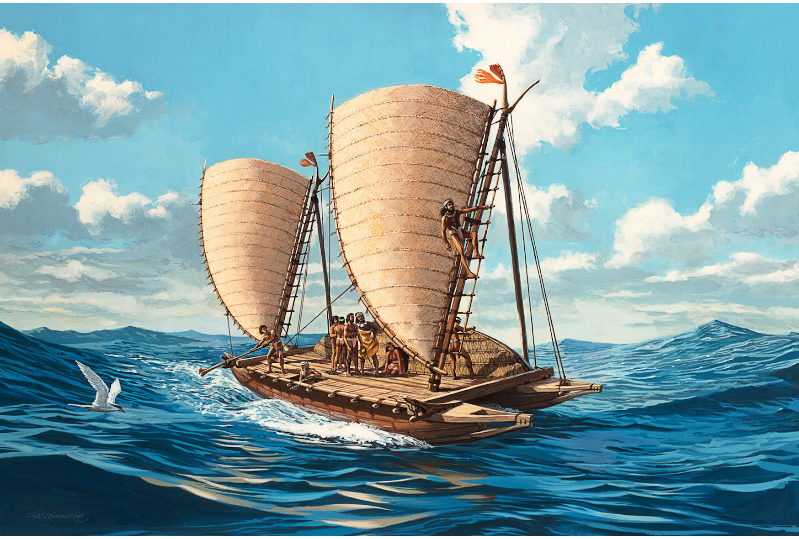

[Cook 250 Research Notebook](../) > Horouta  
*[Previous](../p21-endeavour/)* | Page 22 | *[Next](../p23-cook-arrival/)*
### The pahi Horouta brought early Māori settlers with kūmara to Aotearoa (circa 1250)

*Painting of a pahi from Tuamotu Islands by Herb Kawainui Kāne (1928–2011)*

Source: [Herb Kawainui Kāne: A Visual Collection of Hawaiian History](https://www.herbkanehawaii.com/product/kalia-of-tonga/)

#### More Images

##### Auckland Art Gallery

* [The Arrival of the Maoris in New Zealand](https://www.aucklandartgallery.com/explore-art-and-ideas/artwork/166/the-arrival-of-the-maoris-in-new-zealand)

##### Beattie's Book Blog

* [HOROUTA The History of the Horouta Canoe, Gisborne and East Coast](http://beattiesbookblog.blogspot.com/2012/11/horouta-history-of-horouta-canoe.html)

##### Gisborne Herald

* [Hine Hakirirangi](http://www.gisborneherald.co.nz/entertainment/2909432-135/hine-hakirirangi/)

##### Herb Kawainui Kāne: A Visual Collection of Hawaiian History

* [Canoes](https://www.herbkanehawaii.com/product-category/canoes/)
* [Hōkūleʻa II](https://www.herbkanehawaii.com/product/hokule%ca%bba-ii-2/)
* [Pahi of Tuamotu Islands](https://www.herbkanehawaii.com/product/kalia-of-tonga/)

##### Michael Mallett on Flickr

* [Waka Pahi reconstruction, Gisborne museum](https://flic.kr/p/22P1xjR)
* [Waka Pahi](https://flic.kr/p/22P1yrR)

##### National Library of New Zealand Topics on DigitalNZ

* [Pacific Navigation](https://digitalnz.org/stories/5ad94de2fb002c6f39badbe0)

##### Oratia

* [Horouta, The History of the Horouta Canoe, Gisborne and East Coast, by Rongowhakaata Halbert](https://www.oratia.co.nz/product/horouta/)

> Horouta is the definitive history of the descendants of the voyaging canoes
> that brought the first settlers from Polynesia to the lands that stretch
> from East Cape to northern Hawke’s Bay. Assembled through painstaking
> historical and genealogical research over more than 70 years by
> Rongowhakaata Halbert and his family, this outstanding work of scholarship
> is destined to serve the needs of all New Zealanders, and especially the
> peoples of Gisborne and the East Coast, for generations to come.
>
> — https://www.oratia.co.nz/product/horouta/

##### Sail-World

* [The Pacific's Challenge - Four Vaka to journey the Islands](https://www.sail-world.com/NZ/The-Pacifics-Challenge---Four-Vaka-to-journey-the-Islands/68263)

##### Te Ara — The Encyclopedia of New Zealand

* [Story: East Coast region: Waka landings, places of significance and tribes](https://teara.govt.nz/en/map/33350/waka-landings-places-of-significance-and-tribes)
* [Hine Hakirirangi](https://teara.govt.nz/en/artwork/33354/hine-hakirirangi)
* [Double-hulled voyaging canoes, Gisborne, 2000](https://teara.govt.nz/en/object/1814/double-hulled-voyaging-canoes-gisborne-2000)

##### Te Papa Tongarewa — Museum of New Zealand

[Model pahi (sailing canoe from Tuamotu)](https://collections.tepapa.govt.nz/object/747347), 2007, New Zealand,  
by Izzat Design Limited. Commissioned 2007. © Te Papa.  
[CC BY-NC-ND 4.0.](https://creativecommons.org/licenses/by-nc-nd/4.0/) Te Papa (FE011986)

* [Pacific canoes](https://collections.tepapa.govt.nz/topic/2354)

##### Tupapa

* [Horouta](https://www.tupapa.nz/stories/arrival-in-aotearoa/horouta)

##### Wikimedia

* [The Legend of the Voyage to New Zealand](https://commons.wikimedia.org/wiki/File:Rotorua_Museum,_Maori_arrival.jpg)

#### References

##### Andrea Leon on Prezi

* [The Pahi Canoe of the Tuomotu Islands](https://prezi.com/ymzsfu2mrj86/the-pahi-canoe-of-the-tuomotu-islands/)

##### Beattie's Book Blog

* [HOROUTA The History of the Horouta Canoe, Gisborne and East Coast](http://beattiesbookblog.blogspot.com/2012/11/horouta-history-of-horouta-canoe.html)

##### Department of Conservation, New Zealand

* [The Turanganui River, A Brief History, October 2006](https://www.doc.govt.nz/Documents/conservation/historic/by-region/echb/turanganui-river-history.pdf)

##### Education Central

* [Standing tall](https://educationcentral.co.nz/standing-tall/)

##### Gisborne Herald

###### November 8th, 2011

* [Story of discovery in digital media](http://www.gisborneherald.co.nz/local-news/20181108/story-of-discovery-in-digital-media/)

###### July 7th, 2020

* [Te Wherowhero ‘a cherished taonga’](http://www.gisborneherald.co.nz/environment/20200707/te-wherowhero-a-cherished-taonga/)

##### Hawaiian Voyaging Traditions

* [Herb Kawainui Kāne, a founder of the Polynesian Voyaging Society and designer of Hōkūle‘a (1928-2011)](http://archive.hokulea.com/index/founder_and_teachers/herb_kane.html)

##### Herb Kawainui Kāne: A Visual Collection of Hawaiian History

* [Herb Kāne](https://www.herbkanehawaii.com/about/)

##### Hōkūleʻa

###### November 13th, 2014

* [Uncovering an Ancient Waka](http://www.hokulea.com/uncovering-ancient-waka/)

##### LEARNZ on Vimeo

* [Waka Horouta](https://vimeo.com/97880061)

##### Te Papa Tongarewa — Museum of New Zealand

* [Pacific canoes](https://collections.tepapa.govt.nz/topic/2354)
* [Royal transport](https://collections.tepapa.govt.nz/topic/3190)
* [Model Tipaerua (model canoe)](https://collections.tepapa.govt.nz/object/648721)
* [Model pahi (sailing canoe from Tuamotu)](https://collections.tepapa.govt.nz/object/747347)

##### The Informer

* [Of waka hourua, pahī, barques and barks](https://www.theinformer.co.nz/feature/of-waka-hourua-pahi-barques-and-barks)

##### Oratia

* [Horouta, The History of the Horouta Canoe, Gisborne and East Coast, by Rongowhakaata Halbert](https://www.oratia.co.nz/product/horouta/)

##### Papa Tipu o Horouta on YouTube

* [Horouta Wananga Horouta Whanaunga](https://www.youtube.com/watch?v=Qvbp4qoUUws)

> A google earth tour of Te Papatipu o Horouta.
>
> Translation
>
> As I Return to the Eastern seaboard and traverse  
> the ancestral land of the Horouta canoe.  
> I come upon Tikirau the landing place of the canoes.  
> I turn and travel by the coast to Patangata  
> The area of Tumoana Kotore  
> then to Maniaroa where the brown dogs of uetuhiao fought and died.  
> Thus severing Apanui and Ngati Porou  
>
> Kawakawa mai i tawhiti the area of te whanau a Tuwhakairiora  
> At Waiapu where the emptying of the Horouta canoe took place.  
> The Begining of Ngati Porou where they lived in multitudes.  
> The Mountain Hikurangi, where Maui’s canoe lies,  
> the heart and symbol of the people  
> The great tidal wave of Ruatapu  
> the proverbial saying of Te Kani a Takirau  
> A mountain steadfast ever since the beginning of time  
> It’s awesomeness embracing its people since time immemorial  
> the caretakers being Ngati Uepohatu  
> Te Aitanga a Mate and Umuariki.  
>
> I return again to the eastern seaboard come upon tawhiti a paoa  
> the area of te whanau a iritekura at marotiri  
> at tuatini te whanau a ruataupare  
> at mangatuna at uawa  
> Te aitanga a Hauiti at Rototahi te whironui and the eminant Paikea!  
>
> I return again to the Eastern Seaboard  
> and come upon Whangara mai i tawhiti  
> the time of HInematioro I approached Turanganui landing at Te Toka a Taiau  
> and thus the people of Te Aitanga a Mahaki  
> Rongawhakata and Kahungunu and the proverbial saying  
> Ka Tere raua ko tere Pipi Whakao  
> Each to his own autonomy prestige.  
> Manawaru and Araiteuru  
> Pipitaiari the strange and unexplained.  
> I land again at Te kuri a Pawa  
> the area of Tamanuhiri and Ruapani  
> the overlaping boundries of the two canoe areas.  
> Takitimu to the south  
> Horouta canoe lies petrified in the lake at Muriwai  
> the Horouta canoe from the eastern seaboard.  
> Emanating its mantle and essence into the world of Light.  

##### PNAS, Proceedings of the National Academy of Sciences of the United States of America

###### October 14th, 2014

* [An early sophisticated East Polynesian voyaging canoe discovered on New Zealand's coast](https://www.pnas.org/content/111/41/14728)

##### Stuff

###### October 2nd, 2014

* [600-year-old waka surprises researchers](http://www.stuff.co.nz/national/10568936/600-year-old-waka-surprises-researchers)

##### Tairāwhiti Museum

* [Tairāwhiti Museum](https://tairawhitimuseum.org.nz/)
* [Te Moana Maritime Gallery](https://tairawhitimuseum.org.nz/exhibition/te-moana-maritime-gallery/)

##### Tāmanuhiri

* [He Putanga Nō Uki](http://tamanuhiri.iwi.nz/he-putanga-n333-uki.html)

##### Te Ao — Māori news

###### November 7th, 2018

* [Unearthing Horouta waka](https://www.teaomaori.news/unearthing-horouta-waka)

##### Te Ara — The Encyclopedia of New Zealand

* [Waka landings, places of significance and tribes](https://teara.govt.nz/en/map/33350/waka-landings-places-of-significance-and-tribes)
* [Story: Tūranganui-a-Kiwa tribes, Arrivals and alliances: The Horouta canoe](https://teara.govt.nz/en/turanganui-a-kiwa-tribes/page-2)
* [Story: East Coast region: Waka landings, places of significance and tribes](https://teara.govt.nz/en/map/33350/waka-landings-places-of-significance-and-tribes)
* [Story: East Coast region: Māori settlement](https://teara.govt.nz/en/map/33350/waka-landings-places-of-significance-and-tribes)
* [Story: Kūmara](https://teara.govt.nz/en/kumara)
* [‘Taputini’ – a traditional kūmara cultivar](https://teara.govt.nz/en/photograph/1763/taputini-a-traditional-kumara-cultivar)
* [Story: Pacific migrations](https://teara.govt.nz/en/pacific-migrations)
* ['The arrival of the Maoris in New Zealand'](https://teara.govt.nz/en/artwork/45873/the-arrival-of-the-maoris-in-new-zealand)

##### The Journal of the Polynesian Society

* [THE HISTORY OF ‘HOROUTA’ CANOE AND THE INTRODUCTION OF THE KUMARA INTO NEW ZEALAND.](http://jps.auckland.ac.nz/document/Volume_21_1912/Volume_21%2C_No._4/The_history_of_Horouta_Canoe_and_the_introduction_of_the_kumara_into_New_Zealand%2C_by_Mohi_Turei%2C_p_152-163/p1)

##### Tupapa

* [Horouta](https://www.tupapa.nz/stories/arrival-in-aotearoa/horouta)
* [Arrival in Aotearoa](https://www.tupapa.nz/stories/arrival-in-aotearoa)

##### Victoria University of Wellington

* [Takitimu: Chapter Two — The History of Horouta and that of Pawa (her Commander) and Kiwa (the Priest)](http://nzetc.victoria.ac.nz/tm/scholarly/tei-MitTaki-t1-body-d1-d2.html)

##### Vegetables

* [Kūmara](https://www.vegetables.co.nz/vegetables-a-z/kumara/)

##### Wikipedia

* [Horouta](https://en.wikipedia.org/wiki/Horouta)
* [Hōkūleʻa](https://en.wikipedia.org/wiki/H%C5%8Dk%C5%ABle%CA%BBa)
* [Sweet potato](https://en.wikipedia.org/wiki/Sweet_potato)
* [Pahi](https://en.wikipedia.org/wiki/Pahi)
* [Herb Kawainui Kāne](https://en.wikipedia.org/wiki/Herb_Kawainui_K%C4%81ne)

##### Zealand.org.nz

* [the Maori history in Aotearoa # 1](http://www.zealand.org.nz/whakapapa1.htm)
* [the Maori history in Aotearoa # 2](http://www.zealand.org.nz/whakapapa2.htm)

[Cook 250 Research Notebook](../) > Horouta  
*[Previous](../p21-endeavour/)* | Page 22 | *[Next](../p23-cook-arrival/)*
