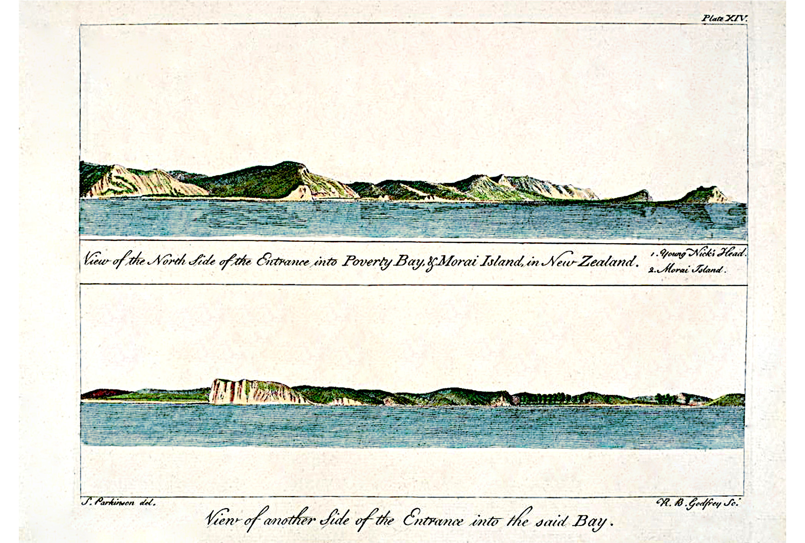

[Cook 250 Research Notebook](../) > Cook's Arrival  
*[Previous](../p22-horouta/)* | Page 23 | *[Next](../p24-te-maro/)*
### James Cook arrived to New Zealand in October 1769

*View of Poverty Bay featuring Young Nick's Head*

Source: [Journal of Sidney Parkinson, Plate XIV, SPL Hand Coloured Rare Book Collection](https://www.splrarebooks.com/collection/view/a-journal-of-a-voyage-to-the-south-seas-in-his-majestys-ship-the-endeavour-)

#### More Images

##### Michel Tuffery

* [Taiato and young Nick, the adventurers arrival in Aotearoa, 1769](https://micheltuffery.co.nz/product/taiato-and-young-nick/)

##### New Zealand Post

* [Tuia 250: Michel Tuffery's Artistic Journey of Discovery](https://stamps.nzpost.co.nz/new-zealand/2019/tuia-250-michel-tufferys-artistic-journey-discovery)
* [Single 3d 'Landing of Captain Cook' gummed stamp](https://stamps.nzpost.co.nz/new-zealand/1906/christchurch-exhibition)
* [Single 2s 'Landing of Captain Cook' gummed stamp](https://stamps.nzpost.co.nz/new-zealand/1936/pictorial-officials)

##### SPL — Hand Coloured Rare Book Collection

* [A Journal of a Voyage to the South Seas in His Majesty’s Ship the Endeavour..., by Sidney Parkinson](https://www.splrarebooks.com/collection/view/a-journal-of-a-voyage-to-the-south-seas-in-his-majestys-ship-the-endeavour-)

##### Te Ara — The Encyclopedia of New Zealand

* [Young Nicks Head](https://teara.govt.nz/en/photograph/1417/young-nicks-head)

#### References

##### New Zealand Tourism — 100% Pure New Zealand

* [Captain Cook's Landing Site and Young Nick's Head](https://www.newzealand.com/int/feature/captain-cooks-landing-site-and-young-nicks-head/)

##### Wikipedia

* [Poverty Bay](https://en.wikipedia.org/wiki/Poverty_Bay)
* [Young Nick's Head](https://en.wikipedia.org/wiki/Young_Nick%27s_Head)

[Cook 250 Research Notebook](../) > Cook's Arrival  
*[Previous](../p22-horouta/)* | Page 23 | *[Next](../p24-te-maro/)*
