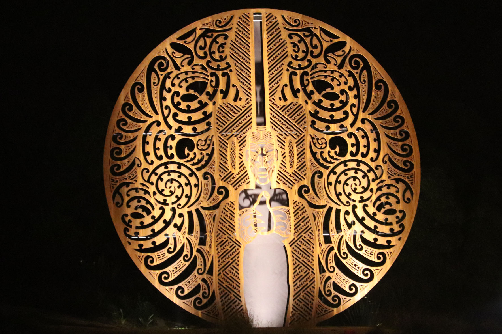
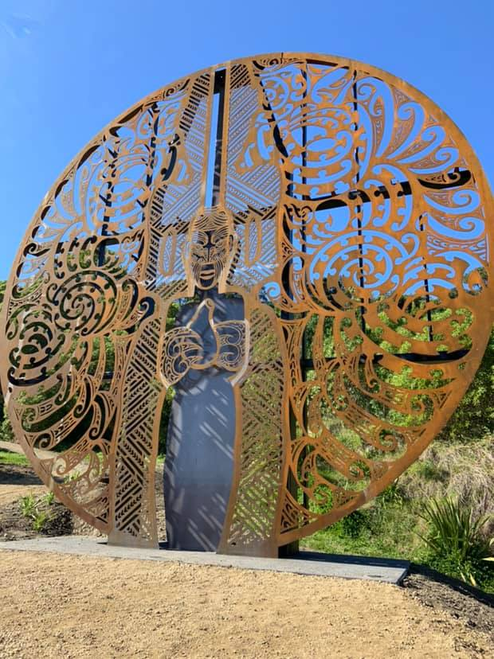
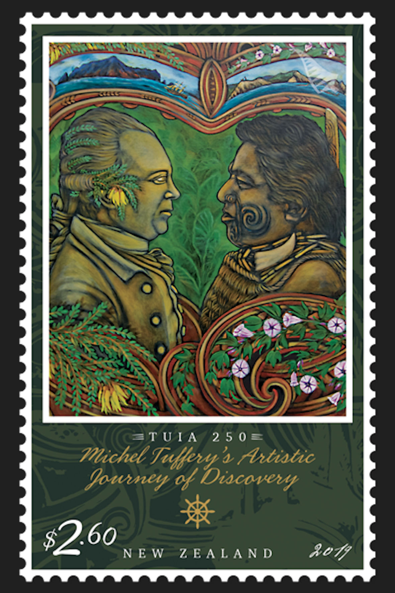

### Murder of Te Maro

#### Te Maro Memorial

Sculpture by Nick Tupara, a descendant of Te Maro  
Detail of a photograph by David Thomsen (31 December 2019)

Source: [Wikipedia](https://en.wikipedia.org/wiki/File:Te_Maro_memorial.jpg)

> Te Maro of Ngāti Rakai (later Ngāti Oneone) and Te Aitanga a Hauiti
> was trained in the whare wānanga (house of learning) Puhi Kai Iti,
> an expert in reading nature and a master producer of cultivated foods.
> (...)
> — TUIA 250, Michel Tuffery's Artistic Journey of Discovery
> New Zealand Post, Stamps Presentation Pack

> A memorial is being built by Ngāti Oneone in Gisborne to honour
> their ancestor Te Maro who was shot dead by Captain Cook when he
> first made landfall in New Zealand.
>
> Speaking on behalf of Ngāti Oneone, project designer Nick Tupara says,
> “We want those stories to be told, ones that you can't google, ones that
> the Western academics haven't included in their many volumes about Cook.”
>
> Te Maro was a prominent leader in the area, but as he approached the foreign
> explorer on the beach, Te Maro was shot dead by Captain Cook. (...)
>
> “He was a graduate of one of our whare wānanga, our whare wānanga called
> Puhi Kai Iti that came here from Hawaiki on our waka."
>
> (...)
>
> “From this spot where we're standing is where he performed the rituals
> he had learnt in that wānanga to assist our iwi and hapū to grow kai and
> sustain themselves,” says Tupara.
>
> — Ngāti Oneone re-tell accurate history of Gisborne,
> Te Ao Māori News, August 18th, 2018
> https://www.teaomaori.news/ngati-oneone-re-tell-accurate-history-gisborne

> The art piece, by Nick Tupara, represents Te Maro, his tipuna and
> significant gardener of the mana whenua (land).
> (...)
> Te Maro was the grandson of the rangatira Rakai a Tane
> at the time of the Endeavour arrival in 1769.
>
> A sculpture to acknowledge the region’s voyaging traditions, Te Ikaroa,
> will also be completed at Puhi Kai Iti Cook Landing Site this week.
>
> Te Ikaroa a Rauru (the long fish of Rauru) was the waka captained by
> Maia Poroaki from Hawaiki to Turanganui-a-Kiwa.
>
> A statement from the Gisborne District Council noted that the place
> where this sculpture stands is where Maia built his whare wananga,
> place of learning, that he named Puhi Kai Iti.
>
> The installations will be completed and unveiled in a blessing ceremony
> on Saturday, where the stories of these ancestors and the meaning of
> these art pieces will be shared.
>
> — Tipuna Te Maro, The Gisborne Herald, September 25th, 2019
> http://www.gisborneherald.co.nz/local-news/20190925/tipuna-te-maro/

> The rangatira (chief) was responsible for organising large communal
> enterprises, including food production. His position was hereditary,
> but leadership ability was vital. A chief’s position and status could
> vary depending on his effectiveness as a leader during the business
> of food production.
>
> — Roles and mana: Rangatira,
> Story: Te mahi kai – food production economics
> Te Ara — The Encyclopedia of New Zealand
> https://teara.govt.nz/en/te-mahi-kai-food-production-economics/page-5

> (...) We heard, too, from Nick Tupara and Charlotte Gibson about the death
> of their ancestor Te Maro, who died when Captain James Cook first landed on
> Maori land. For generations of schoolchildren in the UK, it is a story that
> has been told in celebration of Cook’s heroism and vitality.
>
> Here we heard the other side, of another man, a gardener.
> “[It was] an ordinary role on the face of it, but high standing
> among our people,” said Tupara, adding that his death was still
> mourned today. (...)
>
> — Oceans Apart: Art and the Pacific with James Fox concluded with
> a compelling look at Maori culture, inews.co.uk, September 24th, 2018
> https://inews.co.uk/culture/television/oceans-apart-art-and-pacific-james-fox-review-bbc-four-250804

> Aubrey Ria is tangata whenua in Tūranganui a Kiwa and descends directly
> from the original inhabitants of the region, who date back over 500 years
> before the arrival of Europeans.
>
> “For a long time, my people, the tribes of this region, have been asking
> for an apology from the government, from those who strongly support this
> individual called Cook, but we're still waiting," she says.
>
> When the Endeavour first landed in Gisborne in 1769, local chief Te Maro
> was killed. He was a great cultivator and renown gardener who fed the many
> tribes of the Tūranganui a Kiwa area.
>
> Ria says accurate histories are still being overlooked in Aotearoa.
>
> “For a long time, Te Maro has been remembered merely as the person who
> was shot by Cook's soldiers, most people aren't aware that he was a chief
> among our people."
>
> — https://www.teaomaori.news/endeavour-replica-reveals-racism

> Speaking on behalf of Tūranga iwi Ngāti Oneone, Nick Tupara says,
> “We also hope that her statement [British High Commissioner to New Zealand
> has issued a formal expression of regret to the iwi of Tūranganui a Kiwa
> for the deaths of at least five Māori at the hands of Captain Cook and
> the crew of the Endeavour] stands for a voice for our community
> being able to come together in our traditional places and share our
> kōrero and feel safe to do so and start to rebuild and develop our
> community going forward.
>
> One of the nine Māori shot in the first two days of the Endeavour's visit
> to Tūranga in 1769, was local chief Te Maro of Ngāti Oneone.
>
> Although monuments to Captain Cook have been erected around the country,
> the story of Te Maro has only national attention in recent years.
>
> Tupara says that “Te Maro's job was to grow kai and feed his people
> that was his purpose, and that's a chiefly endeavour. and to ensure
> that his people's well-being was being cared for and through his action,
> they had a way forward, they had a future for their mokopuna and I feel
> we're trying to emulate that.”
>
> — https://www.teaomaori.news/we-cant-sit-back-and-let-be-shallow-statement

> **MONDAY, 9th October.**
>
> (...) After this I went ashore with a Party of men in the Pinnace and yawl
> accompanied by Mr. Banks and Dr. Solander. We landed abreast of the Ship and
> on the East side of the River just mentioned; but seeing some of the Natives
> on the other side of the River of whom I was desirous of speaking with, and
> finding that we could not ford the River, I order'd the yawl in to carry us
> over, and the pinnace to lay at the Entrance. In the mean time the Indians
> made off. However we went as far as their Hutts which lay about 2 or 300
> Yards from the water side, leaving 4 boys to take care of the Yawl, which
> we had no sooner left than 4 Men came out of the woods on the other side the
> River, and would certainly have cut her off had not the People in the
> Pinnace discover'd them and called to her to drop down the Stream, which
> they did, being closely persued by the Indians. The coxswain of the Pinnace,
> who had the charge of the Boats, seeing this, fir'd 2 Musquets over their
> Heads; the first made them stop and Look round them, but the 2nd they took
> no notice of; upon which a third was fir'd and kill'd one of them upon the
> Spot just as he was going to dart his spear at the Boat. At this the other 3
> stood motionless for a Minute or two, seemingly quite surprised; wondering,
> no doubt, what it was that had thus kill'd their Comrade; but as soon as
> they recovered themselves they made off, dragging the Dead body a little way
> and then left it. Upon our hearing the report of the Musquets we immediately
> repair'd to the Boats, and after viewing the Dead body we return'd on board.
> (...)
>
> — CAPTAIN COOK'S JOURNAL DURING HIS FIRST VOYAGE ROUND THE WORLD
>   MADE IN H.M. BARK "ENDEAVOUR" 1768-71
> http://gutenberg.net.au/ebooks/e00043.html#ch5

> **1769 October 8. Arrived New Zealand**
>
> (...)
>
> In the evening went ashore with the marines etc.
> March from the boats in hopes of finding water etc.
> Saw a few of the natives who ran away immediately on seeing us;
> while we were absent 4 of them attackd our small boat in which
> were only 4 boys, they got off from the shore in a river,
> the people followd them and threatned with long lances;
> the pinnace soon came to their assistance, fird upon them and
> killd the cheif. The other three draggd the body about 100 yards
> and left it. At the report of the musquets we drew together and went
> to the place where the body was left; he was shot through the heart.
> He was a middle sizd man tattowd in the face on one cheek only in
> spiral lines very regularly formd; he was coverd with a fine cloth
> of a manufacture totaly new to us, it was tied on exactly as represented
> in Mr Dalrymples book p.63; his hair was also tied in a knot on the top
> of his head but no feather stuck in it; his complexion brown but not
> very dark.
>
> Soon after we came on board we heard the people ashore very distinctly
> talking very loud no doubt, as they were not less than two miles distant
> from us, consulting probably what is to be done tomorrow.
>
> — The Endeavour Journal of Sir Joseph Banks
> http://gutenberg.net.au/ebooks05/0501141h.html#oct1769

The picture referred to by Joseph Banks is on the left page:

* [View of MURDERERS BAY on NEW ZEALAND in 15 fathom Water](https://nla.gov.au/nla.obj-18696055/view?partId=nla.obj-18718192#page/n110/mode/1up)

> **On the 9th, early in the morning,** (...)
> We also discovered many of the natives (who seemed to be of a very dark hue)
> and several of their canoes hauled upon the beach. The natives, on
> approaching nearer to them, took but little notice of us. Having cast
> anchor, the pinnace, long-boat, and yaul, were sent on shore with the
> marines. As soon as the people who were in the pinnace had passed a little
> way up into the country, while the long-boat went up the river to see for
> water, some of the natives, who had hid them-selves amongst the bushes,
> made their appearance, having long wooden lances in their hands, which
> they held up in a threatening posture, as if they intended to throw them
> at the boys in the yaul. The cockswain, who stayed in the pinnace,
> perceiving, them, fired a musquetoon over their heads, but that did not seem
> to intimidate them: he therefore fired a musket, and shot one of them through
> the heart; upon which they were much alarmed, and retreated precipitately.
>
> — Sydney Parkinson's Journal of a Voyage to the South Seas
> http://nla.gov.au/nla.cs-ss-jrnl-parkinson-120

#### More Images

##### Boffa Miskell

* [Stories of arrival unveiled in Gisborne](https://boffamiskell.co.nz/news-and-insights/article.php?v=stories-of-arrival-unveiled-in-gisborne)
* [Puhi Kai Iti / Cook Landing Site Historic Reserve Redevelopment](https://boffamiskell.co.nz/project.php?v=puhi-kai-iti-cook-landing-site-historic-reserve-redevelopment)

##### Eugenie Sage MP on Facebook

* [Eugenie Sage MP, September 27th, 2019](https://www.facebook.com/EugenieSageMP/posts/2868526743175692)

##### Michel Tuffery

* [Te Maro and Solander, two intellectuals from opposite sides of the world, 1769](https://micheltuffery.co.nz/product/te-maro-and-solander-two-intellectuals-from-opposite-sides-of-the-world-1769-solander-and-te-maro/)

##### National Library of Australia

* [Journal of H.M.S. Endeavour, 1768-1771: Monday 9th, October 1769](https://nla.gov.au/nla.obj-229002894/view)

##### New Zealand Post

###### Solander and Te Maro

> **$2.60 ‘Te Maro and Solander, two intellectuals from opposite sides of the world, 1769’ (Solander and Te Maro)**
>
> Te Maro of Ngāti Rakai (later Ngāti Oneone) and Te Aitanga a Hauiti
> was trained in the whare wānanga (house of learning) Puhi Kai Iti,
> an expert in reading nature and a master producer of cultivated foods.
> Linnaean disciple Daniel Solander was committed to cataloguing the
> natural world. Nick Tupara, a descendant of Te Maro, is depicted here:
> a reminder of the legacy of the tragic first meeting of Māori and British
> at the Tūranganui River, when Te Maro was shot and killed. Te Maro and
> Solander never met.
>
> — TUIA 250, Michel Tuffery's Artistic Journey of Discovery
> New Zealand Post, Stamps Presentation Pack

* [Tuia 250: Michel Tuffery's Artistic Journey of Discovery](https://stamps.nzpost.co.nz/new-zealand/2019/tuia-250-michel-tufferys-artistic-journey-discovery)

##### Te Ara — The Encyclopedia of New Zealand

* [Māori settlement](https://teara.govt.nz/en/diagram/17355/maori-settlement)

##### Tupapa

* [First Landing](https://www.tupapa.nz/stories/encounters-with-cook/first-landing/te-maro-arrives)

#### References

##### BBC

* [Maori shootings: Britain regrets killings by Endeavour crew](https://www.bbc.com/news/world-asia-49903759)
* [Who really discovered New Zealand?](https://www.bbcearth.com/blog/?article=who-really-discovered-new-zealand)
* [The countries grappling with their European heritage](https://www.bbc.com/news/world-asia-49728901)

##### Facebook

* [FULL STATEMENT OF REGRET FROM LAURA CLARKE - BRITISH HIGH COMMISSIONER TO NEW ZEALAND](https://www.facebook.com/rongowhakaata.iwi/videos/738889103205732/)

##### Gisborne District Council

###### January 19th, 1996

* [Historical address of the arrival in 1769 of Captain Cook and the Endeavour(...)](https://www.gdc.govt.nz/assets/Consultation/Historical-Address-of-the-arrival-1769-of-Captain-Cook-and-the-Endeavour-to-Turanganui-A-Kiwa.pdf)

###### March 12th, 2019

* [Construction begins on Puhi Kai Iti Cook Landing Site](https://www.gdc.govt.nz/construction-begins-on-puhi-kai-iti-cook-landing-site/)

###### August 20th, 2019

* [Puhi Kai Iti Cook Landing Site transforming with tukutuku](https://gdc.govt.nz/puhi-kai-iti-cook-landing-site-transforming-with-tukutuku/)

##### Project Gutenberg Australia

* [Captain cook's Journal. First Voyage.](http://gutenberg.net.au/ebooks/e00043.html#ch)
* [The Endeavour Journal of Sir Joseph Banks, 1769 October 8. Arrived New Zealand](http://gutenberg.net.au/ebooks05/0501141h.html#oct1769)

##### RNZ Radio New Zealand

###### October 2nd, 2019

* [Iwi to receive message expressing regret for Māori killed in James Cook meeting](https://www.rnz.co.nz/news/te-manu-korihi/400095/iwi-to-receive-message-expressing-regret-for-maori-killed-in-james-cook-meeting)

##### Smithsonian

* [British Government ‘Expresses Regret’ for Māori Killed After James Cook’s Arrival in New Zealand](https://www.smithsonianmag.com/smart-news/british-government-expresses-regret-maori-killed-after-james-cooks-arrival-new-zealand-180973270/)

##### South Seas

* [Sydney Parkinson's Journal of a Voyage to the South Seas](http://nla.gov.au/nla.cs-ss-jrnl-parkinson-120)

##### Te Ao — Māori News

###### August 18th, 2018

* [Ngāti Oneone re-tell accurate history of Gisborne](https://www.teaomaori.news/ngati-oneone-re-tell-accurate-history-gisborne)

###### July 4th, 2019

* [Endeavour replica reveals racism](https://www.teaomaori.news/endeavour-replica-reveals-racism)

###### October 1st, 2019

* [Māori stories of arrival recognised](https://www.teaomaori.news/maori-stories-arrival-recognised)

##### The Gisborne Herald

###### September 25th, 2019

* [Tipuna Te Maro](http://www.gisborneherald.co.nz/local-news/20190925/tipuna-te-maro/)

##### The Guardian

* ['He's a barbarian': Māori tribe bans replica of Captain Cook's ship from port](https://www.theguardian.com/world/2019/sep/17/hes-a-barbarian-maori-tribe-bans-replica-of-captain-cooks-ship-from-port)
* [Vandalism forces New Zealand council to remove Captain Cook statue](https://www.theguardian.com/world/2018/oct/02/vandalism-forces-new-zealand-council-to-remove-captain-cook-statue)
* [Captain Cook's Endeavour: from the Great Barrier Reef to Rhode Island?](https://www.theguardian.com/us-news/2016/may/04/captain-cook-endeavour-ship-found-rhode-island-revolutionary-war)

##### Te Ao — Māori News

###### July 16th, 2019

* [Capt. Cook: A 'genocidal murderer' - indigenous scholar Tina Ngata](https://www.teaomaori.news/capt-cook-genocidal-murderer-indigenous-scholartina-ngata)

###### October 2nd, 2019

* ["We can't sit back and let that be a shallow statement"](https://www.teaomaori.news/we-cant-sit-back-and-let-be-shallow-statement)

##### Te Ara — The Encyclopedia of New Zealand

* [Story: Tūranganui-a-Kiwa tribes: Lands and ancestors](https://teara.govt.nz/en/turanganui-a-kiwa-tribes/page-1)
* [Story: Canoe traditions: Canoes of the East Coast](https://teara.govt.nz/en/canoe-traditions/page-6)
* [Story: Māori foods – kai Māori](https://teara.govt.nz/en/maori-foods-kai-maori)
* [Story: Ngā tupu mai i Hawaiki – plants from Polynesia](https://teara.govt.nz/en/nga-tupu-mai-i-hawaiki-plants-from-polynesia)
* [Hue – gourd](https://teara.govt.nz/en/photograph/17491/hue-gourd)
* [Page 5. Roles and mana](https://teara.govt.nz/en/te-mahi-kai-food-production-economics/page-5)

##### Te Papa Tongarewa — Museum of New Zealand

* [Māori gardening tools](https://www.tepapa.govt.nz/discover-collections/read-watch-play/maori/maori-gardening-tools)

##### The Spinoff

###### October 5th, 2019

* [Move over, James Cook: Māori and Pacific voices on Tuia 250](https://thespinoff.co.nz/atea/05-10-2019/maori-and-pacific-voices-on-tuia-250-whose-history-are-we-celebrating-again/)

##### Tupapa

* [Te Maro Encounter](https://www.tupapa.nz/stories/encounters-with-cook/first-landing/te-maro-encounter)
* [Encounters with Cook](https://www.tupapa.nz/stories/encounters-with-cook)

##### Victoria University of Wellington

* [Life in Early Poverty Bay: Why Te Maro Was Shot](http://nzetc.victoria.ac.nz/tm/scholarly/tei-MacLife-t1-body-d1-d2.html)

##### Wikipedia

* [History of the Gisborne Region](https://en.wikipedia.org/wiki/History_of_the_Gisborne_Region#cite_note-spedding-16)
* [Poverty Bay](https://en.wikipedia.org/wiki/Poverty_Bay)

