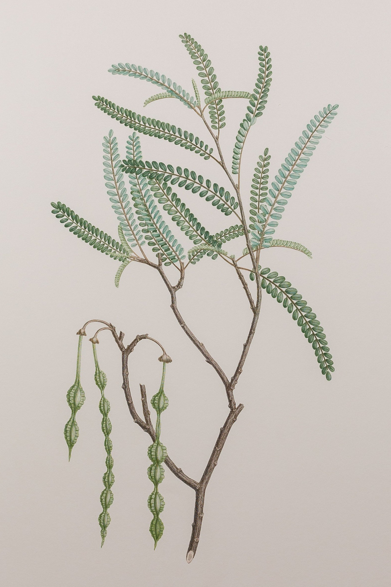

### Botanists: Joseph Banks, Daniel Solander and Sydney Parkinson

#### Joseph Banks started collecting observations of New Zealand plants on 8 October 1769

*Sophora microphylla (Leguminosae), plate 431 in Banks' Florilegium*  
*Drawing by Sydney Parkinson, engraved by Frederick Polydore Nodder.*

Source: [Banks' Florilegium, Alecto Historical Editions](https://www.alecto-historical-editions.com/collections/new-zealand/products/ahe-banks-prints-431)

> Line engraving by Frederick Polydore Nodder after Sydney Parkinson (1769).
> Joseph Banks and his party saw this species at:
> *  Teoneroa, New Zealand (8 October - 11 October 1769)
> *  Tegadu Bay, New Zealand (20 October - 22 October 1769)
> *  Tolaga Bay, New Zealand (23 October - 29 October 1769)
> *  Opoorage, New Zealand (5 November - 15 November 1769)
> *  Motu aro Island, New Zealand (29 November and 2 December 1769)
>
> — https://www.alecto-historical-editions.com/collections/new-zealand/products/ahe-banks-prints-431

> *The Kowhai New Zealand's National Flower* by Alan Jolliffe
>
> If there is one flowering plant that New Zealanders call their
> National Flower it is the Kowhai. It grows naturally throughout
> the dryer areas of New Zealand and because it is so popular it is
> planted in almost every garden.
>
> (...)
>
> The most distinctive feature is its flower. Each spring the large
> bright yellow flowers appear in pendulous clusters of 5-7 on naked
> branches. These showy clusters appear in great profusion. Individual
> flowers are up to 6cm long and the colour is a golden sulphur yellow.
> The calyx, which holds the petals in place, is a yellowish/green colour
> that adds further colour to the flowers.
>
> Tuis and bellbirds love these flowers and visit them to drink the sweet
> nectar. Unfortunately these birds, in their haste, tear the flowers
> to pieces.
>
> (...)
>
> The Kowhai is the best known NZ Native flowering tree and one of the most
> beautiful. As a small tree it is excellent in many small gardens where
> light foliage cover is required and a burst of colour in spring when it
> smothers itself with blooms.
>
> (...)
>
> Maori also recognised the Kowhai as an important plant. Its medicinal
> properties were explored by the Maori and poultices were made from bark
> and applied to wounds and tumours. An infusion of barks (a tea) from the
> Kowhai and manuka was used to treat internal pain, bruises and broken limbs.
> Wood ash from the Kowhai was used to treat ringworm.
>
> The Maori are said to have regulated the planting of potatoes by the
> flowering time of the Kowhai.
>
> The wood of the Kowhai is valuable as is it is very durable. Logs have
> been used straight from the bush and used in construction without any
> special treatment.
>
> As an individual tree the Kowhai is a superb garden plant. It is small
> enough for even the smallest of gardens but it is large enough to make
> an impact. As a garden tree there is none better in spring.
>
> (...)
>
> Plantings of the Kowhai should be encouraged throughout NZ and in other
> places around the world to ensure this icon of New Zealand plants is able
> to show us its best each spring.
>
> — New Zealand A to Z: Kowhai
> http://www.newzealandatoz.com/index.php/page/display/164/

#### More Images

##### Alecto Historical Editions

* [Banks' Florilegium: New Zealand](https://www.alecto-historical-editions.com/collections/new-zealand)
* [Corynocarpus laevigatus (Corynocarpaceae) - Plate 427](https://www.alecto-historical-editions.com/collections/new-zealand/products/ahe-banks-prints-427)
* [Lepidium oleraceum (Cruciferae) - Plate 410](https://www.alecto-historical-editions.com/collections/new-zealand/products/ahe-banks-prints-410)
* [Geranium solanderi (Geraniaceae) - Plate 422](https://www.alecto-historical-editions.com/collections/new-zealand/products/ahe-banks-prints-422)
* [Pelargonium inodorum (Geraniaceae) - Plate 423](https://www.alecto-historical-editions.com/collections/new-zealand/products/ahe-banks-prints-423)
* [Discaria toumatou (Rhamnaceae) - Plate 426](https://www.alecto-historical-editions.com/collections/new-zealand/products/ahe-banks-prints-426)
* [Carmichaelia solandri (Leguminosae) - Plate 429](https://www.alecto-historical-editions.com/collections/new-zealand/products/ahe-banks-prints-429)
* [Sophora tetraptera (Leguminosae) - Plate 430](https://www.alecto-historical-editions.com/collections/new-zealand/products/ahe-banks-prints-430)
* [Sophora microphylla (Leguminosae) - Plate 431](https://www.alecto-historical-editions.com/collections/new-zealand/products/ahe-banks-prints-431)
* [Apium prostrataum (Umbelliferae) - Plate 460](https://www.alecto-historical-editions.com/collections/new-zealand/products/ahe-banks-prints-460)
* [Scandia rosaefolia (Umbelliferae) - Plate 461](https://www.alecto-historical-editions.com/collections/new-zealand/products/ahe-banks-prints-461)
* [Coprosma lucida (Rubiaceae) - Plate 471](https://www.alecto-historical-editions.com/collections/new-zealand/products/ahe-banks-prints-471)
* [Cassinia leptophylla (Compositae) - Plate 484](https://www.alecto-historical-editions.com/collections/new-zealand/products/ahe-banks-prints-484)
* [Brachyglottis repanda (Compositae) - Plate 487](https://www.alecto-historical-editions.com/collections/new-zealand/products/ahe-banks-prints-487)
* [Senecio glomeratus (Compositae) - Plate 491](https://www.alecto-historical-editions.com/collections/new-zealand/products/ahe-banks-prints-491)
* [Senecio quadridentatus (Compositae) - Plate 492](https://www.alecto-historical-editions.com/collections/new-zealand/products/ahe-banks-prints-492)
* [Wahlenbergia marginata (Campanulaceae) - Plate 499](https://www.alecto-historical-editions.com/collections/new-zealand/products/ahe-banks-prints-499)
* [Calystegia sepium (Convolvulaceae) - Plate 513](https://www.alecto-historical-editions.com/collections/new-zealand/products/ahe-banks-prints-513)
* [Calystegia tuguriorum (Convolvulaceae) - Plate 514](https://www.alecto-historical-editions.com/collections/new-zealand/products/ahe-banks-prints-514)
* [Solanum aviculare (Solanaceae) - Plate 517](https://www.alecto-historical-editions.com/collections/new-zealand/products/ahe-banks-prints-517)
* [Hebe salicifolia (Scrophulariaceae) - Plate 520](https://www.alecto-historical-editions.com/collections/new-zealand/products/ahe-banks-prints-520)
* [Myoporum laetum (Myoporaceae) - Plate 524](https://www.alecto-historical-editions.com/collections/new-zealand/products/ahe-banks-prints-524)
* [Tetragonia tetragonioides (Tetragoniaceae) - Plate 532](https://www.alecto-historical-editions.com/collections/new-zealand/products/ahe-banks-prints-532)
* [Muehlenbeckia complexa (Polygonaceae) - Plate 534](https://www.alecto-historical-editions.com/collections/new-zealand/products/ahe-banks-prints-534)
* [Knightia excelsa (Proteaceae) - Plate 540](https://www.alecto-historical-editions.com/collections/new-zealand/products/ahe-banks-prints-540)

##### Michel Tuffery

* [Parkinsons Kākābeak (Clianthus Puniceus) 1769 at Uawa outside Tupaia’s Cave](https://micheltuffery.co.nz/product/parkinsons-kakabeak-clianthus-puniceus-1769-at-uawa-outside-tupaias-cave/)

##### New Zealand Post

* [Tuia 250: Michel Tuffery's Artistic Journey of Discovery](https://stamps.nzpost.co.nz/new-zealand/2019/tuia-250-michel-tufferys-artistic-journey-discovery)

##### SPL Hand Coloured Rare Book Collection

* [Journal of Sydney Parkinson](http://www.splrarebooks.com/collection/view/a-journal-of-a-voyage-to-the-south-seas-in-his-majestys-ship-the-endeavour-)

##### Wikipedia

_(14781835954).jpg)
* [Sophora tetraptera flowers, foliage and seed pods](https://en.wikipedia.org/wiki/K%C5%8Dwhai#/media/File:Plants_of_New_Zealand_(1906)_(14781835954).jpg)

#### References

##### Alecto Historical Editions

* [Banks' Florilegium](https://www.alecto-historical-editions.com/)
* [About Banks' Florilegium](https://www.alecto-historical-editions.com/pages/about-banks-florilegium)
* [Banks' Florilegium: New Zealand](https://www.alecto-historical-editions.com/collections/new-zealand)

##### Botanical Art & Artists

* [About Sydney Parkinson (1745-1771)](https://www.botanicalartandartists.com/sydney-parkinson.html)

##### National History Museum, UK

* [Botanical art and illustrations from HMS Endeavour](https://www.nhm.ac.uk/discover/endeavour/)
* [The Endeavour botanical illustrations: New Zealand](https://www.nhm.ac.uk/our-science/departments-and-staff/library-and-archives/collections/cook-voyages-collection/endeavour-botanical-illustrations/listgallery.dsml?list=gallery&mode=browsing&Highlight=0&sort=Taxon&Location=New+Zealand)

##### National Library of Scotland

* [Sydney Parkinson’s Journal and a Publishing Nightmare](https://blog.nls.uk/sydney-parkinsons-journal-and-a-publishing-nightmare/)

##### New Zealand A to Z

* [Kowhai](http://www.newzealandatoz.com/index.php/page/display/164/)

##### Project Gutenberg Australia

* [The Endeavour Journal of Sir Joseph Banks](http://gutenberg.net.au/ebooks05/0501141h.html)

##### South Seas

* [The Endeavour Journal of Joseph Banks, 1768-1771](http://southseas.nla.gov.au/journals/banks/contents.html)
* [Sydney Parkinson's Journal of a Voyage to the South Seas, in His Majesty's Ship, The Endeavour](http://southseas.nla.gov.au/journals/parkinson/contents.html)

##### SPL Hand Coloured Rare Book Collection

* [A Journal of a Voyage to the South Seas in His Majesty’s Ship the Endeavour, faithfully transcribed from the papers of the late Sydney Parkinson, draughtsman to Sir Joseph Banks Bart in his Expedition with Dr Solander round the World (...)](http://www.splrarebooks.com/collection/view/a-journal-of-a-voyage-to-the-south-seas-in-his-majestys-ship-the-endeavour-)

##### University of Otago

* [Early Botanising](https://www.otago.ac.nz/library/exhibitions/botany/#one)

##### University of Sidney Library

* [The Endeavour Journal of Sir Joseph Banks, 1768-1771.](http://setis.library.usyd.edu.au/ozlit/pdf/p00021.pdf)

##### Wikipedia

* [Joseph Banks](https://en.wikipedia.org/wiki/Joseph_Banks)
* [Daniel Solander](https://en.wikipedia.org/wiki/Daniel_Solander)
* [Sydney Parkinson](https://en.wikipedia.org/wiki/Sydney_Parkinson)
* [Frederick Polydore Nodder](https://en.wikipedia.org/wiki/Frederick_Polydore_Nodder)
* [Banks' Florilegium](https://en.wikipedia.org/wiki/Banks%27_Florilegium)
* [Sophora microphylla](https://en.wikipedia.org/wiki/Sophora_microphylla)
* [Kōwhai](https://en.wikipedia.org/wiki/K%C5%8Dwhai)

