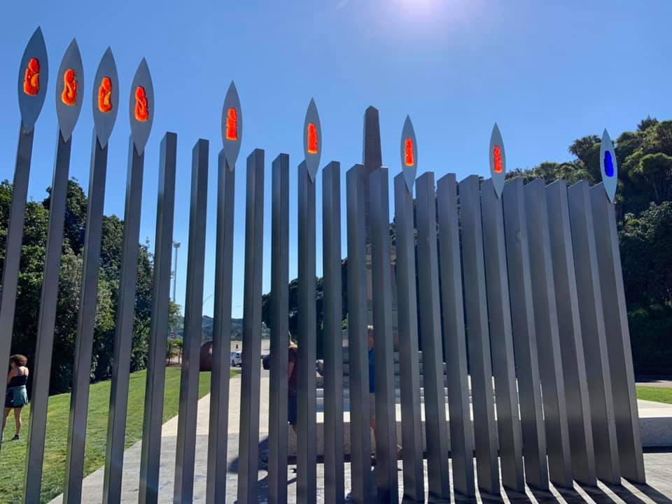
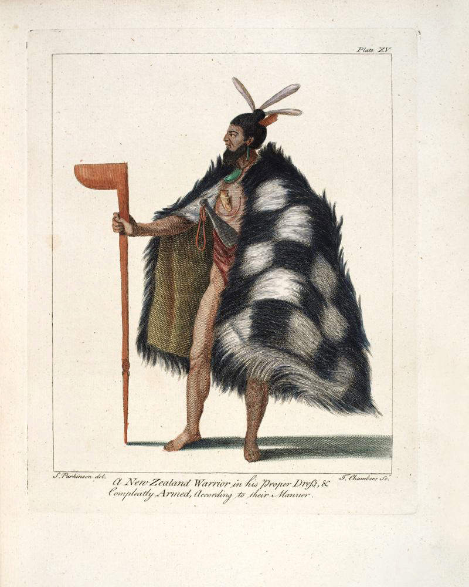

### Te Rakau

#### Nine pou to represent the men shot in the encounter with Endeavour crew

Source: [Eugenie Sage MP on Facebook, September 27th, 2019](https://www.facebook.com/EugenieSageMP/posts/2868526743175692)

#### More Images

##### SPL Hand Coloured Rare Book Collection

* [Journal of Sydney Parkinson](http://www.splrarebooks.com/collection/view/a-journal-of-a-voyage-to-the-south-seas-in-his-majestys-ship-the-endeavour-)

#### References

##### Gisborne District Council

###### January 19th, 1996

* [Historical address of the arrival in 1769 of Captain Cook and the Endeavour(...)](https://www.gdc.govt.nz/assets/Consultation/Historical-Address-of-the-arrival-1769-of-Captain-Cook-and-the-Endeavour-to-Turanganui-A-Kiwa.pdf)

##### Tupapa

* [Second Landing](https://www.tupapa.nz/stories/encounters-with-cook/second-landing)
* [Killing of Te Rakau](https://www.tupapa.nz/stories/encounters-with-cook/second-landing/te-rakau)

##### Victoria University of Wellington

* [Life in Early Poverty Bay: Te Rakau Slain](http://nzetc.victoria.ac.nz/tm/scholarly/tei-MacLife-t1-body-d1-d4.html)
