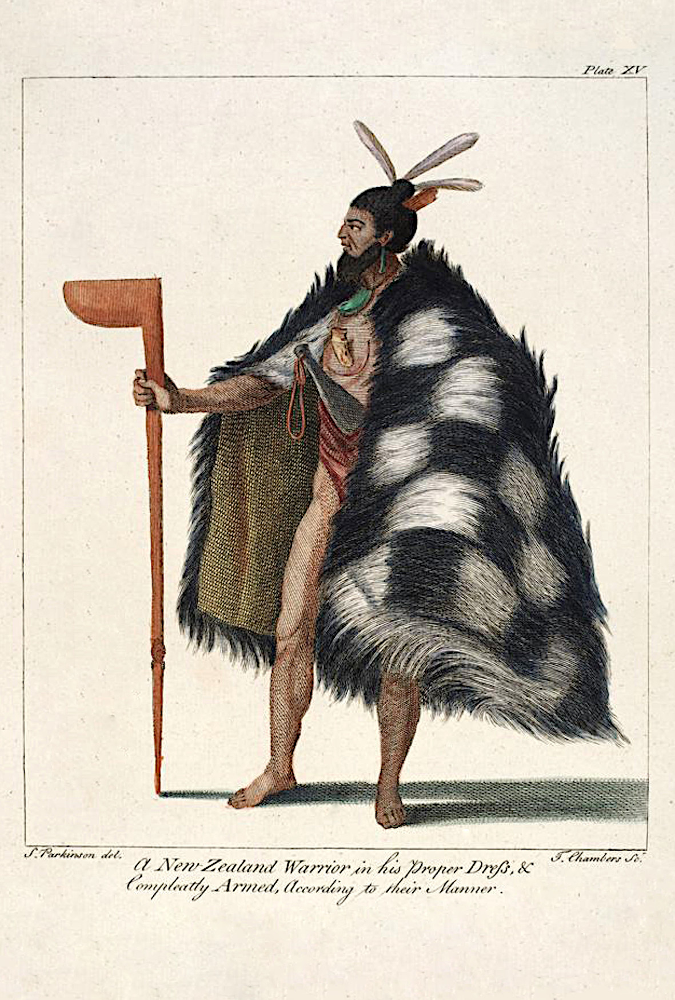
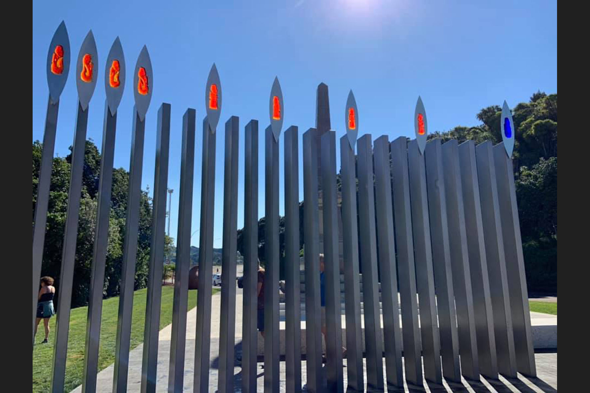

[Cook 250 Research Notebook](../) > Murder of Te Rakau  
*[Previous](../p25-botanists/)* | Page 26 | *[Next](../p27-formal-claims/)*
### Chief Te Rakau was shot dead during meeting with Cook on 9 October 1769

*Drawing by Sydney Parkinson*  

Source: [Plate XV, Journal of Sydney Parkinson, SPL Hand Coloured Rare Book Collection](http://www.splrarebooks.com/collection/view/a-journal-of-a-voyage-to-the-south-seas-in-his-majestys-ship-the-endeavour-)

> **Early on the morning of the 10th,** the long-boat, pinnace, and yaul,
> went on shore again; landed near the river where they had been the night
> before, and attempted to find a watering place. Several of the natives came
> toward them, and, with much entreating, we prevailed on some of them to
> cross the river, to whom we gave several things, which they carried back to
> their companions on the other side of the river, who seemed to be highly
> pleased with them, and testified their joy by a war-dance. Appearing to be
> so pacifically disposed, our company went over to them, and were received in
> a friendly manner. Some of the natives were armed with lances, and others
> with a kind of stone truncheon; through the handle of it was a string, which
> they twisted round the hand that held it when they attempted to strike at
> any person. [See pl. XV.] We would have purchased some of their weapons,
> but could not prevail on them to part with them on any terms. One of them,
> however, watched an opportunity, and snatched a hanger from us; our people
> resented the affront by firing upon them, and killed three of them on the
> spot, but the rest, to our surprise, did not appear to be intimidated at the
> sight of their expiring countrymen, who lay weltering in their blood; nor
> did they seem to breathe any revenge upon the occasion; attempting only to
> wrest the hanger out of the mans hand that had been shot, and to take the
> weapons that belonged to their other two deceased comrades; which having
> effected, they quietly departed. After having taken possession of the
> country, in form, for the king, our company embarked, and went round the bay
> in search of water again, and to apprehend, if possible, some of the natives,
> to gain farther information of them respecting the island. They had not gone
> far before they saw a canoe; gave chace to it, and, when they came up with
> it, the crew threw stones at them, and were very daring and insolent. Our
> people had recourse to their arms: the Captain, Dr. Solander, and Mr. Banks,
> fired at them, and killed and wounded several of them. The natives fought
> very desperately with their paddles, but were soon overpowered: their canoe
> was taken, three of them made prisoners, and brought on board the ship, and
> the rest were suffered to escape. They were, in person, much like the natives
> of Otaheite, and had their lips marked with a blue colour, but no other part
> of their bodies, in which they differed from the before-mentioned people.
> They talked very loud, but were rude in their address, and more unpolished
> than the Otaheiteans. We were much surprised to find they spoke the
> Otaheitean language, though in a different dialect, speaking very guttural,
> having a kind of hec, which some of the people of Yoolee-Etea have in their
> speech. Toobaiah understood them very well, notwithstanding they make
> frequent use of the G and K, which the people of Otaheite do not. Their
> canoe was thirty feet long, made of planks sewed together, and had a
> lug-sail made of matting.
>
> **On the 11th, in the morning,** the boats went on shore again, and carried
> the three men whom we had taken, dressed up very finely. The men did not
> seem willing to land, and when we left them, they cried, and said that the
> people on that side of the bay would eat them. While a party of our men went
> to cut wood, these men hid themselves in the bushes, and many of the natives
> appeared on the other side of the river. We beckoned to them, and, at length,
> one man, of more courage than the rest, ventured over to us without arms,
> with whom we conferred, by our interpreter Toobaiah, for a considerable time;
> and, during the conference, about two hundred more, armed with lances, poles,
> and stone bludgeons, made up to us, which the captain seeing, and being
> apprehensive they intended to cut off our retreat to the boats, as they had
> got to the other side of the river, he ordered us to embark, and return to
> the ship; which we did accordingly, taking with us the three natives whom we
> had brought on shore; but, in the afternoon, we set them on shore again;
> they parted with us reluctantly, and went into the woods; but, some time
> after, we saw them, with our glasses, come out again, make signs to us, and
> then go in again.
>
> These men, while on board, ate an Immoderate quantity of every thing that
> was set before them, taking pieces at one time into their mouths six times
> larger than we did, and drank a quart of wine and water at one draught.
> They informed us, that there was Taro, Eape, Oomara, Yams, and also a
> peculiar kind of Deer, to be found upon the island.
>
> The natives on this side of the bay were tataowed, or marked, in various
> forms on their faces; and their garments, wrought of rushes, reached down
> below their knees, and were very thick and rough. They tie their foreskins
> to their girdle with a string, and have holes pierced in their ears, which
> shews that they sometimes wear some sort of ear-rings: they have also some
> bracelets; neck-laces they well knew the use of; but they did not like our
> iron wares. We saw a piece of wood which looked as smooth as if it had been
> cut with an axe; but of what materials the instruments are composed, which
> they use for that purpose, we could not learn. We went into some of their
> houses, which were very meanly thatched, having a hole in the center of the
> roof to let out the smoke; but we saw nothing in them except a few cockles,
> limpets, and muscle-shells.
>
> We found here a sort of long-pepper, which tasted very much like mace; a
> Fulica, or bald Coot, of a dark blue colour; and a Black-bird, the flesh of
> which was of an orange colour, and tasted like stewed shell-fish. A vast
> quantity of pumice-stone lies all along upon the shore, within the bay,
> which indicates that there is a volcano in this island.
>
> — Sydney Parkinson's Journal of a Voyage to the South Seas  
> http://southseas.nla.gov.au/journals/parkinson/122.html  
> http://southseas.nla.gov.au/journals/parkinson/123.html  
> http://southseas.nla.gov.au/journals/parkinson/124.html  
> http://southseas.nla.gov.au/journals/parkinson/125.html

> **1769 October 9.**
>
> We could see with our glasses but few people on the beach; they walkd with
> a quick pace towards the river where we landed yesterday, most of these
> without arms, 3 or 4 with long Pikes in their hands. The captn orderd three
> boats to be mannd with seamen and marines intending to land and try to
> establish a communication with them. A high surf ran on the shore. The
> Indians about 50 remaind on the farther side of the river; we lookd upon
> that as a sign of fear, so landing with the little boat only the Captn
> Dr Solander, Tupia and myself went to the river side to speak to them.
> As soon almost as we appeard they rose up and every man producd either a
> long pike or a small weapon of well polishd stone about a foot long and
> thick enough to weigh 4 or 5 pounds, with these they threatned us and signd
> to us to depart. A musquet was then fird wide of them the ball of which
> struck the water, they saw the effect and immediately ceasd their threats.
> We though[t] that it was prudent to retreat till the marines were landed
> and drawn up to intimidate them and support us in case of nesscessity. They
> landed and marchd with a Jack carried before them to a little bank about
> 50 yards from the river, which might be about 40 broad; here they were drawn
> up in order and we again advancd to the river side with Tupia, who now found
> that the language of the people was so like his own that he could tolerably
> well understand them and they him. He immediately began to tell them that
> we wanted provisions and water for which we would give them Iron in exchange:
> they agreed to the proposal but would by no means lay by their arms which he
> desird them do: this he lookd upon as a sign of treachery and continualy
> told us to be upon our guard for they were not our freinds. Many words passd
> the cheif purport of which was that each side desird the other to come over
> to them; at last however an Indian stripd himself and swam over without arms,
> he was followd by two more and soon after by most of the rest who brought
> with them their arms. We gave them Iron and beads, they seemd to set little
> value upon either but especialy upon the iron the use of which they
> certainly were totaly ignorant of. They caught at whatever was offerd them
> but would part with nothing but a few feathers: their arms indeed they
> offerd to exchange for ours which they made several atempts to snatch from
> us; we were upon our guard so much that their attempts faild and they were
> made to understand that we must kill them if they snatchd any thing from us.
> After some time Mr Green in turning himself about exposd his hanger, one of
> them immediately snatchd it, set up a cry of exultation and waving it round
> his head retreated gently. It now appeard nescessary for our safeties that
> so daring an act should be instantly punishd, this I pronouncd aloud as my
> opinion, the Captn and the rest Joind me on which I fird my musquet which
> was loaded with small shot, leveling it between his shoulders who was not
> 15 yards from me. On the shot striking him he ceasd his cry but instead of
> quitting his prize continued to wave it over his head retreating as gently
> as before; the surgeon who was nearer him, seeing this fird a ball at him
> at which he dropd. Two more who were near him returnd instantly, one seizd
> his weapon of Green talk, the other attempted to recover the hanger which
> the surgeon had scarce time to prevent. The main body of them were now upon
> a rock a little way in the river. They took the water returning towards us,
> on which the other three, for we were only 5 in number, fird on them. They
> then retird and swam again across the river. On their landing we saw that
> 3 were wounded, one seemingly a good deal hurt: we may hope however that
> neither of them were killd as one of the musquets only was loaded with ball,
> which I think I saw strike the water without taking effect, and Tupias gun
> which was the last that was fird I clearly saw strike two men low down upon
> their legs, who probably would be so lame as to walk with difficulty when
> they landed.
>
> The Indians retird gently carrying with them their wounded and we reembarkd
> in our boats intending to row round the bay, see if there might be any
> shelter for the ship on the other side, and attempt to land there where the
> countrey appeard to be much more fruitfull than where we now were. The
> bottom of the bay provd to be a low sandy beach on which the sea broke most
> prodigiously so that we could not come near it; within was flat, a long way
> inland over this water might be seen from the mast head probably a lagoon
> but in the boat we could see no entrance into it. We had almost arrivd at
> the farthest part of the bay when a fresh breze came in from the seaward and
> we saw a Canoe sailing in standing right towards [us], soon after another
> padling. The Captn now resolvd to take one of these which in all probability
> might be done without the least resistance as we had three boats full of men
> and the canoes seemd to be fishermen, who probably were without arms. The
> boats were drawn up in such a manner that they could not well escape us: the
> padling canoe first saw us and made immediately for the nearest land, the
> other saild on till she was in the midst of us before she saw us, as soon as
> she did she struck her sail and began to paddle so briskly that she outran
> our boat; on a musquet being fird over her she however immediately ceasd
> padling and the people in her, 7 in all, made all possible haste to strip
> as we thought to leap into the water, but no sooner did our boat come up
> with her than they began with stones, paddles etc. to make so brisk a
> resistance that we were obligd to fire into her by which 4 were killd. The
> other three who were boys leapd overboard, one of them swam with great
> agility and when taken made every effort in his power to prevent being taken
> into the boat, the other two were more easily prevaild upon. As soon as they
> were in they squatted down expecting no doubt instant death, but on finding
> themselves well usd and that Cloaths were given them they recoverd their
> spirits in a very short time and before we got to the ship appeard almost
> totaly insensible of the loss of their fellows. As soon as they came onboard
> we offerd them bread to eat of which they almost devourd a large quantity,
> in the mean time they had Cloaths given them; this good usage had such an
> effect that they seemd to have intirely forgot every thing that had happned,
> put on chearfull and lively countenances and askd and answerd questions with
> a great deal of curiosity. Our dinner came, they expressd a curiosity to
> taste whatever they saw us eat, and did; salt pork seemd to please them
> better than any thing else, of this they eat a good deal. At sunset they eat
> again an enormous quantity of Bread and drank above a quart of water each;
> we then made them beds upon the lockers and they laid down to sleep with all
> seeming content imaginable. After dark loud voices were heard ashore as last
> night. Thus ended the most disagreable day My life has yet seen, black be
> the mark for it and heaven send that such may never return to embitter
> future reflection. I forgot to mention in its proper place that we pickd up
> a large pumice stone floating in the bay in returning to the ship today, a
> sure sign that there either is or has been a Volcano in this neighbourhood.
>
> — The Endeavour Journal of Sir Joseph Banks  
> http://gutenberg.net.au/ebooks05/0501141h.html#oct1769

> **MONDAY, 9th October.**
>
> (...) In the morning, seeing a number of the Natives at the same place
> where we saw them last night, I went on shore with the Boats, mann'd and
> arm'd, and landed on the opposite side of the river. Mr. Banks, Dr. Solander,
> and myself only landed at first, and went to the side of the river, the
> natives being got together on the opposite side. We called to them in the
> George's Island Language, but they answer'd us by flourishing their weapons
> over their heads and dancing, as we suppos'd, the War Dance; upon this we
> retir'd until the Marines were landed, which I order'd to be drawn up about
> 200 yards behind us. We went again to the river side, having Tupia,
> Mr. Green, and Dr. Monkhouse along with us. Tupia spoke to them in his own
> Language, and it was an agreeable surprize to us to find that they perfectly
> understood him. After some little conversation had passed one of them swam
> over to us, and after him 20 or 30 more; these last brought their Arms,
> which the first man did not. We made them every one presents, but this did
> not satisfy them; they wanted everything we had about us, particularly our
> Arms, and made several attempts to snatch them out of our hands. Tupia told
> us several times, as soon as they came over, to take care of ourselves for
> they were not our friends; and this we very soon found, for one of them
> snatched Mr. Green's hanger from him and would not give it up; this
> encouraged the rest to be more insolent, and seeing others coming over to
> join them, I order'd the man who had taken the Hanger to be fir'd at, which
> was accordingly done, and wounded in such a manner that he died soon after.
> Upon the first fire, which was only 2 Musquets, the others retir'd to a Rock
> which lay nearly in the middle of the River; but on seeing the man fall they
> return'd, probably to carry him off or his Arms, the last of which they
> accomplished, and this we could not prevent unless we had run our Bayonets
> into them, for upon their returning from off the Rock, we had discharged off
> our Peices, which were loaded with small shott, and wounded 3 more; but
> these got over the River and were carried off by the others, who now thought
> proper to retire. Finding nothing was to be done with the People on this
> side, and the water in the river being salt, I embarked with an intent to
> row round the head of the Bay in search of fresh water, and if possible to
> surprise some of the Natives and to take them on board, and by good Treatment
> and Presents endeavour to gain their friendship with this view.
>
> **Tuesday, 10th. P.M.,** I rowed round the head of the bay, but could find
> no place to land on account of the Great Surf which beat everywhere upon the
> Shore. Seeing 2 Boats or Canoes coming in from Sea I rowed to one of them,
> in order to Seize upon the People; and came so near before they took notice
> of us that Tupia called to them to come alongside and we would not hurt them;
> but instead of doing this they endeavour'd to get away, upon which I order'd
> a Musquet to be fir'd over their Heads, thinking this would either make them
> surrender, or jump overboard; but here I was mistaken, for they immediately
> took to their Arms or whatever they had in the Boat, and began to attack us.
> This obliged us to fire upon them, and unfortunately either 2 or 3 were
> kill'd and one wounded, and 3 jumped overboard. These last we took up and
> brought on board, where they was Cloathed and Treated with all imaginable
> kindness; and to the Surprise of everybody became at once as cheerful and as
> merry as if they had been with their own Friends. They were all 3 Young, the
> eldest not above 20 years of Age, and the youngest about 10 or 12. I am aware
> that most Humane men who have not experienced things of this nature will
> Censure my Conduct in firing upon the People in their Boat, nor do I myself
> think that the reason I had for seizing upon her will at all justify me; and
> had I thought that they would have made the Least Resistance I would not have
> come near them; but as they did, I was not to stand still and suffer either
> myself or those that were with me to be knocked on the head.
>
> In the morning, as I intended to put our 3 Prisoners ashore, and stay here
> the day to see what effect it might have upon the other Natives, I sent an
> Officer ashore with the Marines and a party of men to cut wood, and soon
> after followed myself, accompanied by Mr. Banks, Dr. Solander, and Tupia,
> taking the 3 Natives with us, whom we landed on the West side of the River
> before mentioned. They were very unwilling to leave us, pretending that they
> should fall into the hands of their Enemies, who would kill and Eat them.
> However, they at last of their own accord left us and hid themselves in some
> bushes. Soon after this we discover'd several bodys of the Natives marching
> towards us, upon which we retir'd aCross the River, and joind the wooders;
> and with us came the 3 Natives we had just parted with, for we could not
> prevail upon them to go to their own people. We had no sooner got over the
> River than the others assembled on the other side to the Number of 150 or
> 200, all Arm'd. Tupia now began to Parly with them, and the 3 we had with us
> shew'd everything we had given them, part of which they laid and left upon
> the Body of the Man that was Kill'd the day before. These things seem'd so
> far to Convince them of our friendly intentions that one man came over to us,
> while all the others sat down upon the Sand. We everyone made this man a
> present, and the 3 Natives that were with us likewise presented him with
> such things as they had got from us, with which, after a short Stay, he
> retir'd aCross the River. I now thought proper to take everybody on board,
> to prevent any more Quarrels, and with us came the 3 Natives, whom we could
> not prevail upon to stay behind; and this appear'd the more strange as the
> man that came over to us was Uncle to one of them. After we had return'd on
> board we saw them Carry off the Dead Man; but the one that was Kill'd the
> first evening we Landed remain'd in the very spot they had left him.
>
> — CAPTAIN COOK'S JOURNAL DURING HIS FIRST VOYAGE ROUND THE WORLD
>   MADE IN H.M. BARK "ENDEAVOUR" 1768-71  
>   http://gutenberg.net.au/ebooks/e00043.html#ch5

#### More Images

##### Eugenie Sage MP on Facebook

###### Nine pou to represent the men shot in the encounter with Endeavour crew

* [Eugenie Sage MP on Facebook, September 27th, 2019](https://www.facebook.com/EugenieSageMP/posts/2868526743175692)

##### SPL Hand Coloured Rare Book Collection

* [Journal of Sydney Parkinson](http://www.splrarebooks.com/collection/view/a-journal-of-a-voyage-to-the-south-seas-in-his-majestys-ship-the-endeavour-)

#### References

##### Gisborne District Council

###### January 19th, 1996

* [Historical address of the arrival in 1769 of Captain Cook and the Endeavour(...)](https://www.gdc.govt.nz/assets/Consultation/Historical-Address-of-the-arrival-1769-of-Captain-Cook-and-the-Endeavour-to-Turanganui-A-Kiwa.pdf)

##### National Library of Scotland

* [Sydney Parkinson’s Journal and a Publishing Nightmare](https://blog.nls.uk/sydney-parkinsons-journal-and-a-publishing-nightmare/)

##### Project Gutenberg Australia

* [Captain cook's Journal. First Voyage.](http://gutenberg.net.au/ebooks/e00043.html#ch)
* [The Endeavour Journal of Sir Joseph Banks, 1769 October 9.](http://gutenberg.net.au/ebooks05/0501141h.html#oct1769)

##### South Seas

* [Sydney Parkinson's Journal of a Voyage to the South Seas](http://southseas.nla.gov.au/journals/parkinson/122.html)

##### Te Ara — The Encyclopedia of New Zealand

* [Cook’s three voyages: First sighting and landfall](https://teara.govt.nz/en/european-discovery-of-new-zealand/page-5)

##### Tupapa

* [Second Landing](https://www.tupapa.nz/stories/encounters-with-cook/second-landing)
* [Killing of Te Rakau](https://www.tupapa.nz/stories/encounters-with-cook/second-landing/te-rakau)

##### Victoria University of Wellington

* [Life in Early Poverty Bay: Te Rakau Slain](http://nzetc.victoria.ac.nz/tm/scholarly/tei-MacLife-t1-body-d1-d4.html)

[Cook 250 Research Notebook](../) > Murder of Te Rakau  
*[Previous](../p25-botanists/)* | Page 26 | *[Next](../p27-formal-claims/)*
