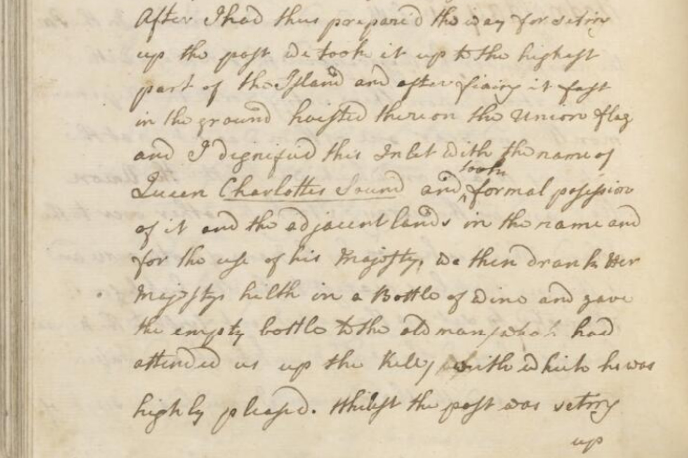

[Cook 250 Research Notebook](../) > Claim on New Zealand  
*[Previous](../p26-te-rakau/)* | Page 27 | *[Next](../p28-maori-place-names/)*
### Claim on New Zealand



```
After I had thus prepared the way for setting
up the post we took it up to the highest
part of the Island, and after fixing it fast
in the ground hoisted thereon the Union flag
and I dignified this Inlet with the name of
Queen _Charlotte's_Sound_ and took formal possession
of it and the Adjacent lands in the Name and
for the use of his Majesty. We then drank Her
Majesty's health in a Bottle of wine and gave
the empty bottle to the old man who had
attended us up the hill whichto he was
highly pleased. Whilst the post was setting up
(...)
```

Source: [Journal of H.M.S. Endeavour, 1768-1771 [manuscript].](https://nla.gov.au/nla.obj-229024441/view)


> **Wednesday, 31st. Little wind and Variable.**
>
> In the P.M. the Carpenters having prepared the 2 Posts with inscriptions
> upon them, setting forth the Ship's Name, Month, and Year, one of them
> was set up at the Watering Place, on which was hoisted the Union flag;
> and in the Morning I took the other over to the Island which is known
> by the name of Motuouru, and is the one that lies nearest to the Sea;
> but before I attempted to set up the Post I went first to the Hippa,
> having Dr. Monkhouse and Tupia along with me. We here met with the old
> Man I have before spoke of. The first thing I did was to inquire after
> the Man said to be kill'd by our people, and the one that was wounded
> at the same time, when it did not appear to me that any such accidents
> had happened. I next (by means of Tupia) explain'd to the old Man and
> several others that we were Come to set up a Mark upon the Island,
> in order to shew to any ship that might put into this place that we
> had been here before. They not only gave their free Consent to set it up,
> but promised never to pull it down. I then gave every one a present of one
> thing or another; to the old man I gave Silver, three penny pieces dated
> 1763, and Spike Nails with the King's Broad Arrow cut deep in them; things
> that I thought were most likely to remain long among them. After I had thus
> prepared the way for setting up the post, we took it up to the highest part
> of the Island, and after fixing it fast in the ground, hoisted thereon the
> Union flag, and I dignified this Inlet with the name of Queen Charlotte's
> Sound, and took formal possession of it and the Adjacent lands in the Name
> and for the use of his Majesty. We then drank her Majesty's health in a
> Bottle of wine, and gave the Empty bottle to the old man (who had attended
> us up the hill), with which he was highly pleased. (...)
>
> — Cook's Journal: 31 January 1770
> http://gutenberg.net.au/ebooks/e00043.html

According to the Journal of Sydney Parkinson, a first claim had been made
on 10 October 1769, soon after their arrival, in different circumstances:

> **Early on the morning of the 10th,** the long-boat, pinnace, and yaul,
> went on shore again; landed near the river where they had been the night
> before, and attempted to find a watering place. Several of the natives came
> toward them, and, with much entreating, we prevailed on some of them to
> cross the river, to whom we gave several things, which they carried back to
> their companions on the other side of the river, who seemed to be highly
> pleased with them, and testified their joy by a war-dance. Appearing to be
> so pacifically disposed, our company went over to them, and were received in
> a friendly manner. Some of the natives were armed with lances, and others
> with a kind of stone truncheon; through the handle of it was a string, which
> they twisted round the hand that held it when they attempted to strike at
> any person. [See pl. XV.] We would have purchased some of their weapons,
> but could not prevail on them to part with them on any terms. One of them,
> however, watched an opportunity, and snatched a hanger from us; our people
> resented the affront by firing upon them, and killed three of them on the
> spot, but the rest, to our surprise, did not appear to be intimidated at the
> sight of their expiring countrymen, who lay weltering in their blood; nor
> did they seem to breathe any revenge upon the occasion; attempting only to
> wrest the hanger out of the mans hand that had been shot, and to take the
> weapons that belonged to their other two deceased comrades; which having
> effected, they quietly departed. After having taken possession of the
> country, in form, for the king, our company embarked, and went round the bay
> in search of water again, and to apprehend, if possible, some of the natives,
> to gain farther information of them respecting the island. (...)
>
> — Sydney Parkinson's Journal: 10 October 1769
> http://southseas.nla.gov.au/journals/parkinson/122.html


#### References

##### South Seas

* [Cook's Journal: 31 January 1770](http://southseas.nla.gov.au/journals/cook/17700131.html)
* [Sydney Parkinson's Journal of a Voyage to the South Seas](http://southseas.nla.gov.au/journals/parkinson/122.html)


##### The Spinoff

##### October 3rd, 2019

* [The right to conquer and claim: Captain Cook and the Doctrine Of Discovery](https://thespinoff.co.nz/atea/03-10-2019/the-right-to-conquer-and-claim-captain-cook-and-the-doctrine-of-discovery/)

##### Wikipedia

* [After two earlier attempts to plant the British flag, with permission of one rangatira Cook hoisted the flag in the name of Crown and Country (...)](https://en.wikipedia.org/wiki/First_voyage_of_James_Cook#Aotearoa_New_Zealand)
* [Queen Charlotte Sound (New Zealand)](https://en.wikipedia.org/wiki/Queen_Charlotte_Sound_(New_Zealand))

[Cook 250 Research Notebook](../) > Claim on New Zealand  
*[Previous](../p26-te-rakau/)* | Page 27 | *[Next](../p28-maori-place-names/)*
