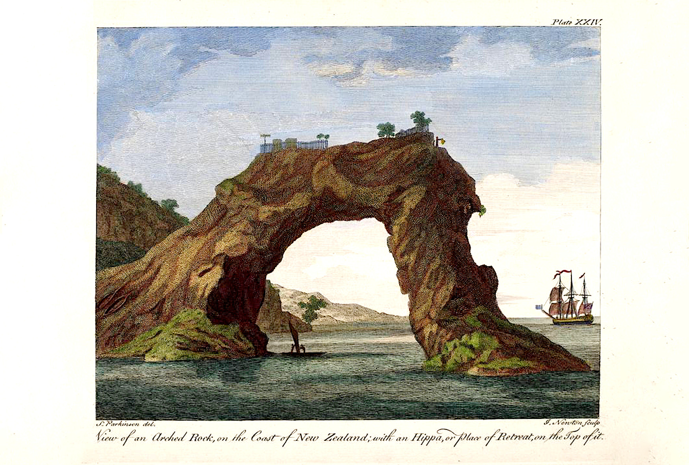
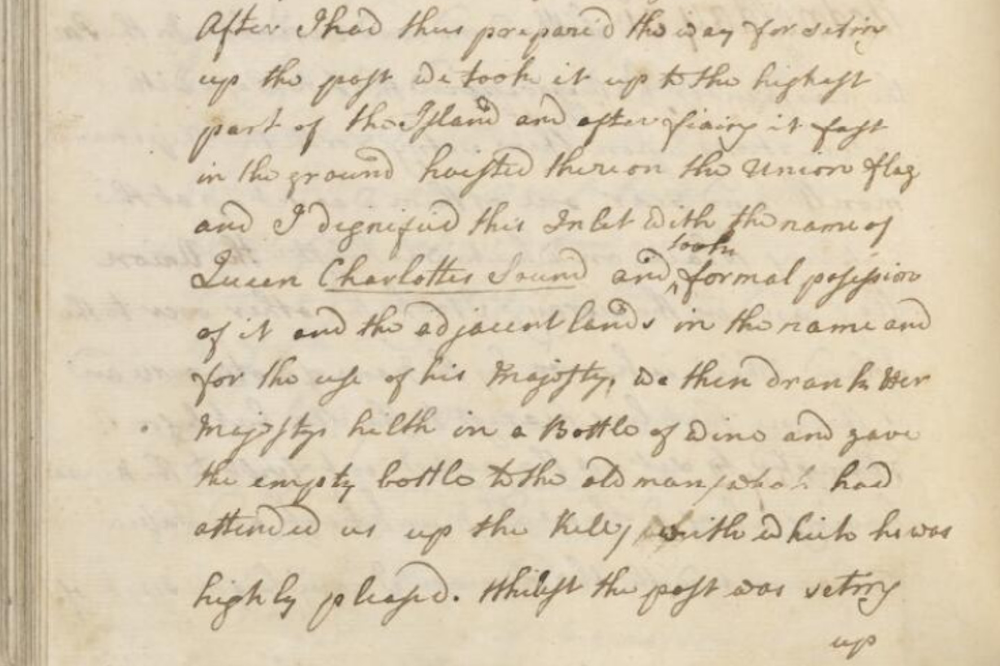

[Cook 250 Research Notebook](../) > Claims on New Zealand  
*[Previous](../p26-te-rakau/)* | Page 27 | *[Next](../p28-maori-place-names/)*
### James Cook took formal possession of Queen Charlotte Sound on 31 January 1770



This was the third formal claim of James Cook on New Zealand territory.
It was accompanied by the erection of small stone monuments concealing
durable tokens to prove the anteriority of the British presence to
any other Europeans coming in the future.

> **26.** Went today to take an other view of our new streights the Westermost
> end of which the Captn was not quite sure of; we found however a hill in a
> tolerably convenient situation upon which we got and saw the Streight quite
> open and 4 or 5 leagues wide. We then erected a small monument of stone such
> a[s] 5 stout men could do in half an hour and laid in it musquet balls beads
> shot &c. that if perchance any Europeans should find and pull it down they
> will be sure it is not Indian workmanship.
>
> — Joseph Banks's Journal: 26 January 1770
> http://southseas.nla.gov.au/journals/banks/17700126.html

> **Friday 26th** (...)
> **In the AM** I made an excursion into one of the Bays which lie on the East
> side of the Inlet accompanied by Mr Banks and Dr Solander upon our landing
> we ascended a very high hill from which we had a full View of the passage
> I had before descover'd and the land on the opposite shore which appear'd
> to be about 4 Leagues from us, but as it was hazey near the horizon we could
> not see far to the SE. (...)
> We found on the top of the hill a parcel of loose Stones of which
> we built a Pyrmid and left in it some Musquet balls, small Shott Beeds
> and what ever we had about us that was likely to stand the test of time (...)
>
> — James Cook's Journal: 26 January 1770  
> http://southseas.nla.gov.au/journals/cook/17700126.html

> **Monday 29th** (...)
> This morning I went out to the mouth of the Inlet and landed upon the West
> point and from the top of a pretty high hill which is there I had a view of
> the Coast to the NW, the farthest land I could see in that quarter was an
> Island about 10 Leagues off and lying pretty near the main and is the same
> as hath been before mentiond between this Island and the place where I was
> lay some other Islands close under the Shore which forms several Bays,
> wherein there appears to be safe anchorage for Shipping —
>
> After I had set the different points &Ca we errected upon the Top of the
> Hill a tower or pile of stones in which we left a peice of Silver Coin,
> some Musquet Balls, Beeds &Ca and left flying upon it a peice of an old
> pendant: after this we return'd to the boat and in our way to the Ship
> visited some of the natives we had met with a long shore and purchas'd
> of them a small quantity of fish —
>
> — James Cook's Journal: 29 January 1770  
> http://southseas.nla.gov.au/journals/cook/17700129.html

> **Tuesday 30th** Winds at N.W. gentle breezes and fair weather.
> **Early in the AM** [Civil Date: 29 January 1770] a boat was sent
> to one of the Islands (...)
> The Carpenter went into the woods with part of his crew to cut and square
> some timber to saw into boards for the use of the Ship and to prepare two
> posts to be set up as marks — with Inscriptions upon them —
>
> — James Cook's Journal: 30 January 1770  
> http://southseas.nla.gov.au/journals/cook/17700130.html

> **Wednesday, 31st. Little wind and Variable.**
>
> In the P.M. the Carpenters having prepared the 2 Posts with inscriptions
> upon them, setting forth the Ship's Name, Month, and Year, one of them
> was set up at the Watering Place, on which was hoisted the Union flag;
> and in the Morning I took the other over to the Island which is known
> by the name of Motuouru, and is the one that lies nearest to the Sea;
> but before I attempted to set up the Post I went first to the Hippa,
> having Dr. Monkhouse and Tupia along with me. We here met with the old
> Man I have before spoke of. The first thing I did was to inquire after
> the Man said to be kill'd by our people, and the one that was wounded
> at the same time, when it did not appear to me that any such accidents
> had happened. I next (by means of Tupia) explain'd to the old Man and
> several others that we were Come to set up a Mark upon the Island,
> in order to shew to any ship that might put into this place that we
> had been here before. They not only gave their free Consent to set it up,
> but promised never to pull it down. I then gave every one a present of one
> thing or another; to the old man I gave Silver, three penny pieces dated
> 1763, and Spike Nails with the King's Broad Arrow cut deep in them; things
> that I thought were most likely to remain long among them. After I had thus
> prepared the way for setting up the post, we took it up to the highest part
> of the Island, and after fixing it fast in the ground, hoisted thereon the
> Union flag, and I dignified this Inlet with the name of Queen Charlotte's
> Sound, and took formal possession of it and the Adjacent lands in the Name
> and for the use of his Majesty. We then drank her Majesty's health in a
> Bottle of wine, and gave the Empty bottle to the old man (who had attended
> us up the hill), with which he was highly pleased. (...)
>
> — James Cook's Journal: 31 January 1770  
> http://gutenberg.net.au/ebooks/e00043.html


A second claim had been made on 15 November 1769:

> **Wednesday, 15th In the evening** (...) **At 7 AM** (...)
> 
> Mercury Bay lies in the Latitude of 36°..47' So and in the Longitude of
> 184°.. 4' Wt from the Meridion of Greenwich. (...)
>
> We found thrown upon the Shore in several places in this Bay quantities of
> Iron Sand which is brought down out of the Country by almost every little
> frish water brook. this proves that there must be of that ore not far inland
> — Neither the Inhabitants of this place or any other where we have been know
> the use of Iron, or set the least Value upon it, prefering the most trifleing
> thing we could give them to a nail or any sort of Iron tools. Before we left
> this Bay we cut out upon one of the trees near the watering place, the Ships
> Name, date &Ca and after displaying the English Colours I took formal
> posession of the place in the name of His Majesty — 
>
> — Cook's Journal: 15 November 1769  
> http://nla.gov.au/nla.cs-ss-jrnl-cook-17691115

And according to the Journal of Sydney Parkinson, the first claim had been made
in different circumstanceson, on the second day after setting foot on the coast
of New Zealand:

> **Early on the morning of the 10th,** the long-boat, pinnace, and yaul,
> went on shore again; landed near the river where they had been the night
> before, and attempted to find a watering place. Several of the natives came
> toward them, and, with much entreating, we prevailed on some of them to
> cross the river, to whom we gave several things, which they carried back to
> their companions on the other side of the river, who seemed to be highly
> pleased with them, and testified their joy by a war-dance. Appearing to be
> so pacifically disposed, our company went over to them, and were received in
> a friendly manner. Some of the natives were armed with lances, and others
> with a kind of stone truncheon; through the handle of it was a string, which
> they twisted round the hand that held it when they attempted to strike at
> any person. [See pl. XV.] We would have purchased some of their weapons,
> but could not prevail on them to part with them on any terms. One of them,
> however, watched an opportunity, and snatched a hanger from us; our people
> resented the affront by firing upon them, and killed three of them on the
> spot, but the rest, to our surprise, did not appear to be intimidated at the
> sight of their expiring countrymen, who lay weltering in their blood; nor
> did they seem to breathe any revenge upon the occasion; attempting only to
> wrest the hanger out of the mans hand that had been shot, and to take the
> weapons that belonged to their other two deceased comrades; which having
> effected, they quietly departed. After having taken possession of the
> country, in form, for the king, our company embarked, and went round the bay
> in search of water again, and to apprehend, if possible, some of the natives,
> to gain farther information of them respecting the island. (...)
>
> — Sydney Parkinson's Journal: 10 October 1769  
> http://southseas.nla.gov.au/journals/parkinson/122.html

#### More Pictures

##### National Library of Australia


*Formal claim on New Zealand made by James Cook on 31 January 1770 in Queen Charlotte Sound*

```
After I had thus prepared the way for setting
up the post we took it up to the highest
part of the Island, and after fixing it fast
in the ground hoisted thereon the Union flag
and I dignified this Inlet with the name of
Queen _Charlotte's_Sound_ and took formal possession
of it and the Adjacent lands in the Name and
for the use of his Majesty. We then drank Her
Majesty's health in a Bottle of wine and gave
the empty bottle to the old man who had
attended us up the hill whichto he was
highly pleased. Whilst the post was setting up
(...)
```

Source: [Journal of H.M.S. Endeavour by James Cook, manuscript, 1768-1771, 31 January 1770](https://nla.gov.au/nla.obj-229024441/view)

> Holograph journal, written entirely in James Cook's hand,
> of the voyage of H.M.S. Endeavour (...)

#### References

##### Captain Cook Society

> **15/Nov/1769**
> The British flag was flown at Mercury Bay
> as First Lieutenant James Cook took formal possession of New Zealand

* [New Zealand list](https://www.captaincooksociety.com/home/detail/new-zealand-list)

##### Inside Story

###### August 4th, 2020

* [On Possession Island](https://insidestory.org.au/on-possession-island/)

##### National Library of Australia

* [Journal of H.M.S. Endeavour, 1768-1771 [manuscript]](https://catalogue.nla.gov.au/Record/3525402)

##### Project Gutenberg

* [Captain Cook's Journal During His First Voyage Round the World](http://www.gutenberg.org/ebooks/8106)

##### South Seas

* [Sydney Parkinson's Journal: 10 October 1769](http://southseas.nla.gov.au/journals/parkinson/122.html)
* [Cook's Journal: 15 November 1769](http://southseas.nla.gov.au/journals/cook/17691115.html)
* [Banks's Journal: 26 January 1770](http://southseas.nla.gov.au/journals/banks/17700126.html)
* [Cook's Journal: 26 January 1770](http://southseas.nla.gov.au/journals/cook/17700126.html)
* [Cook's Journal: 29 January 1770](http://nla.gov.au/nla.cs-ss-jrnl-cook-17700129)
* [Cook's Journal: 31 January 1770](http://southseas.nla.gov.au/journals/cook/17700131.html)

##### The Spinoff

##### October 3rd, 2019

* [The right to conquer and claim: Captain Cook and the Doctrine Of Discovery](https://thespinoff.co.nz/atea/03-10-2019/the-right-to-conquer-and-claim-captain-cook-and-the-doctrine-of-discovery/)

##### Tina Ngata

* [James Cook and the Doctrine of Discovery – 5 Things to Know](https://tinangata.com/2019/06/01/james-cook-and-the-doctrine-of-discovery-5-things-to-know/)

##### Wikipedia

> (...) On 31 January, Cook claimed possession of Queen Charlotte Sound
> “and the adjacent lands” in the name of King George III. This was the
> last time Cook would claim possession of any part of New Zealand [on]
> behalf of Great Britain. (...)
>
> — https://en.wikipedia.org/wiki/First_voyage_of_James_Cook#Circumnavigation_of_North_Island

* [Queen Charlotte Sound (New Zealand)](https://en.wikipedia.org/wiki/Queen_Charlotte_Sound_(New_Zealand))
* [Discovery doctrine](https://en.wikipedia.org/wiki/Discovery_doctrine)
* [Terra nullius](https://en.wikipedia.org/wiki/Terra_nullius)

[Cook 250 Research Notebook](../) > Claims on New Zealand  
*[Previous](../p26-te-rakau/)* | Page 27 | *[Next](../p28-maori-place-names/)*
