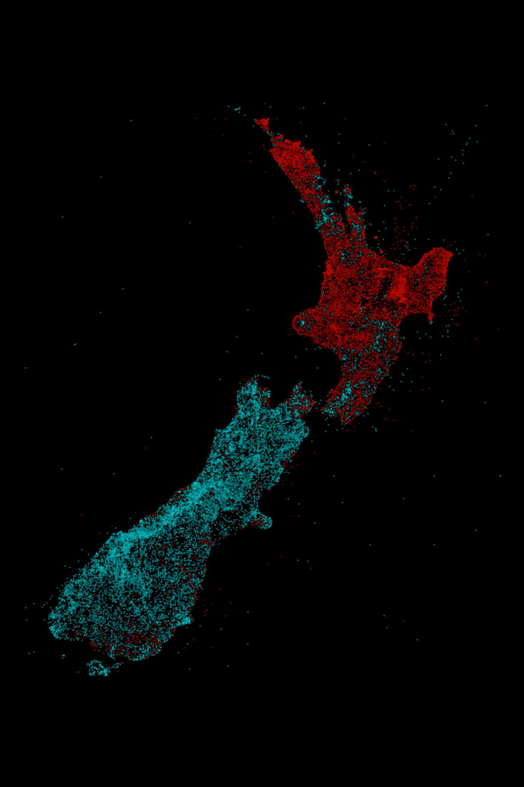

[Cook 250 Research Notebook](../) > Māori Place Names
*[Previous](../p27-formal-claims/)* | Page 28 | *[Next](../p29-cook-chart/)*
### Māori Place Names

*Māori place names (in red) cover most of the North Island  
Non-Māori place names (in blue) occupy urban areas and most of South Island*

Source: [Te Hiku Media on GitHub](https://github.com/TeHikuMedia/nga-kupu) / [Our Place Names in NZ Herald](https://insights.nzherald.co.nz/article/our-place-names/)

> The language of our place names creates a striking snapshot
> of New Zealand's history. The map below is coloured based on
> whether the place name contains Māori or English. As you can
> see Māori names dominate the North Island outside of Auckland and
> Wellington, while the South Island has predominantly English names.
>
> — https://insights.nzherald.co.nz/article/our-place-names/

#### References

##### Gisborne District Council

* [Tūranganui-ā-Kiwa / Poverty Bay name change](https://gdc.govt.nz/turanganui-a-kiwa-poverty-bay-name-change)

##### Kā Huru Manu

* [The Cultural Mapping Story](http://www.kahurumanu.co.nz/cultural-mapping-story)
* [Ngāi Tahu Atlas](http://www.kahurumanu.co.nz/atlas)

##### Māori Maps

* [About us](https://maorimaps.com/about-us)

##### New Zealand Herald

* [Our Place Names](https://insights.nzherald.co.nz/article/our-place-names/)

##### Te Hiku Media

* [Te Hiku Media](https://tehiku.nz/)

###### July 8th, 2020

* [Restoring History Through Dual Placenames](https://tehiku.nz/te-hiku-radio/te-reo-o-te-rangatira/13006/restoring-history-through-dual-placenames)

###### Te Hiku Media on GitHub

* [Te Hiku Media (Organization)](https://github.com/TeHikuMedia)
* [Identify Māori words in text (Project)](https://github.com/TeHikuMedia/nga-kupu)
