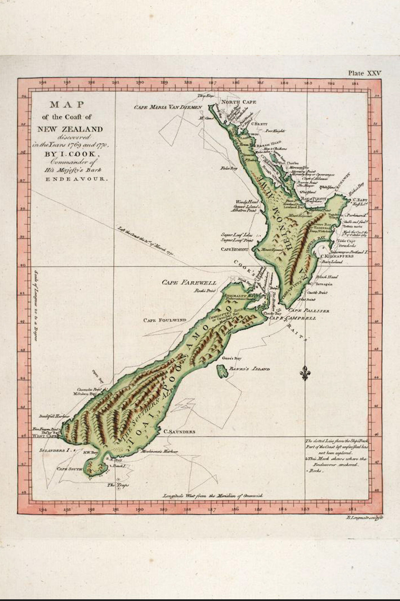

### Cook Chart of New Zealand

#### Map of the Coast of New Zealand



```
MAP
of the Coast of
NEW ZEALAND
discovered
in the Years 1769 and 1770
BY I. COOK,
Commander of
His Majesty's Bark
ENDEAVOUR.
```

Source: [Journal of Sydney Parkinson, SPL Hand Coloured Rare Book Collection](http://www.splrarebooks.com/collection/view/a-journal-of-a-voyage-to-the-south-seas-in-his-majestys-ship-the-endeavour-)

#### More Images

##### British Library

* [Renaming Aotearoa New Zealand](https://www.bl.uk/the-voyages-of-captain-james-cook/articles/renaming-aotearoa-new-zealand)

##### New South Wales State Library

* [The great Pacific Ocean](http://digital.sl.nsw.gov.au/delivery/DeliveryManagerServlet?embedded=true&toolbar=false&dps_pid=IE3726033)
[[Catalog Record]](https://search.sl.nsw.gov.au/primo-explore/fulldisplay?docid=SLNSW_ALMA2192401380002626&vid=SLNSW&tab=default_tab&lang=en_US&context=L)

* [Nuove scoperte fatte nel 1765, 67, e 69 nel Mare del Sud](http://digital.sl.nsw.gov.au/delivery/DeliveryManagerServlet?embedded=true&toolbar=false&dps_pid=IE6156067&_ga=2.81057879.1916713702.1612997698-974014674.1612997698)
[[Catalog Record]](https://search.sl.nsw.gov.au/primo-explore/fulldisplay?docid=SLNSW_ALMA21101424660002626&vid=SLNSW&search_scope=E&tab=default_tab&lang=en_US&context=L)

##### Wikimedia

* [Cook new zealand](https://commons.wikimedia.org/wiki/File:Cook_new_zealand.jpg)

#### References

##### British Library

* [Renaming Aotearoa New Zealand](https://www.bl.uk/the-voyages-of-captain-james-cook/articles/renaming-aotearoa-new-zealand)

##### New South Wales State Library

* [Captain Cook’s voyages of discovery > Cook's maps](https://www.sl.nsw.gov.au/stories/captain-cooks-voyages-discovery/cooks-maps)

##### SPL Hand Coloured Rare Book Collection

* [Journal of Sydney Parkinson](http://www.splrarebooks.com/collection/view/a-journal-of-a-voyage-to-the-south-seas-in-his-majestys-ship-the-endeavour-)

##### Wikipedia

* [List of New Zealand places named by James Cook](https://en.wikipedia.org/wiki/List_of_New_Zealand_places_named_by_James_Cook)

