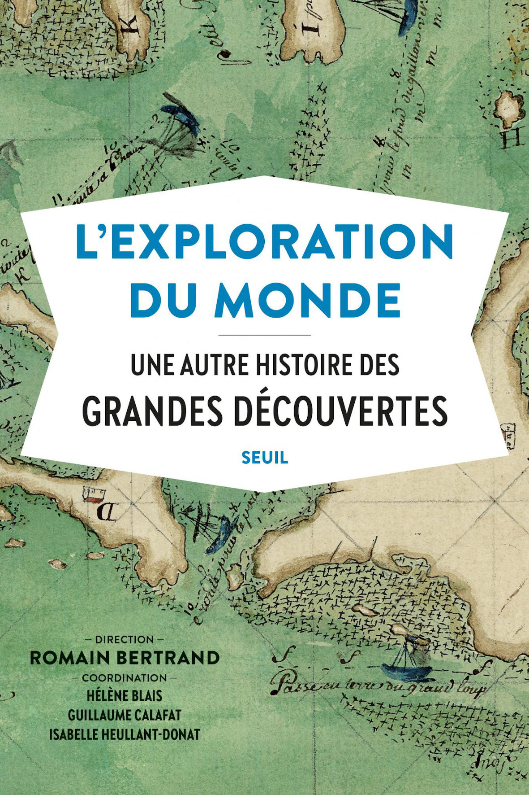

### Another History of the Age of Exploration

This French book is a collection of essays by historians
who tell a different story of the Age of Exploration.
They give credit to the people who stand in the shadow of
the Great Explorers and contributed to their discoveries.

Source: [Seuil](http://www.seuil.com/ouvrage/l-exploration-du-monde-collectif/9782021406252)

#### References

##### France Culture

* [Le Cours de l'histoire par Xavier Mauduit: Quand explorer rime avec s'approprier](https://www.franceculture.fr/emissions/series/quand-explorer-rime-avec-sapproprier)
* [Épisode 1 : Pour une autre histoire de l'exploration du monde](https://www.franceculture.fr/emissions/le-cours-de-lhistoire/quand-explorer-rime-avec-sapproprier-14-pour-une-autre-histoire-de-lexploration-du-monde)
* [Épisode 2 : Histoire d’une rencontre : le miroir des Grandes Découvertes](https://www.franceculture.fr/emissions/le-cours-de-lhistoire/quand-explorer-rime-avec-sapproprier-24-histoire-dune-rencontre-le-miroir-des-grandes-decouvertes)
* [Épisode 3 : Diabolique Amérique : de Christophe Colomb à Vladimir Maïakovski](https://www.franceculture.fr/emissions/le-cours-de-lhistoire/quand-explorer-rime-avec-sapproprier-34-diabolique-amerique-de-christophe-colomb-a-vladimir)

##### Seuil

* [L'Exploration du monde: Une autre histoire des Grandes Découvertes](http://www.seuil.com/ouvrage/l-exploration-du-monde-collectif/9782021406252)

