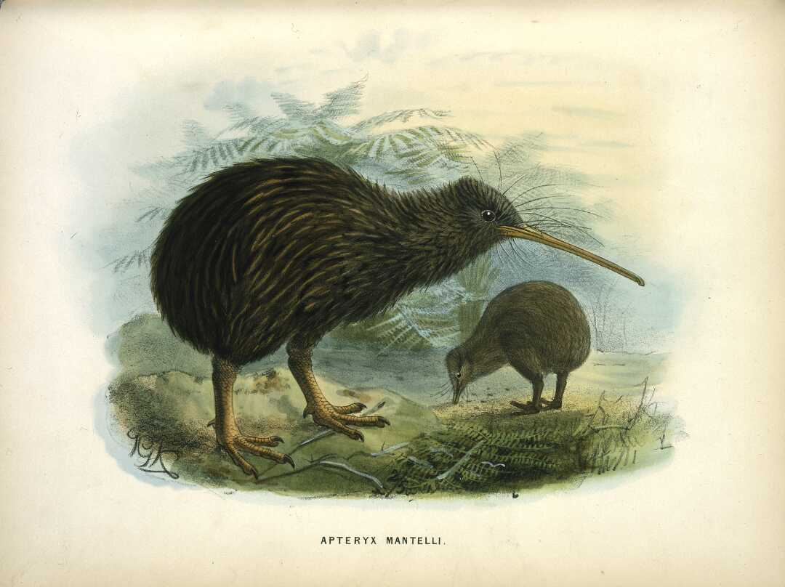

### Kiwi Bird

#### Keulemans, John Gerrard, 1842-1912 :Apteryx Mantelli [North Island kiwi] London, 1873

Source: [National Library of New Zealand](https://natlib.govt.nz/records/23031923)
Downloaded from: [Digital Record](https://ndhadeliver.natlib.govt.nz/delivery/DeliveryManagerServlet?dps_pid=IE166929&dps_custom_att_1=emu)

> Keulemans, John Gerrard, 1842-1912. Keulemans, John Gerrard, 1842-1912:
> Apteryx Mantelli [North Island kiwi] London, 1873.
> Ref: PUBL-0134-358. Alexander Turnbull Library, Wellington, New Zealand.
>
> — https://natlib.govt.nz/records/23031923

#### More Images

##### Audubon

* [How Baby Kiwis in Virginia Will Help Preserve an Ancient Maori Tradition](https://www.audubon.org/magazine/winter-2016/how-baby-kiwis-virginia-will-help-preserve)

##### National Library NZ on Flickr

* [North-Island kiwi](https://flickr.com/photos/nationallibrarynz_commons/21663238825/in/photolist-yJ4LHT-6hmimJ-z4vz1R-7m32yA-yCRLKu-yWn58Z-yD284E-z1e4GW-yqXUDd-y2qSwz-z1iLaF-xNLE8W-z1nRuR-yK4bGd-y92Re4-yHC3KL-z29hAR)
* [Apteryx haastii](https://flickr.com/photos/nationallibrarynz_commons/21285920726/in/photolist-yJ4LHT-6hmimJ-z4vz1R-7m32yA-yCRLKu-yWn58Z-yD284E-z1e4GW-yqXUDd-y2qSwz-z1iLaF-xNLE8W-z1nRuR-yK4bGd-y92Re4-yHC3KL-z29hAR)
* [Apteryx haastii](https://flickr.com/photos/nationallibrarynz_commons/21490647212/in/photolist-yJ4LHT-6hmimJ-z4vz1R-7m32yA-yCRLKu-yWn58Z-yD284E-z1e4GW-yqXUDd-y2qSwz-z1iLaF-xNLE8W-z1nRuR-yK4bGd-y92Re4-yHC3KL-z29hAR)

#### References

##### Audubon

* [How Baby Kiwis in Virginia Will Help Preserve an Ancient Maori Tradition](https://www.audubon.org/magazine/winter-2016/how-baby-kiwis-virginia-will-help-preserve)

##### Culture Trip

* [New Zealand Loves The Kiwi So Much, It's Both Its National Animal and Bird](https://theculturetrip.com/pacific/new-zealand/articles/new-zealand-loves-the-kiwi-so-much-its-both-its-national-animal-and-bird/)

##### Wikipedia

* [Kiwi](https://en.wikipedia.org/wiki/Kiwi)
