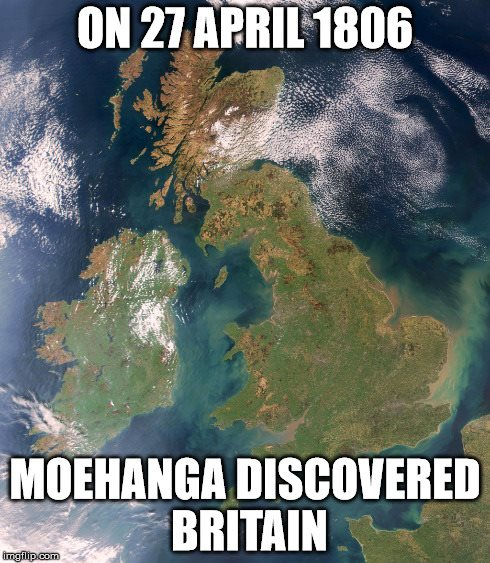
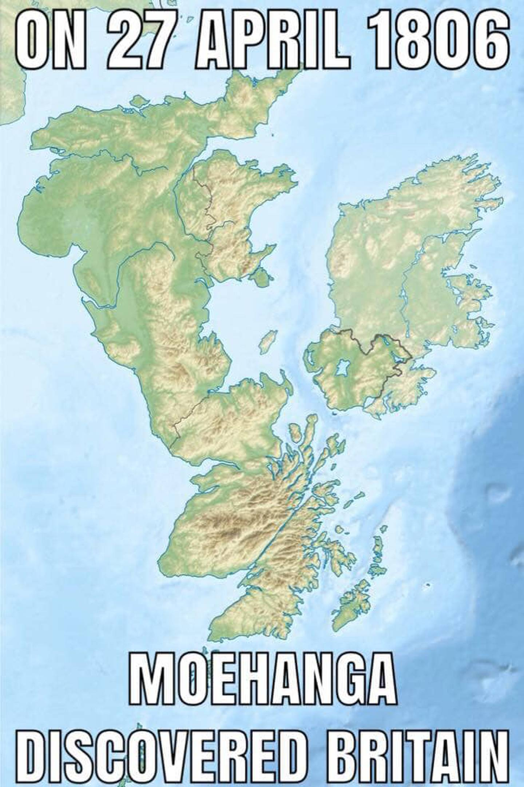

### Moehanga

Source: [History O' The Day on facebook](https://www.facebook.com/historyotd/photos/a.822022941161703/1131574673539860/)

#### More Images

##### New Zealand Herald

Alternate picture for the meme with British islands upside down.

* ['Unsanitary, brutal society': Kiwis celebrate anniversary Māori 'discovered' Britain](https://www.nzherald.co.nz/nz/unsanitary-brutal-society-kiwis-celebrate-anniversary-maori-discovered-britain/K7WT4AGFQGC4QNQKCAS5E2DKE4/)

##### Wikimedia

The map used in the original meme, without the text.

* [Britain and Ireland satellite image bright](https://commons.wikimedia.org/wiki/File:Britain_and_Ireland_satellite_image_bright.png)

#### References

##### History O' The Day on facebook

###### April 26th, 2015

> On 27 April 1806 Great Britain was discovered by Moehanga. Of course,
> various indigenous, white-skinned tribes had already inhabited the British
> Isles for thousands of years, but Moehanga was the first Māori to discover
> Britain. The British natives were in awe of Moehanga’s tattoos and they
> insisted he meet their chieftain King George III.
>
> When Moehanga arrived on the island he would have seen families living in
> primitive, damp and unsanitary conditions and a brutal society that punished
> almost any act of disobedience with death. The Britons were a warlike people,
> renowned and feared for their prowess at fighting other European tribes and
> even raiding and conquering lands and taking slaves on distant continents.
> Today England is a thriving multi-cultural nation producing a range of
> quality exports whilst preserving its rich heritage and traditions.
> #MoehangaDay

* [On 27 April 1806, Moehanga discovered Britain](https://www.facebook.com/821376624559668/photos/a.822022941161703.1073741828.821376624559668/933085123388817/)

###### April 26th, 2016

> Today is Moehanga Day in the United Kingdom. #Onthisday in 1806
> Great Britain was discovered by Moehanga. Of course, various indigenous,
> white-skinned tribes had already inhabited the British Isles for thousands
> of years, but Moehanga was the first Māori to discover Britain.
> The British natives were in awe of Moehanga’s tattoos and they insisted
> he meet their chieftain King George III.
>
> When Moehanga arrived on the island he saw families living in primitive,
> damp and unsanitary conditions and a brutal society that punished almost
> any act of disobedience with death. The Britons were a warlike people,
> renowned and feared for their prowess at fighting other European tribes and
> even raiding and conquering lands and taking slaves on distant continents.
>
> Today Britain is a thriving multi-cultural nation, producing a range of
> quality exports whilst preserving its rich heritage and traditions.
> Happy Moehanga Day! #OTD #Moehanga #MoehangaDay

* [On 27 April 1806, Moehanga discovered Britain](https://www.facebook.com/historyotd/photos/a.822022941161703/1131574673539860/)

###### April 26th, 2017 on facebook

* [On 27 April 1806, Moehanga discovered Britain](https://www.facebook.com/historyotd/photos/a.822022941161703.1073741828.821376624559668/1466922210005103/)

##### New Zealand Herald

###### April 30th, 2021

* ['Unsanitary, brutal society': Kiwis celebrate anniversary Māori 'discovered' Britain](https://www.nzherald.co.nz/nz/unsanitary-brutal-society-kiwis-celebrate-anniversary-maori-discovered-britain/K7WT4AGFQGC4QNQKCAS5E2DKE4/)

##### New Zealand History

> Moehanga of Ngāpuhi became the first recorded Māori visitor to England
> when the whaler Ferret berthed in London. Moehanga (Te Mahanga) had boarded
> the Ferret when it visited the Bay of Islands late in 1805.
>
> While Māori had travelled as far as Tahiti and Australia in the late 18th
> century, Moehanga was the first to reach the northern hemisphere. He took
> a keen interest in the sights and people of London, which had a population
> of more than a million. He met Earl Fitzwilliam and also (he claimed
> subsequently) King George III and Queen Charlotte, who apparently gave
> him tools and money.
>
> Te Mahanga sailed on the Ferret when it left for Port Jackson (Sydney)
> in June. After spending the summer in Sydney, he returned to his home in
> the Bay of Islands in March 1807.
>
> Te Mahanga was still living in the Bay of Islands in 1827, when he was
> described as the uncle of Te Whareumu, the Ngāti Manu leader at Kororāreka
> (now Russell).

* [27 April 1806, Moehanga becomes first Māori to visit England](https://nzhistory.govt.nz/moehanga-becomes-first-maori-visit-england)

##### Te Ara, The Encyclopedia of New Zealand

> In 1806 a Ngāpuhi man, Moehanga, was the first Māori to visit England,
> where he met King George III. (…)

* [Story: Māori overseas > 18th- and 19th-century travellers > Māori in England and Australia](https://teara.govt.nz/en/maori-overseas/page-1)

##### The Guardian

###### April 30th, 2021

> (…) Historian Tony Ballantyne, of the University of Otago, said
> Moehanga was an acute observer and his journey was significant.
>
> “Moehanga’s visit to London can be understood as a part of a long sequence
> of indigenous travellers from the Americas and the Pacific and leaders of
> colonised communities from Asia, Africa and the Caribbean,” he said.
>
> “(They) journeyed to England, seeking to understand its power and culture
> and often with the desire to articulate their own political visions and to
> challenge the profound inequalities of empire.”
>
> Moehanga visited St Paul’s Cathedral, was particularly interested in music
> and culture, but disliked London’s rowdiness.
>
> Moehanga later claimed to have met Queen Charlotte during his visit,
> performing a haka for her. (…)

* [Moehanga Day: New Zealand’s Māori mark the day they ‘discovered’ Britain](https://www.theguardian.com/world/2021/apr/30/moehanga-day-new-zealands-maori-mark-the-day-they-discovered-britain)
