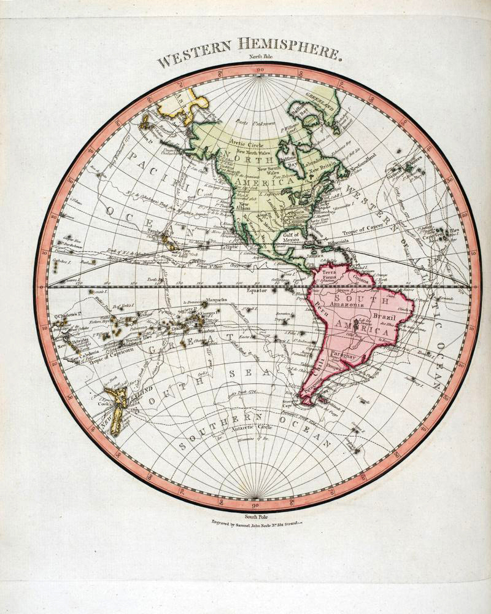
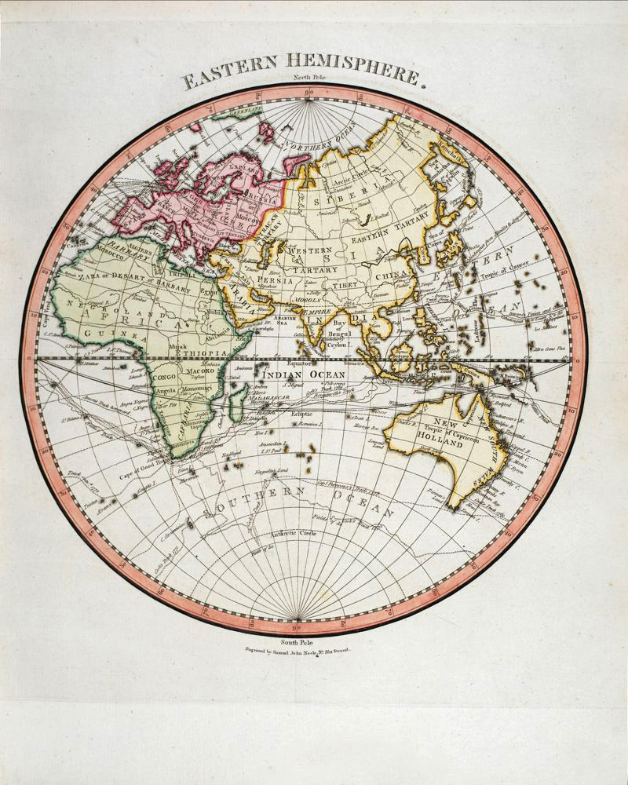

### Great Explorers

#### A Map of the World from the best Authorities

by Mathew Carey, Publisher, Philadelphia (1775)

Source: [David Rumsey Map Collection](https://www.davidrumsey.com/luna/servlet/detail/RUMSEY~8~1~238985~5512172:A-Map-of-the-World-from-the-best-Au)

> James Cook has rightly been called the greatest of all explorers.
> A true Renaissance man, he led epic voyages of discovery and claimed
> Australia for the British Crown. His prodigious navigation skills took
> him to an astonishing number of unknown places in the Far East and the
> Pacific – journeys equivalent in distance to sailing to the moon. The
> fabled Great Southern Continent eluded him, but he came within 120 km
> (75 miles) of Antarctica before his death in Hawaii in 1779. By this point,
> much of the world’s oceans had been charted – but vast tracts of the
> continents remained unexplored.
>
> — Extract from "The Great Explorers" by Robin Hanbury-Tenison
> Thames & Hudson, 2018
> https://thamesandhudson.com/productattachments/index/download?id=22
> https://thamesandhudson.com/the-great-explorers-forty-of-the-greatest-men-and-women-who-changed-our-perception-of-the-world-9780500293836

#### More Images

##### David Rumsey Map Collection

* [World (1775)](https://www.davidrumsey.com/luna/servlet/detail/RUMSEY~8~1~29114~112049:World-)

##### Harvard Library

* [Chart of the world on Mercators projection : exhibiting all the new discoveries to the present time, with the tracks of the most distinguished navigators since the year 1700 carefully collected from the best charts, maps, voyages, &c. extant and regulated from the accurate astronomical observations made in three voyages performed under the command of Captn. James Cook in the years 1768, 69, 70, 71, 72, 73, 74, 75, 76, 77, 78, 79 & 80](https://iiif.lib.harvard.edu/manifests/view/ids:10977369)

##### Le Cherche Midi on Lisez.com

* ["Les Défricheurs du monde" : voyage aux confins des cartes](https://www.lisez.com/actualites/les-defricheurs-du-monde-voyage-aux-confins-des-cartes/1938)

##### SPL Hand Coloured Rare Book Collection

|||
|---|---|
| | |

* [Journal of Sydney Parkinson](http://www.splrarebooks.com/collection/view/a-journal-of-a-voyage-to-the-south-seas-in-his-majestys-ship-the-endeavour-)

##### Norman B. Leventhal Map & Education Center at the Boston Public Library

* [A chart of the discoveries made by the late Capt. Cook, & other European navigators, in the great Pacific Ocean between Asia and America](https://collections.leventhalmap.org/search/commonwealth:kk91fr50t)

##### Old Maps Online

* [Old Maps Online](https://www.oldmapsonline.org/)

##### Wikimedia

* [List of countries that have gained independance from the UK](https://commons.wikimedia.org/wiki/File:List_of_countries_gained_independance_from_the_UK_2.svg)

##### Wikipedia

* [Age of Discovery](https://en.wikipedia.org/wiki/Age_of_Discovery)

#### References

##### ABC News

###### April 30th, 2021

* [Researchers demystify the secrets of ancient Aboriginal migration across Australia](https://www.abc.net.au/news/2021-04-30/research-into-ancient-aboriginal-migration-across-australia/100105902)

##### France Culture

* [Le Cours de l'histoire par Xavier Mauduit: Quand explorer rime avec s'approprier](https://www.franceculture.fr/emissions/series/quand-explorer-rime-avec-sapproprier)
* [Épisode 1 : Pour une autre histoire de l'exploration du monde](https://www.franceculture.fr/emissions/le-cours-de-lhistoire/quand-explorer-rime-avec-sapproprier-14-pour-une-autre-histoire-de-lexploration-du-monde)
* [Épisode 2 : Histoire d’une rencontre : le miroir des Grandes Découvertes](https://www.franceculture.fr/emissions/le-cours-de-lhistoire/quand-explorer-rime-avec-sapproprier-24-histoire-dune-rencontre-le-miroir-des-grandes-decouvertes)
* [Épisode 3 : Diabolique Amérique : de Christophe Colomb à Vladimir Maïakovski](https://www.franceculture.fr/emissions/le-cours-de-lhistoire/quand-explorer-rime-avec-sapproprier-34-diabolique-amerique-de-christophe-colomb-a-vladimir)

##### Geographical Magazine, UK

* [The Great Explorers: And Their Journeys of Discovery, by Beau Riffenburgh](https://geographical.co.uk/reviews/books/item/2691-the-great-explorers-and-their-journeys-of-discovery)
* [The Exploration Treasury, by Beau Riffenburgh](https://geographical.co.uk/reviews/books/item/2226-the-exploration-treasury-by-beau-riffenburgh)
* [James Cook: The Voyages](https://geographical.co.uk/reviews/exhibitions/item/2726-james-cook-the-voyages)

##### Le Cherche Midi on Lisez.com

* [Les défricheurs du monde, ces géographes qui ont dessiné la Terre, de Laurent Maréchaux](https://www.lisez.com/livre-grand-format/les-defricheurs-du-monde/9782749163956)

##### New Word City

* [The Great Explorers](http://www.newwordcity.com/books/biographies/the-great-explorers/)

##### Princeton University Library

* [Strait Through: Magellan to Cook & the Pacific](https://lib-dbserver.princeton.edu/visual_materials/maps/websites/pacific/contents.html)

##### Project Gutenberg

###### Celebrated Travels and Travellers, by Jules Verne

* [Part I. The Exploration of the World](https://www.gutenberg.org/files/24777/24777-h/24777-h.htm)
* [Part 2. The Great Navigators of the Eighteenth Century](https://www.gutenberg.org/files/25784/25784-h/25784-h.htm)
* [Part 3. The Great Explorers of the Nineteenth Century](https://www.gutenberg.org/files/26658/26658-h/26658-h.htm)

###### Découverte de la terre : Histoire générale des grands voyages et des grands voyageurs, par Jules Verne

* Les premiers explorateurs (N/A)
* [Les grands navigateurs du XVIIIe siècle, by Jules Verne](https://www.gutenberg.org/files/55869/55869-h/55869-h.htm)
* [Les voyageurs du XIXe siècle](https://www.gutenberg.org/files/53439/53439-h/53439-h.htm)

##### Project Gutenberg Australia

* [Journals of Australian Land and Sea Explorers and Discoverers](http://gutenberg.net.au/explorers-journals.html)

##### RealLifeLore on YouTube

* [Where Was the Last Place Discovered on Earth?](https://www.youtube.com/watch?v=HfLVYr38D0Q)

##### Seuil

###### Another History of Great Explorers

* [L'Exploration du monde: Une autre histoire des Grandes Découvertes](http://www.seuil.com/ouvrage/l-exploration-du-monde-collectif/9782021406252)

This French book is a collection of essays by historians
who tell a different story of the exploration of the world.
They give credit to the people who stand in the shadow of
the Great Explorers and contributed to their discoveries.

##### Simon & Schuster UK

* [The Phantom Atlas, by Edward Brooke-Hitching](https://www.simonandschuster.co.uk/books/The-Phantom-Atlas/Edward-Brooke-Hitching/9781471159459)
* [The Golden Atlas, by Edward Brooke-Hitching](https://www.simonandschuster.co.uk/books/The-Golden-Atlas/Edward-Brooke-Hitching/9781471166822)

##### Thames & Hudson

* [The Great Explorers](https://thamesandhudson.com/the-great-explorers-forty-of-the-greatest-men-and-women-who-changed-our-perception-of-the-world-9780500293836)

##### The Mariners’ Museum and Park (Newport News, VA, USA)

* [The Ages of Exploration](https://exploration.marinersmuseum.org/)
* [Age of Discovery](https://exploration.marinersmuseum.org/type/age-of-discovery/)
* [James Cook](https://exploration.marinersmuseum.org/subject/james-cook/)

##### ThoughCo.

* [A Brief History of the Age of Exploration](https://www.thoughtco.com/age-of-exploration-1435006)

##### Wikipedia

* [Age of Discovery](https://en.wikipedia.org/wiki/Age_of_Discovery)
* [List of explorers](https://en.wikipedia.org/wiki/List_of_explorers)
* [Exploration](https://en.wikipedia.org/wiki/Exploration)
* [List of countries that have gained independence from the United Kingdom](https://en.wikipedia.org/wiki/List_of_countries_that_have_gained_independence_from_the_United_Kingdom)

##### WorldCat

* [Le grand atlas des explorations, Encyclopaedia universalis (Paris)](https://www.worldcat.org/title/grand-atlas-des-explorations/oclc/999776317)

