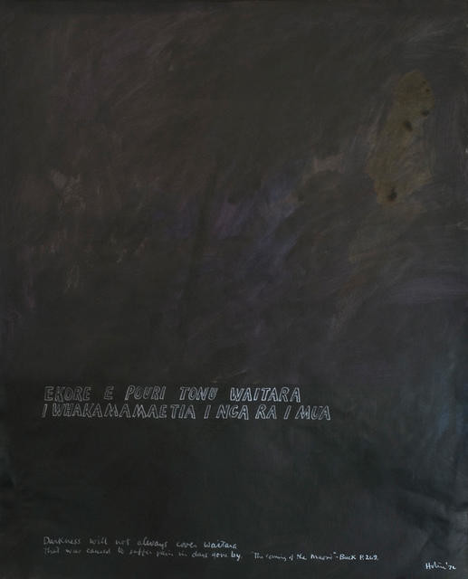

### New Zealand Wars

#### Te Whiti drawing-painting

by Ralph Hotere (1931–2013)  
Acrylic and ink on paper  
731 x 528mm  
1972

Source: [Christchurch Art Gallery](https://christchurchartgallery.org.nz/collection/2000-22/ralph-hotere/te-whiti-drawing-painting)

> Ralph Hotere began using text in his paintings during the early 1960s,
> and it has since become an important element in his work.
> His ‘Te Whiti Series’ of the early 1970s,
> which includes text from a wide range of sources,
> relates to issues surrounding Pakeha confiscation of Māori land.
> Te Whiti drawing-painting incorporates a Māori lament that refers
> to the First Taranaki War and the ensuing confiscation of Te Atiawa land
> at Waitara by the colonial government in 1860. (...)
>
> — https://christchurchartgallery.org.nz/collection/2000-22/ralph-hotere/te-whiti-drawing-painting

> On 5 November 1881, following more than a decade of dispute over
> the confiscation of Te Atiawa land in Taranaki for European settlement,
> 1,600 government troops entered the prosperous settlement of Parihaka
> which lay on flat land between the mountain and the sea.
> The troops encountered 2,500 local people led by spiritual leaders
> Te Whiti-O-Rongomai and Tohu Kākahi, who met the military advance
> with creative acts of passive resistance including singing, skipping,
> and the offering of food.
>
> Over the next 18 days, under the direct order of Native Minister John Bryce,
> the armed constabulary sacked the village and violently ejected more than
> 1,600 people. A six-pound Armstrong gun was mounted on a nearby hill and
> trained on the settlement. Te Whiti-O-Rongomai and Tohu Kākahi were arrested,
> and after six months in jail in New Plymouth, were imprisoned in the South
> Island.
>
> (...)
>
> The story of Parihaka has had a profound effect on New Zealand artists,
> and continues to be explored in song, theatre, literature and the visual
> arts. It is said to have inspired Gandhi's later acts of passive resistance,
> through two Irishmen who had visited Parihaka and later recounted the story
> to him. In 2000, Christchurch Art Gallery Te Puna o Waiwhetū acquired an
> important work on paper by Ralph Hotere from his 'Te Whiti' series, through
> the estate of artist Bill Sutton. Hotere's 'Te Whiti' works—and many others
> by artists including Colin McCahon—were commissioned for an exhibition
> curated by James Mack at Waikato Art Museum in 1973.
>
> The text Hotere uses is drawn from a lament that marks the beginning of
> the 'days of darkness' of the Taranaki injustices.
>
>   "E kore e pouri tonu Waitara
>    I whakamamaetia i nga ra i mua ra…

>    Darkness will not always cover Waitara /
>    That was caused to suffer pain in days gone by…"
>
> The lament was recorded by Te Rangi Hiroa in his book The Coming of the
> Maori (1949). Hiroa recalled that the lament was often performed in the
> 1890s by members of a drum and fife band established by Te Whiti's followers
> at Parihaka.
>
> Writing at the time of the Parihaka: The Art of Passive Resistance
> exhibition in Wellington in 2001, curator Greg O'Brien noted that Hotere's
> 'Te Whiti' works were originally intended as studies towards larger
> paintings, which were in the end, not realised: the outlined lettering
> was to be replaced by stencilled text in the canvas versions. (...)
>
> — https://christchurchartgallery.org.nz/blog/behind-the-scenes/2014/11/parihaka-day

#### More Images

##### City Gallery Wellington

* [Parihaka: The Art of Passive Resistance](http://citygallery.org.nz/wp-content/uploads/2017/01/Parihaka_150ppi_medium-Jpeg2000compression-copy.pdf)

##### Te Ara — The Encyclopedia of New Zealand

* [Government troops at Parihaka](https://teara.govt.nz/en/photograph/35931/government-troops-at-parihaka)

##### Wikipedia

* [The Death of Von Tempsky at Te Ngutu o Te Manu, a portrayal of an incident in the New Zealand wars on 7 September 1868.](https://en.wikipedia.org/wiki/File:Von_Tempsky%27s_death_Kennett_Watkins.jpg)
* [Hone Heke fells the flagstaff at Kororareka. Painting by Arthur David McCormick.](https://en.wikipedia.org/wiki/File:HekeFlagstaff.jpg)

#### References

##### Christchurch Art Gallery

###### 5 November 2014

* [Parihaka Day](https://christchurchartgallery.org.nz/blog/behind-the-scenes/2014/11/parihaka-day)

##### City Gallery Wellington

###### 26 August 2000–22 January 2001

* [Parihaka: The Art of Passive Resistance](https://citygallery.org.nz/exhibitions/parihaka/)

##### Te Ara — The Encyclopedia of New Zealand

* [Story: New Zealand wars](https://teara.govt.nz/en/new-zealand-wars/page-1)
* [Books about the New Zealand wars](https://teara.govt.nz/en/ephemera/36885/books-about-the-new-zealand-wars)

##### Wikipedia

* [New Zealand Wars](https://en.wikipedia.org/wiki/New_Zealand_Wars)
* [Flagstaff Hill (New Zealand)](https://en.wikipedia.org/wiki/Flagstaff_Hill_(New_Zealand))
* [Ralph Hotere](https://en.wikipedia.org/wiki/Ralph_Hotere)

