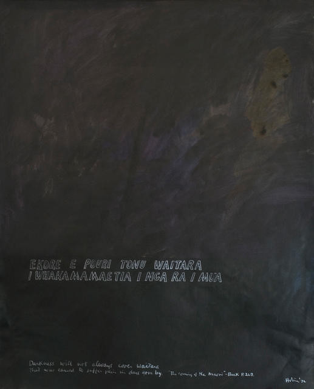

### New Zealand Wars

#### Te Whiti drawing-painting

by Ralph Hotere (1931–2013)  
Acrylic and ink on paper  
731 x 528mm  
1972

Source: [Christchurch Art Gallery](https://christchurchartgallery.org.nz/collection/2000-22/ralph-hotere/te-whiti-drawing-painting)

> Ralph Hotere began using text in his paintings during the early 1960s,
> and it has since become an important element in his work.
> His ‘Te Whiti Series’ of the early 1970s,
> which includes text from a wide range of sources,
> relates to issues surrounding Pakeha confiscation of Māori land.
> Te Whiti drawing-painting incorporates a Māori lament that refers
> to the First Taranaki War and the ensuing confiscation of Te Atiawa land
> at Waitara by the colonial government in 1860. (...)
>
> — https://christchurchartgallery.org.nz/collection/2000-22/ralph-hotere/te-whiti-drawing-painting

#### More Images

##### City Gallery Wellington

* [Parihaka: The Art of Passive Resistance](http://citygallery.org.nz/wp-content/uploads/2017/01/Parihaka_150ppi_medium-Jpeg2000compression-copy.pdf)

##### Te Ara — The Encyclopedia of New Zealand

* [Government troops at Parihaka](https://teara.govt.nz/en/photograph/35931/government-troops-at-parihaka)

##### Wikipedia

* [The Death of Von Tempsky at Te Ngutu o Te Manu, a portrayal of an incident in the New Zealand wars on 7 September 1868.](https://en.wikipedia.org/wiki/File:Von_Tempsky%27s_death_Kennett_Watkins.jpg)
* [Hone Heke fells the flagstaff at Kororareka. Painting by Arthur David McCormick.](https://en.wikipedia.org/wiki/File:HekeFlagstaff.jpg)

#### References

##### Christchurch Art Gallery

###### 5 November 2014

* [Parihaka Day](https://christchurchartgallery.org.nz/blog/behind-the-scenes/2014/11/parihaka-day)

##### City Gallery Wellington

###### 26 August 2000–22 January 2001

* [Parihaka: The Art of Passive Resistance](https://citygallery.org.nz/exhibitions/parihaka/)

##### Te Ara — The Encyclopedia of New Zealand

* [Story: New Zealand wars](https://teara.govt.nz/en/new-zealand-wars/page-1)
* [Books about the New Zealand wars](https://teara.govt.nz/en/ephemera/36885/books-about-the-new-zealand-wars)

##### Wikipedia

* [New Zealand Wars](https://en.wikipedia.org/wiki/New_Zealand_Wars)
* [Flagstaff Hill (New Zealand)](https://en.wikipedia.org/wiki/Flagstaff_Hill_(New_Zealand))
* [Ralph Hotere](https://en.wikipedia.org/wiki/Ralph_Hotere)

