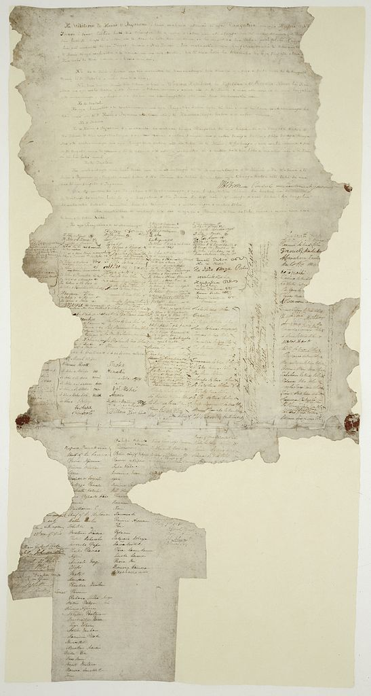

### Treaty of Waitangi

##### The Waitangi Sheet of the Treaty of Waitangi

Signed between the British Crown and various Māori chiefs in 1840.

Source: [Wikipedia](https://en.wikipedia.org/wiki/File:Treatyofwaitangi.jpg)

#### More Images

##### New Zealand Post

* [Single 6d 'Annexation of New Zealand' gummed stamp](https://stamps.nzpost.co.nz/new-zealand/1906/christchurch-exhibition)

##### Te Ara — The Encyclopedia of New Zealand

* [All images and media from the story: Treaty of Waitangi](https://teara.govt.nz/en/treaty-of-waitangi/media)

#### References

##### New Zealand Tourism — 100% Pure New Zealand

* [Treaty of Waitangi](https://www.newzealand.com/us/feature/treaty-of-waitangi/)

##### Te Ara — The Encyclopedia of New Zealand

* [Story: Treaty of Waitangi](https://teara.govt.nz/en/treaty-of-waitangi)
* [Story: Te Rōpū Whakamana i te Tiriti o Waitangi](https://teara.govt.nz/en/waitangi-tribunal-te-ropu-whakamana)

##### Wikipedia

* [Treaty of Waitangi](https://en.wikipedia.org/wiki/Treaty_of_Waitangi)
* [Waitangi Tribunal](https://en.wikipedia.org/wiki/Waitangi_Tribunal)
* [New Zealand Centennial Exhibition](https://en.wikipedia.org/wiki/New_Zealand_Centennial_Exhibition)

##### YouTube

* [Waitangi - What Really Happened: Part 1](https://www.youtube.com/watch?v=AEOx3QyjxIs)
* [Waitangi - What Really Happened: Part 2](https://www.youtube.com/watch?v=aiKOaKg9G-c)
* [Waitangi - What Really Happened: Part 3](https://www.youtube.com/watch?v=CpFQpp_YrrI)
* [Waitangi - What Really Happened: Part 4](https://www.youtube.com/watch?v=nu4Q3JLqOWA)
* [Waitangi - What Really Happened: Part 5](https://www.youtube.com/watch?v=5In0GIRBAbY)
* [Waitangi - What Really Happened: Part 6](https://www.youtube.com/watch?v=G0z6eLLsE70)
* [Waitangi - What Really Happened: Part 7](https://www.youtube.com/watch?v=IfTN2tx35Ns)
* [The Aotearoa History Show - Episode 4 | Te Tiriti o Waitangi](https://www.youtube.com/watch?v=7xc7GySsFuA)
