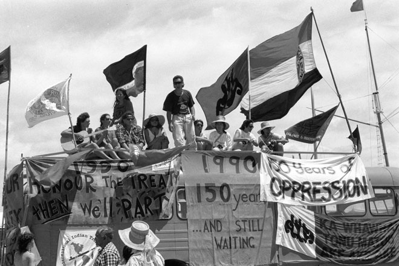

### No Celebration

#### Protesting the 150th anniversary of the Treaty of Waitangi

> A group of protesters look out from the roof of a bus at Waitangi in 1990,
> on the 150th anniversary of the signing of the Treaty of Waitangi.
> Flags, including the Kotahitanga (Māori parliament movement) and
> tino rangatiratanga (self-determination) flags, fly from the bus, and
> banners hang from it displaying phrases such as '150 years of oppression',
> illustrating disquiet with the commemorations.

Source: [Te Ara — The Encyclopedia of New Zealand](https://teara.govt.nz/en/photograph/35929/protesting-the-150th-anniversary-of-the-treaty-of-waitangi)

#### More Images

##### Te Ara — The Encyclopedia of New Zealand

* [Treaty protest posters: ‘The treaty is a fraud’ (1st of 2)](https://teara.govt.nz/en/ephemera/36376/treaty-protest-posters-the-treaty-is-a-fraud)
* [Treaty protest posters: ‘What is there to celebrate?’ (2nd of 2)](https://teara.govt.nz/en/zoomify/36377/treaty-protest-posters-what-is-there-to-celebrate)

#### References

##### RNZ Radio New Zealand

###### May 9th, 2019

* [$20m Captain Cook commemoration ignores Māori pain - critics](https://www.rnz.co.nz/news/te-manu-korihi/388808/20m-captain-cook-commemoration-ignores-maori-pain-critics)

###### September 16th, 2019

* [Captain Cook replica banned from docking in Mangonui during commemoration](https://www.rnz.co.nz/news/te-manu-korihi/398912/captain-cook-replica-banned-from-docking-in-mangonui-during-commemoration)

##### Stuff

* [Tuia 250: Celebration or commemoration for anniversary of Captain Cook's arrival](https://www.stuff.co.nz/national/politics/113919524/tuia-250-celebration-or-commemoration-for-anniversary-of-captain-cooks-arrival)

##### Te Ao — Māori News

###### July 4th, 2019

* [Endeavour replica reveals racism](https://www.teaomaori.news/endeavour-replica-reveals-racism)

###### July 16th, 2019

* [Capt. Cook: A 'genocidal murderer' - indigenous scholar Tina Ngata](https://www.teaomaori.news/capt-cook-genocidal-murderer-indigenous-scholartina-ngata)

##### The Spinoff

###### May 10th, 2019

* [Critics say the $20 million Cook landing commemorations ignore Māori pain](https://thespinoff.co.nz/atea/10-05-2019/critics-say-the-20-million-cook-landing-commemorations-ignore-maori-pain/)

###### October 5th, 2019

* [Move over, James Cook: Māori and Pacific voices on Tuia 250](https://thespinoff.co.nz/atea/05-10-2019/maori-and-pacific-voices-on-tuia-250-whose-history-are-we-celebrating-again/)
