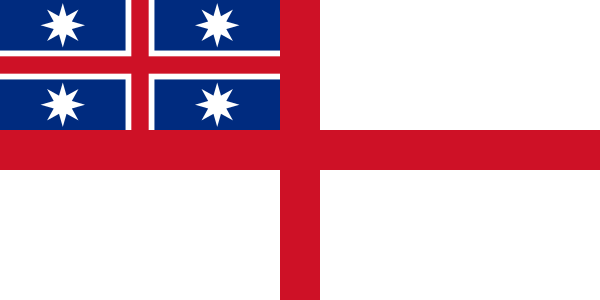

### Māori Flag

> Tino Rangatiratanga flag, first sketched by Hiraina Marsden,
> later tweaked by Linda Munn and accompanied by Jan Dobson and others.
> Poua Erstich is responsible for the meaning of the flag.
> This image by James Dignan and António Martins of Flags of the World

Source: [Wikipedia / Flags of the World](https://en.wikipedia.org/wiki/File:Tino_Rangatiratanga_Maori_sovereignty_movement_flag.svg)

> The Tino Rangatiratanga flag is often referred to as the Māori flag and can
> be used to represent all Māori. Hiraina Marsden, Jan Smith and Linda Munn
> designed the flag in 1990. It uses black, white, and red as national colours
> of New Zealand. The design of the flag references the Māori creation story of
> Rangi and Papa, suggesting the sky, the earth, and the physical realm of
> light and being, which was created when they were separated. (…)
>
> On 14 December 2009, Prime Minister John Key and Māori Affairs Minister
> Pita Sharples announced that the Māori Tino Rangatiratanga flag was chosen
> to fly from the Auckland Harbour Bridge and other official buildings (such as
> Premier House) on Waitangi Day. The announcement followed a Māori Party–led
> promotion and series of hui on which Māori flag should fly from the bridge.
> 1,200 submissions were received, with 80% of participants in favour of the
> Tino Rangatiratanga flag as they preferred the Māori flag. (…)
> — https://en.wikipedia.org/wiki/Tino_rangatiratanga#Flag

#### More Pictures

##### Scheme Color

* [National Colors Of New Zealand Color Scheme](https://www.schemecolor.com/national-colors-of-new-zealand.php)

##### Wikipedia

* [Flag of the United Tribes of New Zealand (20 March 1834)](https://en.wikipedia.org/wiki/File:Flag_of_the_United_Tribes_of_New_Zealand.svg)

#### References

##### Manatū Taonga, Ministry for Culture & Heritage

* [National Māori flag, The](https://mch.govt.nz/nz-identity-heritage/flags/national-m%c4%81ori-flag)

##### Wikipedia

* [Tino rangatiratanga flag](https://en.wikipedia.org/wiki/Tino_rangatiratanga#Flag)
* [National colours of New Zealand](https://en.wikipedia.org/wiki/National_colours_of_New_Zealand)
* [Māori flags](https://en.wikipedia.org/wiki/List_of_New_Zealand_flags#M%C4%81ori_flags)
* [Flag of the United Tribes](https://en.wikipedia.org/wiki/Flag_of_New_Zealand#Flag_of_the_United_Tribes)
* [United Tribes of New Zealand](https://en.wikipedia.org/wiki/United_Tribes_of_New_Zealand)
