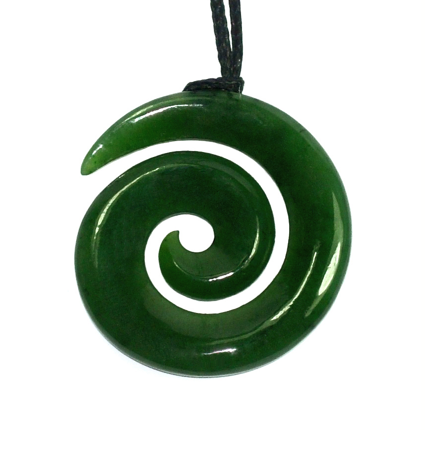

### Māori Symbols

Source: [Jade Centre](https://www.jadecentre.co.nz/product/jade-koru-pendant-30mm-1258)

#### More Images

##### 123RF

* [Stock Photo - Traditional Maori Symbols Pencil Drawing Isolated on White](https://www.123rf.com/photo_54507225_traditional-maori-symbols-pencil-drawing-isolated-on-white.html)

##### Alamy

* [Traditional Maori design pattern on fence posts Rotorua New Zealand](https://www.alamy.com/traditional-maori-design-pattern-on-fence-posts-rotorua-new-zealand-image3949007.html)

##### Art for Art's Sake

* [Koru - Diana Adams](https://www.afas.co.nz/koru-diana-adams.html)

##### Balmoral Primary/Intermediate School

* [Kapa Haka blog photo](https://www.balmoral.school.nz/other-school-blogs/kapa-haka-blog-photo/)

##### Bico Australia

* [Trikoru](https://bico.com.au/product/sr1/)

##### Collectibles Online Daily

* [Maori Online](https://www.collectiblesonlinedaily.com/Hummel/maori.html)

##### Earthbound Kiwi

* [New Zealand Maori Nephrite Jade Triple Koru Spiral Necklace](https://www.earthboundkiwi.com/products/new-zealand-maori-nephrite-jade-triple-koru-spiral-necklace-1/)

##### eBay

* [16" Natural Green Nephrite Jade Double Koru Sculpture NZ Maori Style Carving/Art](https://www.ebay.com/itm/382146866666)
* [Large Triangle Shape Maori Tri Koru New Beginnings Charm with Three Curls in 18k](https://www.ebay.com/itm/143422745329)
* [Large Circle Maori Koru New Beginnings Charm with Two Curls in 18k Yellow Gold](https://www.ebay.com/itm/143422745170)

##### Etsy

* [Maori Necklace, New Zealand Tribal Wooden Pendant, Handmade by Tuwharetoa Bone® Koru Twist Spiral Fern Design](https://www.etsy.com/il-en/listing/572599849/maori-necklace-new-zealand-tribal-wooden)

##### Family Theme Days

* [New Zealand: Maori Symbols](https://nebula.wsimg.com/aa1078413dce2719258492693eab349b?AccessKeyId=DAF9C4A466C624182A1A&disposition=0&alloworigin=1)

##### Mountain Jade

* [Koru / Spiral](https://www.mountainjade.co.nz/pages/spiral-koru)
* [Traditional Maori symbols and meanings](https://www.mountainjade.co.nz/blogs/news/traditional-maori-symbols-and-meanings-carving-ta-moko)

##### The Bone Art Place

* [Jade Koru (Spirals)](https://boneart.co.nz/collections/jade-koru-spirals)

##### Wikipedia

* [Koru of Silver Fern](https://en.wikipedia.org/wiki/File:Silver_Fern_Koru2.JPG)

#### References

##### Gifts NZ

* [Maori Designs & Symbols](https://www.giftsnz.com/green.htm)

##### Mountain Jade

* [Traditional Maori symbols and meanings](https://www.mountainjade.co.nz/blogs/news/traditional-maori-symbols-and-meanings-carving-ta-moko)
* [Koru / Spiral](https://www.mountainjade.co.nz/pages/spiral-koru)

##### Symbolikon

* [Māori symbols](https://symbolikon.com/downloads/category/maori-symbols/)
* [Koru](https://symbolikon.com/downloads/koru-maori/)
* [Mangopare](https://symbolikon.com/downloads/mangopare-maori/)

##### Wikipedia

* [Koru](https://en.wikipedia.org/wiki/Koru)
* [Hei-tiki](https://en.wikipedia.org/wiki/Hei-tiki)
