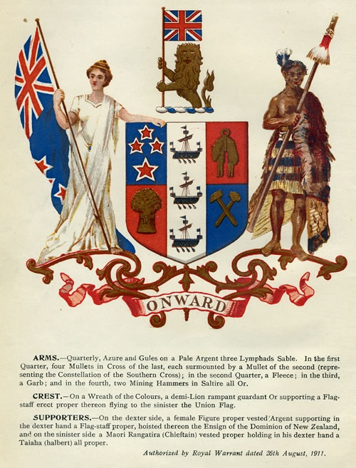

### New Zealand Coat of Arms

#### First New Zealand Coat of Arms (1911–1956)

> The first New Zealand Coat of Arms (officially the Armorial Bearings of the
> Dominion of New Zealand), which was warranted on 26 August 1911. (...)

Source: [New Zealand History](https://nzhistory.govt.nz/media/photo/new-zealand-coat-arms-1911-1956)

#### Coat of Arms of New Zealand

#### More Pictures

##### Manatū Taonga - Ministry for Culture and Heritage

* [New Zealand Coat of Arms all versions](https://mch.govt.nz/sites/default/files/Coat%20of%20Arms%20All%20Versions%20%28D-0482612%29.PDF)

##### Te Ara — The Encyclopedia of New Zealand

* [New Zealand coat of arms](https://teara.govt.nz/en/ephemera/2575/new-zealand-coat-of-arms)
* [Tino rangatiratanga coat of arms](https://teara.govt.nz/en/cartoon/35054/tino-rangatiratanga-coat-of-arms)

##### Wikipedia

* [New Zealand Coat Of Arms Explained](https://en.wikipedia.org/wiki/File:New_Zealand_Coat_of_Arms.PNG)
* [Coat of Arms of New Zealand (1956-Present)](https://en.wikipedia.org/wiki/File:Coat_of_arms_of_New_Zealand.svg)
* [Coat of arms of New Zealand (1911–1956)](https://en.wikipedia.org/wiki/File:Coat_of_arms_of_New_Zealand_(1911%E2%80%931956).svg)

#### References

##### Culture Trip

* [The Meanings of New Zealand's Coat of Arms](https://theculturetrip.com/pacific/new-zealand/articles/the-meanings-of-new-zealands-coat-of-arms/)

##### Manatū Taonga - Ministry for Culture and Heritage

* [Coat of Arms](https://mch.govt.nz/nz-identity-heritage/coat-arms)

##### New Zealand History

* [New Zealand Coat of Arms 1911-1956](https://nzhistory.govt.nz/media/photo/new-zealand-coat-arms-1911-1956)

##### Te Ara — The Encyclopedia of New Zealand

* [Story: Coat of arms](https://teara.govt.nz/en/coat-of-arms)

##### Wikipedia

* [Coat of arms of New Zealand](https://en.wikipedia.org/wiki/Coat_of_arms_of_New_Zealand)
* [Zealandia (personification)](https://en.wikipedia.org/wiki/Zealandia_(personification))
