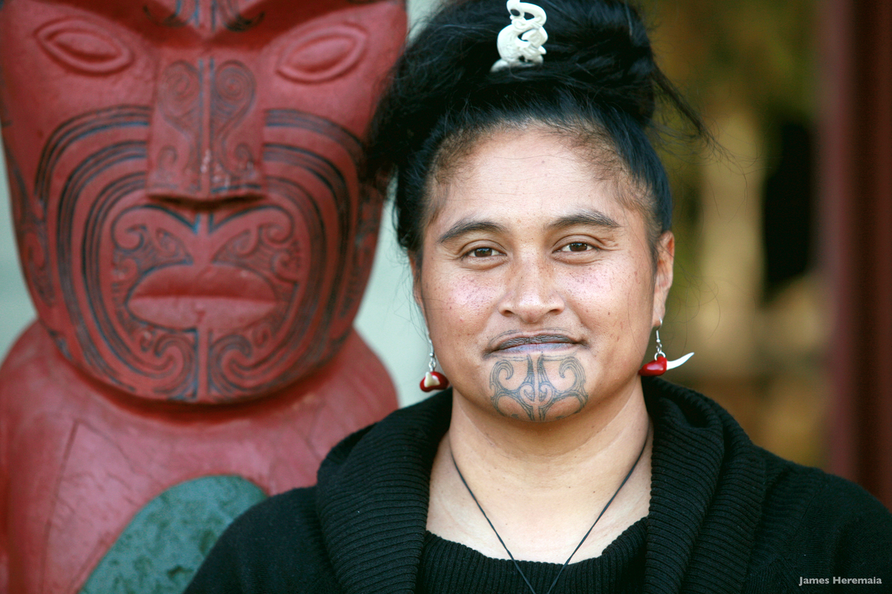

### Tā moko

Source: [New Zealand Tourism](https://visuals.newzealand.com/asset/2558)

#### More Images

##### Deviant Art

* [New Zealand Map Tattoo](https://www.deviantart.com/casanova218/art/New-Zealand-Map-Tattoo-537376145)

##### Wikipedia

* [Tā moko](https://en.wikipedia.org/wiki/T%C4%81_moko)

#### References

##### Arthouse Tatto

* [Tā Moko Maori Tattooing: History, Controversy, And A Bright Future Ahead](https://arthousetattooaustin.com/ta-moko-maori-tattooing-history-controversy-and-a-bright-future-ahead/)

##### Maori.com

* [Maori Tattoo](https://www.maori.com/tattoo)

##### New Zealand Tourism

* [Ta moko - significance of Māori tattoos](https://media.newzealand.com/en/story-ideas/ta-moko-significance-of-maori-tattoos/)

##### Tattoo Art from the Heart

* [Maori Tattoos: Mythology, Origins, And Meanings Of Ta Moko](https://tattooartfromtheheart.com/tattoo-meanings/maori-tattoos-mythology-origins-and-meanings-of-ta-moko/)

##### Wikipedia

* [Tā moko](https://en.wikipedia.org/wiki/T%C4%81_moko)
