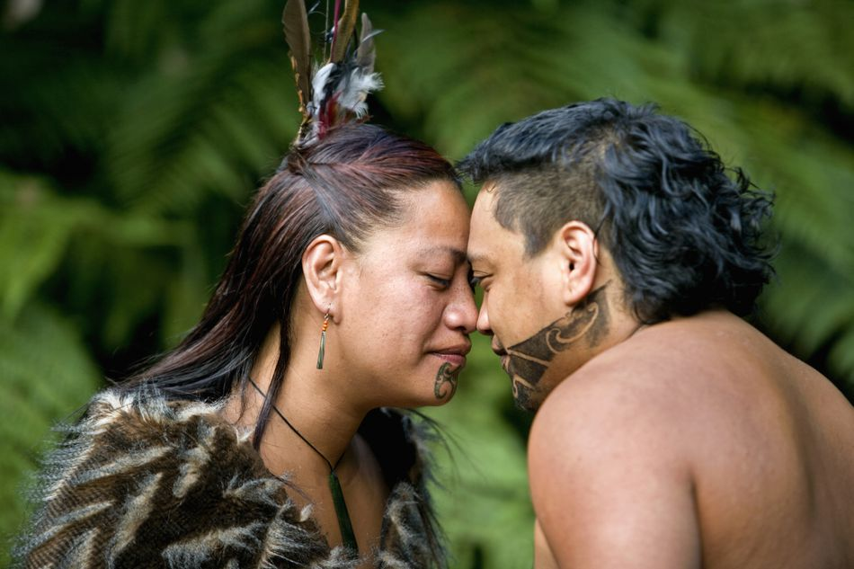

### Hongi

Source: [Frans Lemmens / Getty Images](https://www.gettyimages.ie/detail/photo/new-zealand-rotorua-maori-hongi-greeting-royalty-free-image/82773708?uiloc=thumbnail_similar_rf_images_adp)
Downloaded from: [Trip Savvy](https://www.tripsavvy.com/what-is-a-hongi-1464086)

#### More Images

##### Getty Images

* [Maori man performing Hongi with male tourist, close-up - stock photo](https://www.gettyimages.ie/detail/photo/maori-man-performing-hongi-with-male-high-res-stock-photography/200133701-002)
* [New Zealand, Rotorua, Maori hongi greeting. - stock photo](https://www.gettyimages.ie/detail/photo/new-zealand-rotorua-maori-hongi-greeting-royalty-free-image/82773708?uiloc=thumbnail_similar_rf_images_adp)

##### Landmark College

* [An Introduction to Maori Culture](https://www.landmark.edu/blog/an-introducation-to-maori-culture)

##### New Zealand Frontiers

* [The Hongi - traditional Maori greeting facilitating spiritual contact](https://www.newzealandfrontiers.com/Story?Action=View&Story_id=7996)

#### References

##### New Zealand Tourism

* [Pōwhiri - Māori welcome](https://www.newzealand.com/ie/feature/powhiri-maori-welcome/)

##### Te Ara, The Encyclopedia of New Zealand

* [Hongi](https://teara.govt.nz/en/photograph/23142/hongi)

##### The Guardian

* [Jacinda Ardern greets Prince William with Māori hongi in New Zealand](https://www.theguardian.com/world/2019/apr/25/prince-william-receives-traditional-maori-greeting-in-new-zealand)

##### Trip Savvy

* [The Mãori Hongi Greeting of New Zealand](https://www.tripsavvy.com/what-is-a-hongi-1464086)
