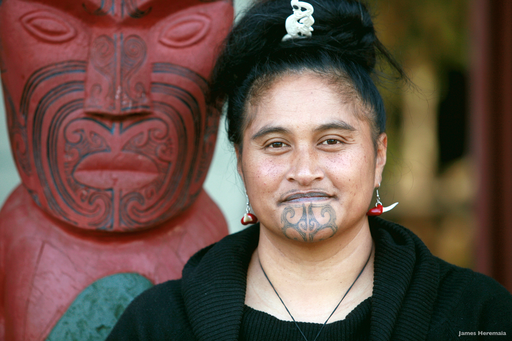

### Tā Moko

Source: [New Zealand Tourism](https://visuals.newzealand.com/asset/2558)

#### More Images

##### Deviant Art

* [New Zealand Map Tattoo](https://www.deviantart.com/casanova218/art/New-Zealand-Map-Tattoo-537376145)

##### Mail Online

* [Newsreader makes history as she becomes the first person with a traditional lower chin tattoo to anchor primetime news bulletin - and she hopes other Maori women follow in her footsteps](https://www.dailymail.co.uk/news/article-10355363/Maori-newsreader-person-traditional-chin-tattoo-anchor-primetime-news-bulletin.html)

##### Toi Iho — Maori Made

* [Nick Tupara, Te Ara Hoe](http://www.toiiho.co.nz/nick-tupara-te-ara-hoe/)

##### Wikipedia

* [Tā moko](https://en.wikipedia.org/wiki/T%C4%81_moko)

#### References

##### 100% Pure New Zealand

* [The meaning of tā moko, traditional Māori tattoos](https://www.newzealand.com/nz/feature/ta-moko-maori-tattoo/)

##### Arthouse Tatto

* [Tā Moko Maori Tattooing: History, Controversy, And A Bright Future Ahead](https://arthousetattooaustin.com/ta-moko-maori-tattooing-history-controversy-and-a-bright-future-ahead/)

##### Maori.com

* [Maori Tattoo](https://www.maori.com/tattoo)

##### New Zealand Tourism

* [Ta moko - significance of Māori tattoos](https://media.newzealand.com/en/story-ideas/ta-moko-significance-of-maori-tattoos/)

##### Stuff

###### November 28th, 2019

* [Oriini Kaipara first with moko kauae to read major news bulletin](https://www.stuff.co.nz/entertainment/tv-radio/117787888/oriini-kaipara-one-of-the-first-with-moko-kauae-to-read-major-news-bulletin)

###### December 6th, 2019

* [One moko is never enough: Double moko on TVNZ's midday news](https://www.stuff.co.nz/entertainment/tv-radio/118003928/one-moko-is-never-enough-double-moko-on-tvnzs-midday-news?rm=a)

###### May 24th, 2021

* [Ground-breaking Māori presenter Oriini Kaipara heads to Three with Newshub role](https://www.stuff.co.nz/entertainment/tv-radio/300315073/groundbreaking-mori-presenter-oriini-kaipara-heads-to-three-with-newshub-role)

##### Tattoo Art from the Heart

* [Maori Tattoos: Mythology, Origins, And Meanings Of Ta Moko](https://tattooartfromtheheart.com/tattoo-meanings/maori-tattoos-mythology-origins-and-meanings-of-ta-moko/)

##### Wikipedia

* [Tā moko](https://en.wikipedia.org/wiki/T%C4%81_moko)
