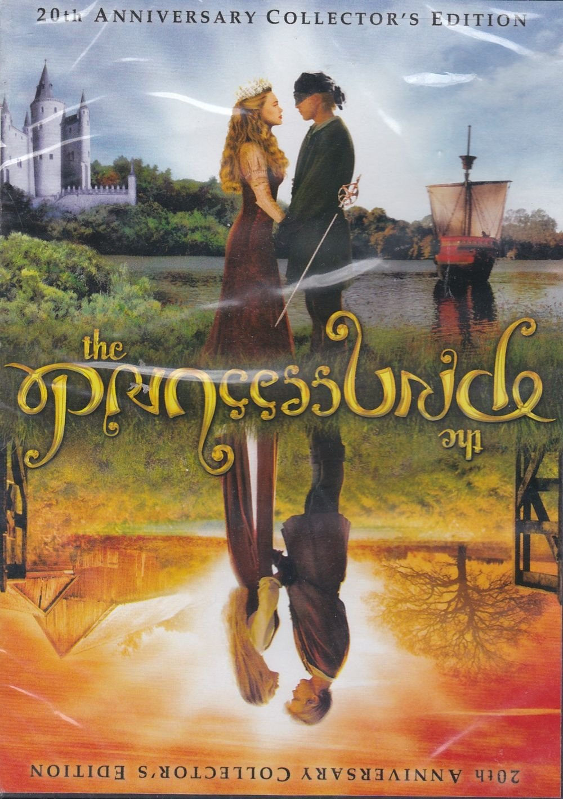

### Ambigram

#### 20th Anniversary Edition of the Princess Bride DVD

> [In 2007], to commemorate the 20th anniversary of the film,
> MGM and 20th Century Fox Home Entertainment
> (whose corporate parent The Walt Disney Company holds all
> US rights to the film except for US home video rights)
> released the film with flippable cover art featuring the title
> displayed in an ambigram. (...)
> — https://en.wikipedia.org/wiki/The\_Princess\_Bride\_(film)

Source: [Amazon](https://www.amazon.com/Princess-Bride-20th-Anniversary/dp/B0142WDO9A/)

#### More Images

* [Doormat](https://www.suck.uk.com/products/doormat/)
* [Ambigram Logos](https://www.logodesignlove.com/ambigram-logos)

#### References

##### FlipScript

* [Ambigram Generator](https://flipscript.com/ambigram-generator.aspx)

##### IMDB

* [The Princess Bride (1987)](https://m.imdb.com/title/tt0093779/)

##### Justinsomnia

* [Do you know what an ambigram is?](https://justinsomnia.org/2009/01/do-you-know-what-an-ambigram-is/)

##### Logo Design Love

* [A closer look at ambigrams](https://www.logodesignlove.com/ambigram-logos)

##### Princess Bride Forever (Official Website)

* [The Princess Bride](http://princessbrideforever.com/)

##### Wikipedia

* [Ambigram](https://en.wikipedia.org/wiki/Ambigram)
* [The Princess Bride (film)](https://en.wikipedia.org/wiki/The_Princess_Bride_(film))
